```{r setup, include=FALSE}
knitr::opts_chunk$set(echo = TRUE)
```

The textbook for the Data Science course series is [freely available online](https://rafalab.github.io/dsbook/){target="_blank"}.

# Learning Objectives

* The basics of machine learning
* How to perform cross-validation to avoid overtraining
* Several popular machine learning algorithms
* How to build a recommendation system
* What regularization is and why it is useful

## Course Overview

There are six major sections in this course: introduction to machine learning; machine learning basics; linear regression for prediction, smoothing, and working with matrices; distance, knn, cross validation, and generative models; classification with more than two classes and the caret package; and model fitting and recommendation systems.

### Introduction to Machine Learning

In this section, you'll be introduced to some of the terminology and concepts you'll need going forward.

### Machine Learning Basics

In this section, you'll learn how to start building a machine learning algorithm using training and test data sets and the importance of conditional probabilities for machine learning.

### Linear Regression for Prediction, Smoothing, and Working with Matrices

In this section, you'll learn why linear regression is a useful baseline approach but is often insufficiently flexible for more complex analyses, how to smooth noisy data, and how to use matrices for machine learning.

### Distance, Knn, Cross Validation, and Generative Models

In this section, you'll learn different types of discriminative and generative approaches for machine learning algorithms.

### Classification with More than Two Classes and the Caret Package

In this section, you'll learn how to overcome the curse of dimensionality using methods that adapt to higher dimensions and how to use the caret package to implement many different machine learning algorithms.

### Model Fitting and Recommendation Systems

In this section, you'll learn how to apply the machine learning algorithms you have learned.

# Section 1 - Introduction to Machine Learning Overview

In the **Introduction to Machine Learning** section, you will be introduced to machine learning.

After completing this section, you will be able to:

* Explain the difference between the **outcome** and the **features**.
* Explain when to use **classification** and when to use **prediction**.
* Explain the importance of **prevalence**.
* Explain the difference between **sensitivity** and **specificity**.

This section has one part: **introduction to machine learning**.

## Notation

There is a link to the relevant section of the textbook: [Notation](https://rafalab.github.io/dsbook/introduction-to-machine-learning.html#notation-1){target="_blank"}

**Key points**

* $X_1, ..., X_p$ denote the features, $Y$ denotes the outcomes, and $\hat{Y}$ denotes the predictions.
* Machine learning prediction tasks can be divided into **categorical** and **continuous** outcomes. We refer to these as **classification** and **prediction**, respectively.

## An Example

There is a link to the relevant section of the textbook: [An Example](https://rafalab.github.io/dsbook/introduction-to-machine-learning.html#an-example){target="_blank"}

**Key points**

* $Y_i$ = an outcome for observation or index i.
* We use boldface for $\mathbf{X_i}$ to distinguish the vector of predictors from the individual predictors $X_{i,1}, ..., X_{i,784}$.
* When referring to an arbitrary set of features and outcomes, we drop the index i and use $Y$ and bold $\mathbf{X}$.
* Uppercase is used to refer to variables because we think of predictors as random variables.
* Lowercase is used to denote observed values. For example, $\mathbf{X} = \mathbf{x}$.

## Comprehension Check - Introduction to Machine Learning

1. True or False: A key feature of machine learning is that the algorithms are built with data.

- [X] A. True
- [ ] B. False

2. True or False: In machine learning, we build algorithms that take feature values (X) and train a model using known outcomes (Y) that is then used to predict outcomes when presented with features without known outcomes.

- [X] A. True
- [ ] B. False

# Section 2 - Machine Learning Basics Overview

In the **Machine Learning Basics** section, you will learn the basics of machine learning.

After completing this section, you will be able to:

* Start to use the **caret** package.
* Construct and interpret a **confusion matrix**.
* Use **conditional probabilities** in the context of machine learning.

This section has two parts: **basics of evaluating machine learning algorithms** and **conditional probabilities**. 

## Caret package, training and test sets, and overall accuracy

There is a link to the relevant sections of the textbook: [Training and test sets](https://rafalab.github.io/dsbook/introduction-to-machine-learning.html#training-and-test-sets){target="_blank"} and [Overall accuracy](https://rafalab.github.io/dsbook/introduction-to-machine-learning.html#overall-accuracy){target="_blank"}

**Key points**

* Note: the ```set.seed()``` function is used to obtain reproducible results. If you have R 3.6 or later, please use the ```sample.kind = "Rounding"``` argument whenever you set the seed for this course.
* To mimic the ultimate evaluation process, we randomly split our data into two — a training set and a test set — and act as if we don’t know the outcome of the test set. We develop algorithms using only the training set; the test set is used only for evaluation.
* The ```createDataPartition()```  function from the **caret** package can be used to generate indexes for randomly splitting data.
* Note: contrary to what the documentation says, this course will use the argument p as the percentage of data that goes to testing. The indexes made from ```createDataPartition()``` should be used to create the test set. Indexes should be created on the outcome and not a predictor.
* The simplest evaluation metric for categorical outcomes is overall accuracy: the proportion of cases that were correctly predicted in the test set.

*Code*

```{r}
if(!require(tidyverse)) install.packages("tidyverse")
if(!require(caret)) install.packages("caret")
if(!require(dslabs)) install.packages("dslabs")

library(tidyverse)
library(caret)
library(dslabs)
data(heights)

# define the outcome and predictors
y <- heights$sex
x <- heights$height

# generate training and test sets
set.seed(2, sample.kind = "Rounding") # if using R 3.5 or earlier, remove the sample.kind argument
test_index <- createDataPartition(y, times = 1, p = 0.5, list = FALSE)
test_set <- heights[test_index, ]
train_set <- heights[-test_index, ]

# guess the outcome
y_hat <- sample(c("Male", "Female"), length(test_index), replace = TRUE)
y_hat <- sample(c("Male", "Female"), length(test_index), replace = TRUE) %>% 
  factor(levels = levels(test_set$sex))

# compute accuracy
mean(y_hat == test_set$sex)
heights %>% group_by(sex) %>% summarize(mean(height), sd(height))
y_hat <- ifelse(x > 62, "Male", "Female") %>% factor(levels = levels(test_set$sex))
mean(y == y_hat)

# examine the accuracy of 10 cutoffs
cutoff <- seq(61, 70)
accuracy <- map_dbl(cutoff, function(x){
  y_hat <- ifelse(train_set$height > x, "Male", "Female") %>% 
    factor(levels = levels(test_set$sex))
  mean(y_hat == train_set$sex)
})
data.frame(cutoff, accuracy) %>% 
  ggplot(aes(cutoff, accuracy)) + 
  geom_point() + 
  geom_line() 
max(accuracy)

best_cutoff <- cutoff[which.max(accuracy)]
best_cutoff

y_hat <- ifelse(test_set$height > best_cutoff, "Male", "Female") %>% 
  factor(levels = levels(test_set$sex))
y_hat <- factor(y_hat)
mean(y_hat == test_set$sex)
```

## Comprehension Check - Basics of Evaluating Machine Learning Algorithms

1. For each of the following, indicate whether the outcome is continuous or categorical.

* Digit reader - categorical 
* Height - continuous  
* Spam filter - categorical 
* Stock prices - continuous 
* Sex - categorical

2. How many features are available to us for prediction in the ```mnist``` digits dataset?

You can download the ```mnist``` dataset using the ```read_mnist()``` function from the **dslabs** package.

```{r}
mnist <- read_mnist()
ncol(mnist$train$images)
```

## Confusion matrix

There is a link to the relevant section of the textbook: [Confusion Matrix](https://rafalab.github.io/dsbook/introduction-to-machine-learning.html#the-confusion-matrix){target="_blank"}

**Key points**

* Overall accuracy can sometimes be a deceptive measure because of unbalanced classes.
* A general improvement to using overall accuracy is to study sensitivity and specificity separately. **Sensitivity**, also known as the true positive rate or recall, is the proportion of actual positive outcomes correctly identified as such. **Specificity**, also known as the true negative rate, is the proportion of actual negative outcomes that are correctly identified as such.
* A confusion matrix tabulates each combination of prediction and actual value. You can create a confusion matrix in R using the ```table()``` function or the ```confusionMatrix()``` function from the **caret** package.

*Code*

```{r}
# tabulate each combination of prediction and actual value
table(predicted = y_hat, actual = test_set$sex)
test_set %>% 
  mutate(y_hat = y_hat) %>%
  group_by(sex) %>% 
  summarize(accuracy = mean(y_hat == sex))
prev <- mean(y == "Male")

confusionMatrix(data = y_hat, reference = test_set$sex)
```

## Balanced accuracy and F1 score

There is a link to the relevant section of the textbook: [Balanced accuracy and F1 Score](https://rafalab.github.io/dsbook/introduction-to-machine-learning.html#balanced-accuracy-and-f_1-score){target="_blank"}

**Key points**

* For optimization purposes, sometimes it is more useful to have a one number summary than studying both specificity and sensitivity. One preferred metric is **balanced accuracy**. Because specificity and sensitivity are rates, it is more appropriate to compute the *harmonic* average. In fact, the **F1-score**, a widely used one-number summary, is the harmonic average of precision and recall. 
* Depending on the context, some type of errors are more costly than others. The **F1-score** can be adapted to weigh specificity and sensitivity differently. 
* You can compute the **F1-score** using the ```F_meas()``` function in the **caret** package.

*Code*

```{r}
# maximize F-score
cutoff <- seq(61, 70)
F_1 <- map_dbl(cutoff, function(x){
  y_hat <- ifelse(train_set$height > x, "Male", "Female") %>% 
    factor(levels = levels(test_set$sex))
  F_meas(data = y_hat, reference = factor(train_set$sex))
})

data.frame(cutoff, F_1) %>% 
  ggplot(aes(cutoff, F_1)) + 
  geom_point() + 
  geom_line()

max(F_1)

best_cutoff <- cutoff[which.max(F_1)]
best_cutoff

y_hat <- ifelse(test_set$height > best_cutoff, "Male", "Female") %>% 
  factor(levels = levels(test_set$sex))
sensitivity(data = y_hat, reference = test_set$sex)
specificity(data = y_hat, reference = test_set$sex)
```

## Prevalence matters in practice

There is a link to the relevant section of the textbook: [Prevalence matters in practice](https://rafalab.github.io/dsbook/introduction-to-machine-learning.html#prevalence-matters-in-practice){target="_blank"}

**Key points**

* A machine learning algorithm with very high sensitivity and specificity may not be useful in practice when prevalence is close to either 0 or 1. For example, if you develop an algorithm for disease diagnosis with very high sensitivity, but the prevalence of the disease is pretty low, then the precision of your algorithm is probably very low based on Bayes' theorem.

## ROC and precision-recall curves

There is a link to the relevant section of the textbook: [ROC and precision-recall curves](https://rafalab.github.io/dsbook/introduction-to-machine-learning.html#roc-and-precision-recall-curves){target="_blank"}

**Key points**

* A very common approach to evaluating accuracy and F1-score is to compare them graphically by plotting both. A widely used plot that does this is the **receiver operating characteristic (ROC) curve**. The ROC curve plots sensitivity (TPR) versus 1 - specificity or the false positive rate (FPR).
* However, ROC curves have one weakness and it is that neither of the measures plotted depend on prevalence. In cases in which prevalence matters, we may instead make a **precision-recall plot**, which has a similar idea with ROC curve.

*Code*

Note: your results and plots may be slightly different.

```{r}
p <- 0.9
n <- length(test_index)
y_hat <- sample(c("Male", "Female"), n, replace = TRUE, prob=c(p, 1-p)) %>% 
  factor(levels = levels(test_set$sex))
mean(y_hat == test_set$sex)

# ROC curve
probs <- seq(0, 1, length.out = 10)
guessing <- map_df(probs, function(p){
  y_hat <- 
    sample(c("Male", "Female"), n, replace = TRUE, prob=c(p, 1-p)) %>% 
    factor(levels = c("Female", "Male"))
  list(method = "Guessing",
       FPR = 1 - specificity(y_hat, test_set$sex),
       TPR = sensitivity(y_hat, test_set$sex))
})
guessing %>% qplot(FPR, TPR, data =., xlab = "1 - Specificity", ylab = "Sensitivity")

cutoffs <- c(50, seq(60, 75), 80)
height_cutoff <- map_df(cutoffs, function(x){
  y_hat <- ifelse(test_set$height > x, "Male", "Female") %>% 
    factor(levels = c("Female", "Male"))
   list(method = "Height cutoff",
        FPR = 1-specificity(y_hat, test_set$sex),
        TPR = sensitivity(y_hat, test_set$sex))
})

# plot both curves together
bind_rows(guessing, height_cutoff) %>%
  ggplot(aes(FPR, TPR, color = method)) +
  geom_line() +
  geom_point() +
  xlab("1 - Specificity") +
  ylab("Sensitivity")

if(!require(ggrepel)) install.packages("ggrepel")

library(ggrepel)
map_df(cutoffs, function(x){
  y_hat <- ifelse(test_set$height > x, "Male", "Female") %>% 
    factor(levels = c("Female", "Male"))
   list(method = "Height cutoff",
        cutoff = x, 
        FPR = 1-specificity(y_hat, test_set$sex),
        TPR = sensitivity(y_hat, test_set$sex))
}) %>%
  ggplot(aes(FPR, TPR, label = cutoff)) +
  geom_line() +
  geom_point() +
  geom_text_repel(nudge_x = 0.01, nudge_y = -0.01)

# plot precision against recall
guessing <- map_df(probs, function(p){
  y_hat <- sample(c("Male", "Female"), length(test_index), 
                  replace = TRUE, prob=c(p, 1-p)) %>% 
    factor(levels = c("Female", "Male"))
  list(method = "Guess",
    recall = sensitivity(y_hat, test_set$sex),
    precision = precision(y_hat, test_set$sex))
})

height_cutoff <- map_df(cutoffs, function(x){
  y_hat <- ifelse(test_set$height > x, "Male", "Female") %>% 
    factor(levels = c("Female", "Male"))
  list(method = "Height cutoff",
       recall = sensitivity(y_hat, test_set$sex),
    precision = precision(y_hat, test_set$sex))
})

bind_rows(guessing, height_cutoff) %>%
  ggplot(aes(recall, precision, color = method)) +
  geom_line() +
  geom_point()
guessing <- map_df(probs, function(p){
  y_hat <- sample(c("Male", "Female"), length(test_index), replace = TRUE, 
                  prob=c(p, 1-p)) %>% 
    factor(levels = c("Male", "Female"))
  list(method = "Guess",
    recall = sensitivity(y_hat, relevel(test_set$sex, "Male", "Female")),
    precision = precision(y_hat, relevel(test_set$sex, "Male", "Female")))
})

height_cutoff <- map_df(cutoffs, function(x){
  y_hat <- ifelse(test_set$height > x, "Male", "Female") %>% 
    factor(levels = c("Male", "Female"))
  list(method = "Height cutoff",
       recall = sensitivity(y_hat, relevel(test_set$sex, "Male", "Female")),
    precision = precision(y_hat, relevel(test_set$sex, "Male", "Female")))
})
bind_rows(guessing, height_cutoff) %>%
  ggplot(aes(recall, precision, color = method)) +
  geom_line() +
  geom_point()
```

## Comprehension Check - Practice with Machine Learning, Part 1

The following questions all ask you to work with the dataset described below.

The ```reported_heights``` and ```heights``` datasets were collected from three classes taught in the Departments of Computer Science and Biostatistics, as well as remotely through the Extension School. The Biostatistics class was taught in 2016 along with an online version offered by the Extension School. On 2016-01-25 at 8:15 AM, during one of the lectures, the instructors asked student to fill in the sex and height questionnaire that populated the ```reported_heights``` dataset. The online students filled out the survey during the next few days, after the lecture was posted online. We can use this insight to define a variable which we will call ```type```, to denote the type of student, ```inclass``` or ```online```.

The code below sets up the dataset for you to analyze in the following exercises:

```{r}
if(!require(dplyr)) install.packages("dplyr")
if(!require(lubridate)) install.packages("lubridate")

library(dplyr)
library(lubridate)
data(reported_heights)

dat <- mutate(reported_heights, date_time = ymd_hms(time_stamp)) %>%
  filter(date_time >= make_date(2016, 01, 25) & date_time < make_date(2016, 02, 1)) %>%
  mutate(type = ifelse(day(date_time) == 25 & hour(date_time) == 8 & between(minute(date_time), 15, 30), "inclass","online")) %>%
  select(sex, type)

y <- factor(dat$sex, c("Female", "Male"))
x <- dat$type
```

1. The ```type``` column of ```dat``` indicates whether students took classes in person ("inclass") or online ("online"). What proportion of the inclass group is female? What proportion of the online group is female?

Enter your answer as a percentage or decimal (eg "50%" or "0.50") to at least the hundredths place.

```{r}
dat %>% group_by(type) %>% summarize(prop_female = mean(sex == "Female"))
```

2. In the course videos, height cutoffs were used to predict sex. Instead of height, use the ```type``` variable to predict sex. Assume that for each class type the students are either all male or all female, based on the most prevalent sex in each class type you calculated in Q1. Report the accuracy of your prediction of sex based on type. You do not need to split the data into training and test sets.

Enter your accuracy as a percentage or decimal (eg "50%" or "0.50") to at least the hundredths place.

```{r}
y_hat <- ifelse(x == "online", "Male", "Female") %>% 
      factor(levels = levels(y))
mean(y_hat==y)
```

3. Write a line of code using the ```table()``` function to show the confusion matrix between ```y_hat``` and ```y```. Use the **exact** format ```function(a, b)``` for your answer and do not name the columns and rows. Your answer should have exactly one space.

```{r}
table(y_hat, y)
```

4. What is the sensitivity of this prediction? You can use the ```sensitivity()``` function from the **caret** package. Enter your answer as a percentage or decimal (eg "50%" or "0.50") to at least the hundredths place.

```{r}
sensitivity(y_hat, y)
```

5. What is the specificity of this prediction? You can use the ```specificity()``` function from the **caret** package. Enter your answer as a percentage or decimal (eg "50%" or "0.50") to at least the hundredths place.

```{r}
specificity(y_hat, y)
```

6. What is the prevalence (% of females) in the ```dat``` dataset defined above? Enter your answer as a percentage or decimal (eg "50%" or "0.50") to at least the hundredths place.

```{r}
mean(y == "Female")
```

## Comprehension Check - Practice with Machine Learning, Part 2

We will practice building a machine learning algorithm using a new dataset, ```iris```, that provides multiple predictors for us to use to train. To start, we will remove the ```setosa``` species and we will focus on the ```versicolor``` and ```virginica``` iris species using the following code:

```{r}
data(iris)
iris <- iris[-which(iris$Species=='setosa'),]
y <- iris$Species
```

The following questions all involve work with this dataset.

7. First let us create an even split of the data into ```train``` and ```test``` partitions using ```createDataPartition()``` from the **caret** package. The code with a missing line is given below:

```{r, include=TRUE, eval=FALSE}
# set.seed(2) # if using R 3.5 or earlier
set.seed(2, sample.kind="Rounding") # if using R 3.6 or later
# line of code
test <- iris[test_index,]
train <- iris[-test_index,]
```

Which code should be used in place of # line of code above?

- [ ] A. test_index <- createDataPartition(y,times=1,p=0.5)
- [ ] B. test_index <- sample(2,length(y),replace=FALSE)
- [X] C. test_index <- createDataPartition(y,times=1,p=0.5,list=FALSE)
- [ ] D. test_index <- rep(1,length(y))

```{r}
# set.seed(2) # if using R 3.5 or earlier
set.seed(2, sample.kind="Rounding") # if using R 3.6 or later
test_index <- createDataPartition(y,times=1,p=0.5,list=FALSE)
test <- iris[test_index,]
train <- iris[-test_index,]
```

8. Next we will figure out the singular feature in the dataset that yields the greatest overall accuracy when predicting species. You can use the code from the introduction and from Q7 to start your analysis.

Using only the ```train``` iris dataset, for each feature, perform a simple search to find the cutoff that produces the highest accuracy, predicting virginica if greater than the cutoff and versicolor otherwise. Use the ```seq``` function over the range of each feature by intervals of 0.1 for this search.

Which feature produces the highest accuracy?

```{r}
foo <- function(x){
	rangedValues <- seq(range(x)[1],range(x)[2],by=0.1)
	sapply(rangedValues,function(i){
		y_hat <- ifelse(x>i,'virginica','versicolor')
		mean(y_hat==train$Species)
	})
}
predictions <- apply(train[,-5],2,foo)
sapply(predictions,max)	
```

- [ ] A. Sepal.Length
- [ ] B. Sepal.Width
- [X] C. Petal.Length
- [ ] D. Petal.Width

9. For the feature selected in Q8, use the smart cutoff value from the training data to calculate overall accuracy in the test data. What is the overall accuracy?

```{r}
predictions <- foo(train[,3])
rangedValues <- seq(range(train[,3])[1],range(train[,3])[2],by=0.1)
cutoffs <-rangedValues[which(predictions==max(predictions))]

y_hat <- ifelse(test[,3]>cutoffs[1],'virginica','versicolor')
mean(y_hat==test$Species)
```

10. Notice that we had an overall accuracy greater than 96% in the training data, but the overall accuracy was lower in the test data. This can happen often if we overtrain. In fact, it could be the case that a single feature is not the best choice. For example, a combination of features might be optimal. Using a single feature and optimizing the cutoff as we did on our training data can lead to overfitting.

Given that we know the test data, we can treat it like we did our training data to see if the same feature with a different cutoff will optimize our predictions.

Which feature best optimizes our overall accuracy?

```{r}
foo <- function(x){
	rangedValues <- seq(range(x)[1],range(x)[2],by=0.1)
	sapply(rangedValues,function(i){
		y_hat <- ifelse(x>i,'virginica','versicolor')
		mean(y_hat==test$Species)
	})
}
predictions <- apply(test[,-5],2,foo)
sapply(predictions,max)
```

- [ ] A. Sepal.Length
- [ ] B. Sepal.Width
- [ ] C. Petal.Length
- [X] D. Petal.Width

11. Now we will perform some exploratory data analysis on the data.

Notice that ```Petal.Length``` and ```Petal.Width``` in combination could potentially be more information than either feature alone.

Optimize the the cutoffs for ```Petal.Length``` and ```Petal.Width``` separately in the train dataset by using the ```seq``` function with increments of 0.1. Then, report the overall accuracy when applied to the test dataset by creating a rule that predicts virginica if ```Petal.Length``` is greater than the length cutoff OR ```Petal.Width``` is greater than the width cutoff, and versicolor otherwise.

What is the overall accuracy for the test data now?

```{r}
data(iris)
iris <- iris[-which(iris$Species=='setosa'),]
y <- iris$Species

plot(iris,pch=21,bg=iris$Species)

# set.seed(2) # if using R 3.5 or earlier
set.seed(2, sample.kind="Rounding") # if using R 3.6 or later
test_index <- createDataPartition(y,times=1,p=0.5,list=FALSE)
test <- iris[test_index,]
train <- iris[-test_index,]
            
petalLengthRange <- seq(range(train$Petal.Length)[1],range(train$Petal.Length)[2],by=0.1)
petalWidthRange <- seq(range(train$Petal.Width)[1],range(train$Petal.Width)[2],by=0.1)

length_predictions <- sapply(petalLengthRange,function(i){
		y_hat <- ifelse(train$Petal.Length>i,'virginica','versicolor')
		mean(y_hat==train$Species)
	})
length_cutoff <- petalLengthRange[which.max(length_predictions)] # 4.7

width_predictions <- sapply(petalWidthRange,function(i){
		y_hat <- ifelse(train$Petal.Width>i,'virginica','versicolor')
		mean(y_hat==train$Species)
	})
width_cutoff <- petalWidthRange[which.max(width_predictions)] # 1.5

y_hat <- ifelse(test$Petal.Length>length_cutoff | test$Petal.Width>width_cutoff,'virginica','versicolor')
mean(y_hat==test$Species)
```

## Conditional probabilities

There is a link to the relevant section of the textbook: [Conditional probabilities](https://rafalab.github.io/dsbook/introduction-to-machine-learning.html#conditional-probabilities-1){target="_blank"}

**Key points**

* Conditional probabilities for each class: 

$p_{k}(x) = Pr(Y = k|X = x), for\, k = 1, ..., K$

* In machine learning, this is referred to as **Bayes' Rule**. This is a theoretical rule because in practice we don't know $p(x)$. Having a good estimate of the $p(x)$ will suffice for us to build optimal prediction models, since we can control the balance between specificity and sensitivity however we wish. In fact, estimating these conditional probabilities can be thought of as the main challenge of machine learning.

## Conditional expectations and loss function

There is a link to the relevant sections of the textbook: [Conditional expectations](https://rafalab.github.io/dsbook/introduction-to-machine-learning.html#conditional-expectations){target="_blank"} and [Loss functions](https://rafalab.github.io/dsbook/introduction-to-machine-learning.html#conditional-expectation-minimizes-squared-loss-function){target="_blank"}

**Key points**

* Due to the connection between **conditional probabilities** and **conditional expectations**:

$p_{k}(x) = Pr(Y = k|X = x),\,\text{for}\,k = 1, ..., K$

we often only use the expectation to denote both the conditional probability and conditional expectation.

* For continuous outcomes, we define a loss function to evaluate the model. The most commonly used one is **MSE (Mean Squared Error)**. The reason why we care about the conditional expectation in machine learning is that the expected value minimizes the MSE:

$\hat{Y} = E(Y|X = x)\, \text{minimizes}\, E\{(\hat{Y} - Y)^2|X=x\}$

Due to this property, a succinct description of the main task of machine learning is that we use data to estimate for any set of features. **The main way in which competing machine learning algorithms differ is in their approach to estimating this expectation**.

## Comprehension Check - Conditional Probabilities, Part 1

1. In a previous module, we covered Bayes' theorem and the Bayesian paradigm. Conditional probabilities are a fundamental part of this previous covered rule.

$P(A|B) = P(B|A)\frac{P(A)}{P(B)}$

We first review a simple example to go over conditional probabilities.

Assume a patient comes into the doctor’s office to test whether they have a particular disease.

* The test is positive 85% of the time when tested on a patient with the disease (high sensitivity): $P(\text{test} + | \text{disease}) = 0.85$
* The test is negative 90% of the time when tested on a healthy patient (high specificity): $P(\text{test} - | \text{heathy}) = 0.90$
* The disease is prevalent in about 2% of the community: $P(\text{disease}) = 0.02$

Using Bayes' theorem, calculate the probability that you have the disease if the test is positive.

$P(\text{disease} | \text{test}+) = P(\text{test}+ | \text{disease}) \times \frac{P(\text{disease})}{P(\text{test}+)} = \frac{P(\text{test}+ | \text{disease})P(\text{disease})}{P(\text{test}+ | \text{disease})P(\text{disease})+P(\text{test}+ | \text{healthy})P(\text{healthy})]} = \frac{0.85 \times 0.02}{0.85 \times 0.02 + 0.1 \times 0.98} = 0.1478261$

The following 4 questions (Q2-Q5) all relate to implementing this calculation using R.

We have a hypothetical population of 1 million individuals with the following conditional probabilities as described below:

* The test is positive 85% of the time when tested on a patient with the disease (high sensitivity): $P(\text{test} + | \text{disease}) = 0.85$
* The test is negative 90% of the time when tested on a healthy patient (high specificity): $P(\text{test} - | \text{heathy}) = 0.90$
* The disease is prevalent in about 2% of the community: $P(\text{disease}) = 0.02$

Here is some sample code to get you started:

```{r}
# set.seed(1) # if using R 3.5 or earlier
set.seed(1, sample.kind = "Rounding") # if using R 3.6 or later
disease <- sample(c(0,1), size=1e6, replace=TRUE, prob=c(0.98,0.02))
test <- rep(NA, 1e6)
test[disease==0] <- sample(c(0,1), size=sum(disease==0), replace=TRUE, prob=c(0.90,0.10))
test[disease==1] <- sample(c(0,1), size=sum(disease==1), replace=TRUE, prob=c(0.15, 0.85))
```

2. What is the probability that a test is positive?

```{r}
mean(test)
```

3. What is the probability that an individual has the disease if the test is negative?

```{r}
mean(disease[test==0])
```

4. What is the probability that you have the disease if the test is positive? Remember: calculate the conditional probability the disease is positive assuming a positive test.

```{r}
mean(disease[test==1]==1)
```

5. Compare the prevalence of disease in people who test positive to the overall prevalence of disease.

If a patient's test is positive, by how many times does that increase their risk of having the disease? First calculate the probability of having the disease given a positive test, then divide by the probability of having the disease.

```{r}
mean(disease[test==1]==1)/mean(disease==1)
```

## Comprehension Check - Conditional Probabilities, Part 2

6. We are now going to write code to compute conditional probabilities for being male in the heights dataset. Round the heights to the closest inch. Plot the estimated conditional probability $P(x) = \mbox{Pr}(\mbox{Male} | \mbox{height}=x)$.

Part of the code is provided here:

```{r, include=TRUE, eval=FALSE}
data("heights")
# MISSING CODE
	qplot(height, p, data =.)
```

Which of the following blocks of code can be used to replace **# MISSING CODE** to make the correct plot?

- [ ] A.

```{r, include=TRUE, eval=FALSE}
heights %>% 
	group_by(height) %>%
	summarize(p = mean(sex == "Male")) %>%
```        

- [ ] B. 

```{r, include=TRUE, eval=FALSE}
heights %>% 
	mutate(height = round(height)) %>%
	group_by(height) %>%
	summarize(p = mean(sex == "Female")) %>%
```      
 
- [ ] C. 

```{r, include=TRUE, eval=FALSE}       
heights %>% 
	mutate(height = round(height)) %>%
	summarize(p = mean(sex == "Male")) %>%
```       

- [X] D. 

```{r, include=TRUE, eval=FALSE}
heights %>% 
	mutate(height = round(height)) %>%
	group_by(height) %>%
	summarize(p = mean(sex == "Male")) %>%
```       

```{r}
data("heights")
heights %>% 
	mutate(height = round(height)) %>%
	group_by(height) %>%
	summarize(p = mean(sex == "Male")) %>%
	qplot(height, p, data =.)
```

7. In the plot we just made in Q6 we see high variability for low values of height. This is because we have few data points. This time use the quantile $0.1,0.2,\dots,0.9$ and the ```cut()``` function to assure each group has the same number of points. Note that for any numeric vector ```x```, you can create groups based on quantiles like this: ```cut(x, quantile(x, seq(0, 1, 0.1)), include.lowest = TRUE)```.

Part of the code is provided here:

```{r, include=TRUE, eval=FALSE}     
ps <- seq(0, 1, 0.1)
heights %>% 
	# MISSING CODE
	group_by(g) %>%
	summarize(p = mean(sex == "Male"), height = mean(height)) %>%
	qplot(height, p, data =.)
```
    
Which of the following lines of code can be used to replace **# MISSING CODE** to make the correct plot?

- [ ] A.

```{r, include=TRUE, eval=FALSE}
mutate(g = cut(male, quantile(height, ps), include.lowest = TRUE)) %>%
```        

- [X] B.

```{r, include=TRUE, eval=FALSE}
mutate(g = cut(height, quantile(height, ps), include.lowest = TRUE)) %>%
```        
 
- [ ] C.

```{r, include=TRUE, eval=FALSE}
mutate(g = cut(female, quantile(height, ps), include.lowest = TRUE)) %>%
```

- [ ] D.

```{r, include=TRUE, eval=FALSE}
mutate(g = cut(height, quantile(height, ps))) %>%
```

```{r}     
ps <- seq(0, 1, 0.1)
heights %>% 
	mutate(g = cut(height, quantile(height, ps), include.lowest = TRUE)) %>%
	group_by(g) %>%
	summarize(p = mean(sex == "Male"), height = mean(height)) %>%
	qplot(height, p, data =.)
```

8. You can generate data from a bivariate normal distrubution using the **MASS** package using the following code:

```{r}
if(!require(MASS)) install.packages("MASS")

Sigma <- 9*matrix(c(1,0.5,0.5,1), 2, 2)
dat <- MASS::mvrnorm(n = 10000, c(69, 69), Sigma) %>%
	data.frame() %>% setNames(c("x", "y"))
```

And you can make a quick plot using ```plot(dat)```.

```{r}
plot(dat)
```

Using an approach similar to that used in the previous exercise, let's estimate the conditional expectations and make a plot. Part of the code has again been provided for you:

```{r, include=TRUE, eval=FALSE}
ps <- seq(0, 1, 0.1)
dat %>% 
	# MISSING CODE
	qplot(x, y, data =.)
```
    
Which of the following blocks of code can be used to replace **# MISSING CODE** to make the correct plot?

- [X] A.

```{r, include=TRUE, eval=FALSE}      
mutate(g = cut(x, quantile(x, ps), include.lowest = TRUE)) %>%
group_by(g) %>%
summarize(y = mean(y), x = mean(x)) %>%
```        
 
- [ ] B.

```{r, include=TRUE, eval=FALSE}          
mutate(g = cut(x, quantile(x, ps))) %>%
group_by(g) %>%
summarize(y = mean(y), x = mean(x)) %>%
```        

- [ ] C.

```{r, include=TRUE, eval=FALSE} 
mutate(g = cut(x, quantile(x, ps), include.lowest = TRUE)) %>%
summarize(y = mean(y), x = mean(x)) %>%
```        
 

- [ ] D.

```{r, include=TRUE, eval=FALSE}       
mutate(g = cut(x, quantile(x, ps), include.lowest = TRUE)) %>%
group_by(g) %>%
summarize(y =(y), x =(x)) %>%
```

```{r}
ps <- seq(0, 1, 0.1)
dat %>% 
	mutate(g = cut(x, quantile(x, ps), include.lowest = TRUE)) %>%
	group_by(g) %>%
	summarize(y = mean(y), x = mean(x)) %>%
	qplot(x, y, data =.)
```

# Section 3 - Linear Regression for Prediction, Smoothing, and Working with Matrices Overview

In the **Linear Regression for Prediction, Smoothing, and Working with Matrices Overview** section, you will learn why linear regression is a useful baseline approach but is often insufficiently flexible for more complex analyses, how to smooth noisy data, and how to use matrices for machine learning.

After completing this section, you will be able to:

* Use **linear regression for prediction** as a baseline approach.
* Use **logistic regression** for categorical data.
* Detect trends in noisy data using **smoothing** (also known as **curve fitting** or **low pass filtering**).
* Convert predictors to **matrices** and outcomes to **vectors** when all predictors are numeric (or can be converted to numerics in a meaningful way).
* Perform basic **matrix algebra** calculations.

This section has three parts: **linear regression for prediction**, **smoothing**, and **working with matrices**.

## Linear Regression for Prediction

There is a link to the relevant section of the textbook: [Linear regression for prediction](https://rafalab.github.io/dsbook/examples-of-algorithms.html#linear-regression){target="_blank"}

**Key points**

* Linear regression can be considered a machine learning algorithm. Although it can be too rigid to be useful, it works rather well for some challenges. It also serves as a baseline approach: if you can’t beat it with a more complex approach, you probably want to stick to linear regression. 

*Code*

Note: the seed was not set before ```createDataPartition``` so your results may be different.

```{r}
if(!require(HistData)) install.packages("HistData")

library(HistData)

galton_heights <- GaltonFamilies %>%
  filter(childNum == 1 & gender == "male") %>%
  dplyr::select(father, childHeight) %>%
  rename(son = childHeight)

y <- galton_heights$son
test_index <- createDataPartition(y, times = 1, p = 0.5, list = FALSE)

train_set <- galton_heights %>% slice(-test_index)
test_set <- galton_heights %>% slice(test_index)

avg <- mean(train_set$son)
avg

mean((avg - test_set$son)^2)

# fit linear regression model
fit <- lm(son ~ father, data = train_set)
fit$coef

y_hat <- fit$coef[1] + fit$coef[2]*test_set$father
mean((y_hat - test_set$son)^2)
```

## Predict Function

There is a link to the relevant section of the textbook: [Predict function](https://rafalab.github.io/dsbook/examples-of-algorithms.html#the-predict-function){target="_blank"}

**Key points**

* The ```predict()``` function takes a fitted object from functions such as ```lm()``` or ```glm()``` and a data frame with the new predictors for which to predict. We can use predict like this:

```{r, include=TRUE, eval=FALSE}
y_hat <- predict(fit, test_set)
```

* ```predict()``` is a generic function in R that calls other functions depending on what kind of object it receives. To learn about the specifics, you can read the help files using code like this: 

```{r, include=TRUE, eval=FALSE}
?predict.lm    # or ?predict.glm
```

*Code*

```{r}
y_hat <- predict(fit, test_set)
mean((y_hat - test_set$son)^2)

# read help files
?predict.lm
?predict.glm
```

## Comprehension Check - Linear Regression

1. Create a data set using the following code:

```{r}
# set.seed(1) # if using R 3.5 or earlier
set.seed(1, sample.kind="Rounding") # if using R 3.6 or later
n <- 100
Sigma <- 9*matrix(c(1.0, 0.5, 0.5, 1.0), 2, 2)
dat <- MASS::mvrnorm(n = 100, c(69, 69), Sigma) %>%
      data.frame() %>% setNames(c("x", "y"))
```

We will build 100 linear models using the data above and calculate the mean and standard deviation of the combined models. First, set the seed to 1 again (make sure to use ```sample.kind="Rounding"``` if your R is version 3.6 or later). Then, within a ```replicate()``` loop, (1) partition the dataset into test and training sets with ```p = 0.5``` and using ```dat$y``` to generate your indices, (2) train a linear model predicting ```y``` from ```x```, (3) generate predictions on the test set, and (4) calculate the RMSE of that model. Then, report the mean and standard deviation (SD) of the RMSEs from all 100 models.

Report all answers to at least 3 significant digits.

```{r}
# set.seed(1) # if using R 3.5 or earlier
set.seed(1, sample.kind="Rounding") # if using R 3.6 or later
rmse <- replicate(100, {
	test_index <- createDataPartition(dat$y, times = 1, p = 0.5, list = FALSE)
	train_set <- dat %>% slice(-test_index)
	test_set <- dat %>% slice(test_index)
	fit <- lm(y ~ x, data = train_set)
 	y_hat <- predict(fit, newdata = test_set)
	sqrt(mean((y_hat-test_set$y)^2))
})

mean(rmse)
sd(rmse)
```

2. Now we will repeat the exercise above but using larger datasets. Write a function that takes a size ```n```, then (1) builds a dataset using the code provided at the top of Q1 but with ```n``` observations instead of 100 and without the ```set.seed(1)```, (2) runs the ```replicate()``` loop that you wrote to answer Q1, which builds 100 linear models and returns a vector of RMSEs, and (3) calculates the mean and standard deviation of the 100 RMSEs.

Set the seed to 1 (if using R 3.6 or later, use the argument ```sample.kind="Rounding")``` and then use ```sapply()``` or ```map()``` to apply your new function to ```n <- c(100, 500, 1000, 5000, 10000)```.

Hint: You only need to set the seed once before running your function; do not set a seed within your function. Also be sure to use ```sapply()``` or ```map()``` as you will get different answers running the simulations individually due to setting the seed.

```{r}
# set.seed(1) # if R 3.5 or earlier
set.seed(1, sample.kind="Rounding") # if R 3.6 or later
n <- c(100, 500, 1000, 5000, 10000)
res <- sapply(n, function(n){
	Sigma <- 9*matrix(c(1.0, 0.5, 0.5, 1.0), 2, 2)
	dat <- MASS::mvrnorm(n, c(69, 69), Sigma) %>%
		data.frame() %>% setNames(c("x", "y"))
	rmse <- replicate(100, {
		test_index <- createDataPartition(dat$y, times = 1, p = 0.5, list = FALSE)
		train_set <- dat %>% slice(-test_index)
		test_set <- dat %>% slice(test_index)
		fit <- lm(y ~ x, data = train_set)
		y_hat <- predict(fit, newdata = test_set)
		sqrt(mean((y_hat-test_set$y)^2))
	})
	c(avg = mean(rmse), sd = sd(rmse))
})

res
```

3. What happens to the RMSE as the size of the dataset becomes larger?

- [X] A. On average, the RMSE does not change much as n gets larger, but the variability of the RMSE decreases.
- [ ] B. Because of the law of large numbers the RMSE decreases; more data means more precise estimates.
- [ ] C. n = 10000 is not sufficiently large. To see a decrease in the RMSE we would need to make it larger.
- [ ] D. The RMSE is not a random variable.

4. Now repeat the exercise from Q1, this time making the correlation between ```x``` and ```y``` larger, as in the following code: 

```{r}
# set.seed(1) # if using R 3.5 or earlier
set.seed(1, sample.kind="Rounding") # if using R 3.6 or later
n <- 100
Sigma <- 9*matrix(c(1.0, 0.95, 0.95, 1.0), 2, 2)
dat <- MASS::mvrnorm(n = 100, c(69, 69), Sigma) %>%
	data.frame() %>% setNames(c("x", "y"))
```

Note what happens to RMSE - set the seed to 1 as before.

```{r}
# set.seed(1) # if using R 3.5 or earlier
set.seed(1, sample.kind="Rounding") # if using R 3.6 or later
rmse <- replicate(100, {
	test_index <- createDataPartition(dat$y, times = 1, p = 0.5, list = FALSE)
	train_set <- dat %>% slice(-test_index)
	test_set <- dat %>% slice(test_index)
	fit <- lm(y ~ x, data = train_set)
 	y_hat <- predict(fit, newdata = test_set)
	sqrt(mean((y_hat-test_set$y)^2))
})

mean(rmse)
sd(rmse)
```

5. Which of the following best explains why the RMSE in question 4 is so much lower than the RMSE in question 1?

- [ ] A. It is just luck. If we do it again, it will be larger.
- [ ] B. The central limit theorem tells us that the RMSE is normal.
- [X] C. When we increase the correlation between x and y, x has more predictive power and thus provides a better estimate of y.
- [ ] D. These are both examples of regression so the RMSE has to be the same.

6. Create a data set using the following code.

```{r}      
# set.seed(1) # if using R 3.5 or earlier
set.seed(1, sample.kind="Rounding") # if using R 3.6 or later
Sigma <- matrix(c(1.0, 0.75, 0.75, 0.75, 1.0, 0.25, 0.75, 0.25, 1.0), 3, 3)
dat <- MASS::mvrnorm(n = 100, c(0, 0, 0), Sigma) %>%
	data.frame() %>% setNames(c("y", "x_1", "x_2"))
```

Note that ```y``` is correlated with both ```x_1``` and ```x_2``` but the two predictors are independent of each other, as seen by ```cor(dat)```.

Set the seed to 1, then use the **caret** package to partition into test and training sets with ```p = 0.5```. Compare the RMSE when using just ```x_1```, just ```x_2``` and both ```x_1``` and ```x_2```. Train a single linear model for each (not 100 like in the previous questions).

Which of the three models performs the best (has the lowest RMSE)?

```{r}
# set.seed(1) # if using R 3.5 or earlier
set.seed(1, sample.kind="Rounding") # if using R 3.6 or later
test_index <- createDataPartition(dat$y, times = 1, p = 0.5, list = FALSE)
train_set <- dat %>% slice(-test_index)
test_set <- dat %>% slice(test_index)

fit <- lm(y ~ x_1, data = train_set)
y_hat <- predict(fit, newdata = test_set)
sqrt(mean((y_hat-test_set$y)^2))

fit <- lm(y ~ x_2, data = train_set)
y_hat <- predict(fit, newdata = test_set)
sqrt(mean((y_hat-test_set$y)^2))

fit <- lm(y ~ x_1 + x_2, data = train_set)
y_hat <- predict(fit, newdata = test_set)
sqrt(mean((y_hat-test_set$y)^2))
```

- [ ] A. ```x_1```
- [ ] B. ```x_2```
- [X] C. ```x_1``` and ```x_2```

7. Report the lowest RMSE of the three models tested in Q6.

```{r}
fit <- lm(y ~ x_1 + x_2, data = train_set)
y_hat <- predict(fit, newdata = test_set)
sqrt(mean((y_hat-test_set$y)^2))
```

8. Repeat the exercise from Q6 but now create an example in which ```x_1``` and ```x_2``` are highly correlated.

```{r}
# set.seed(1) # if using R 3.5 or earlier
set.seed(1, sample.kind="Rounding") # if using R 3.6 or later
Sigma <- matrix(c(1.0, 0.75, 0.75, 0.75, 1.0, 0.95, 0.75, 0.95, 1.0), 3, 3)
dat <- MASS::mvrnorm(n = 100, c(0, 0, 0), Sigma) %>%
	data.frame() %>% setNames(c("y", "x_1", "x_2"))
```

Set the seed to 1, then use the **caret** package to partition into a test and training set of equal size. Compare the RMSE when using just ```x_1```, just ```x_2```, and both ```x_1``` and ```x_2```.

Compare the results from Q6 and Q8. What can you conclude?

```{r}
# set.seed(1) # if using R 3.5 or earlier
set.seed(1, sample.kind="Rounding") # if using R 3.6 or later
test_index <- createDataPartition(dat$y, times = 1, p = 0.5, list = FALSE)
train_set <- dat %>% slice(-test_index)
test_set <- dat %>% slice(test_index)

fit <- lm(y ~ x_1, data = train_set)
y_hat <- predict(fit, newdata = test_set)
sqrt(mean((y_hat-test_set$y)^2))

fit <- lm(y ~ x_2, data = train_set)
y_hat <- predict(fit, newdata = test_set)
sqrt(mean((y_hat-test_set$y)^2))

fit <- lm(y ~ x_1 + x_2, data = train_set)
y_hat <- predict(fit, newdata = test_set)
sqrt(mean((y_hat-test_set$y)^2))
```

- [ ] A. Unless we include all predictors we have no predictive power.
- [ ] B. Adding extra predictors improves RMSE regardless of whether the added predictors are correlated with other predictors or not.
- [ ] C. Adding extra predictors results in over fitting.
- [X] D. Adding extra predictors can improve RMSE substantially, but not when the added predictors are highly correlated with other predictors.

## Regression for a Categorical Outcome

There is a link to the relevant section of the textbook: [Regression for a categorical outcome](https://rafalab.github.io/dsbook/examples-of-algorithms.html#logistic-regression){target="_blank"}

**Key points**

* The regression approach can be extended to categorical data. For example, we can try regression to estimate the conditional probability:

$p(x)=Pr(Y=1|X=x)=\beta_{0}+\beta_{1}x$

* Once we have estimates $\beta_0$ and $\beta_1$, we can obtain an actual prediction $p(x)$. Then we can define a specific decision rule to form a prediction.

*Code*

```{r}
data("heights")
y <- heights$height

set.seed(2) #if you are using R 3.5 or earlier
set.seed(2, sample.kind = "Rounding") #if you are using R 3.6 or later

test_index <- createDataPartition(y, times = 1, p = 0.5, list = FALSE)
train_set <- heights %>% slice(-test_index)
test_set <- heights %>% slice(test_index)

train_set %>% 
  filter(round(height)==66) %>%
  summarize(y_hat = mean(sex=="Female"))

heights %>% 
  mutate(x = round(height)) %>%
  group_by(x) %>%
  filter(n() >= 10) %>%
  summarize(prop = mean(sex == "Female")) %>%
  ggplot(aes(x, prop)) +
  geom_point()
lm_fit <- mutate(train_set, y = as.numeric(sex == "Female")) %>% lm(y ~ height, data = .)
p_hat <- predict(lm_fit, test_set)
y_hat <- ifelse(p_hat > 0.5, "Female", "Male") %>% factor()
confusionMatrix(y_hat, test_set$sex)$overall["Accuracy"]
```

## Logistic Regression

There is a link to the relevant section of the textbook: [Logistic regression](https://rafalab.github.io/dsbook/examples-of-algorithms.html#logistic-regression){target="_blank"}

**Key points**

* **Logistic regression** is an extension of linear regression that assures that the estimate of conditional probability $Pr(Y=1|X=x)$ is between 0 and 1. This approach makes use of the logistic transformation: 

$g(p)=log\frac{p}{1-p}$

* With logistic regression, we model the conditional probability directly with:

$g\{Pr(Y=1|X=x)\}=\beta_{0}+\beta_{1}x$

* Note that with this model, we can no longer use least squares. Instead we compute the **maximum likelihood estimate (MLE)**. 
* In R, we can fit the logistic regression model with the function ```glm()``` (generalized linear models). If we want to compute the conditional probabilities, we want ```type="response"``` since the default is to return the logistic transformed values.

*Code*

```{r}
heights %>% 
  mutate(x = round(height)) %>%
  group_by(x) %>%
  filter(n() >= 10) %>%
  summarize(prop = mean(sex == "Female")) %>%
  ggplot(aes(x, prop)) +
  geom_point() + 
  geom_abline(intercept = lm_fit$coef[1], slope = lm_fit$coef[2])

range(p_hat)

# fit logistic regression model
glm_fit <- train_set %>% 
  mutate(y = as.numeric(sex == "Female")) %>%
  glm(y ~ height, data=., family = "binomial")

p_hat_logit <- predict(glm_fit, newdata = test_set, type = "response")

tmp <- heights %>% 
  mutate(x = round(height)) %>%
  group_by(x) %>%
  filter(n() >= 10) %>%
  summarize(prop = mean(sex == "Female")) 
logistic_curve <- data.frame(x = seq(min(tmp$x), max(tmp$x))) %>%
  mutate(p_hat = plogis(glm_fit$coef[1] + glm_fit$coef[2]*x))
tmp %>% 
  ggplot(aes(x, prop)) +
  geom_point() +
  geom_line(data = logistic_curve, mapping = aes(x, p_hat), lty = 2)

y_hat_logit <- ifelse(p_hat_logit > 0.5, "Female", "Male") %>% factor
confusionMatrix(y_hat_logit, test_set$sex)$overall[["Accuracy"]]
```

## Case Study: 2 or 7

There is a link to the relevant section of the textbook: [Case study: 2 or 7](https://rafalab.github.io/dsbook/examples-of-algorithms.html#logistic-regression-with-more-than-one-predictor){target="_blank"}

**Key points**

* In this case study we apply logistic regression to classify whether a digit is two or seven. We are interested in estimating a conditional probability that depends on two variables:

$g\{p(x_{1},x_{2}\}=g\{Pr(Y=1|X_{1}=x_{1}, X_{2}=x_{2})\} = \beta_{0}+\beta_{1}x_{1}+\beta_{2}x_{2}$

* Through this case, we know that logistic regression forces our estimates to be a **plane** and our boundary to be a **line**. This implies that a logistic regression approach has no chance of capturing the **non-linear** nature of the true $p(x_{1}, x_{2})$. Therefore, we need other more flexible methods that permit other shapes.

*Code*

```{r}
mnist <- read_mnist()
is <- mnist_27$index_train[c(which.min(mnist_27$train$x_1), which.max(mnist_27$train$x_1))]
titles <- c("smallest","largest")
tmp <- lapply(1:2, function(i){
    expand.grid(Row=1:28, Column=1:28) %>%
        mutate(label=titles[i],
               value = mnist$train$images[is[i],])
})
tmp <- Reduce(rbind, tmp)
tmp %>% ggplot(aes(Row, Column, fill=value)) +
    geom_raster() +
    scale_y_reverse() +
    scale_fill_gradient(low="white", high="black") +
    facet_grid(.~label) +
    geom_vline(xintercept = 14.5) +
    geom_hline(yintercept = 14.5)

data("mnist_27")
mnist_27$train %>% ggplot(aes(x_1, x_2, color = y)) + geom_point()

is <- mnist_27$index_train[c(which.min(mnist_27$train$x_2), which.max(mnist_27$train$x_2))]
titles <- c("smallest","largest")
tmp <- lapply(1:2, function(i){
    expand.grid(Row=1:28, Column=1:28) %>%
        mutate(label=titles[i],
               value = mnist$train$images[is[i],])
})
tmp <- Reduce(rbind, tmp)
tmp %>% ggplot(aes(Row, Column, fill=value)) +
    geom_raster() +
    scale_y_reverse() +
    scale_fill_gradient(low="white", high="black") +
    facet_grid(.~label) +
    geom_vline(xintercept = 14.5) +
    geom_hline(yintercept = 14.5)

fit_glm <- glm(y ~ x_1 + x_2, data=mnist_27$train, family = "binomial")
p_hat_glm <- predict(fit_glm, mnist_27$test)
y_hat_glm <- factor(ifelse(p_hat_glm > 0.5, 7, 2))
confusionMatrix(data = y_hat_glm, reference = mnist_27$test$y)$overall["Accuracy"]

mnist_27$true_p %>% ggplot(aes(x_1, x_2, fill=p)) +
    geom_raster()

mnist_27$true_p %>% ggplot(aes(x_1, x_2, z=p, fill=p)) +
    geom_raster() +
    scale_fill_gradientn(colors=c("#F8766D","white","#00BFC4")) +
    stat_contour(breaks=c(0.5), color="black") 

p_hat <- predict(fit_glm, newdata = mnist_27$true_p)
mnist_27$true_p %>%
    mutate(p_hat = p_hat) %>%
    ggplot(aes(x_1, x_2,  z=p_hat, fill=p_hat)) +
    geom_raster() +
    scale_fill_gradientn(colors=c("#F8766D","white","#00BFC4")) +
    stat_contour(breaks=c(0.5),color="black") 

p_hat <- predict(fit_glm, newdata = mnist_27$true_p)
mnist_27$true_p %>%
    mutate(p_hat = p_hat) %>%
    ggplot() +
    stat_contour(aes(x_1, x_2, z=p_hat), breaks=c(0.5), color="black") +
    geom_point(mapping = aes(x_1, x_2, color=y), data = mnist_27$test)
```

## Comprehension Check - Logistic Regression

1. Define a dataset using the following code:

```{r}
# set.seed(2) #if you are using R 3.5 or earlier
set.seed(2, sample.kind="Rounding") #if you are using R 3.6 or later
make_data <- function(n = 1000, p = 0.5, 
				mu_0 = 0, mu_1 = 2, 
				sigma_0 = 1,  sigma_1 = 1){

y <- rbinom(n, 1, p)
f_0 <- rnorm(n, mu_0, sigma_0)
f_1 <- rnorm(n, mu_1, sigma_1)
x <- ifelse(y == 1, f_1, f_0)
  
test_index <- createDataPartition(y, times = 1, p = 0.5, list = FALSE)

list(train = data.frame(x = x, y = as.factor(y)) %>% slice(-test_index),
	test = data.frame(x = x, y = as.factor(y)) %>% slice(test_index))
}
dat <- make_data()
```

Note that we have defined a variable ```x``` that is predictive of a binary outcome ```y```: 

```dat$train %>% ggplot(aes(x, color = y)) + geom_density()```.

Set the seed to 1, then use the ```make_data()``` function defined above to generate 25 different datasets with ```mu_1 <- seq(0, 3, len=25)```. Perform logistic regression on each of the 25 different datasets (predict 1 if p > 0.5) and plot accuracy (```res``` in the figures) vs mu_1 (```delta``` in the figures).

Which is the correct plot?

```{r}
set.seed(1) #if you are using R 3.5 or earlier
set.seed(1, sample.kind="Rounding") #if you are using R 3.6 or later
delta <- seq(0, 3, len = 25)
res <- sapply(delta, function(d){
	dat <- make_data(mu_1 = d)
	fit_glm <- dat$train %>% glm(y ~ x, family = "binomial", data = .)
	y_hat_glm <- ifelse(predict(fit_glm, dat$test) > 0.5, 1, 0) %>% factor(levels = c(0, 1))
	mean(y_hat_glm == dat$test$y)
})
qplot(delta, res)
```

- [X] A.

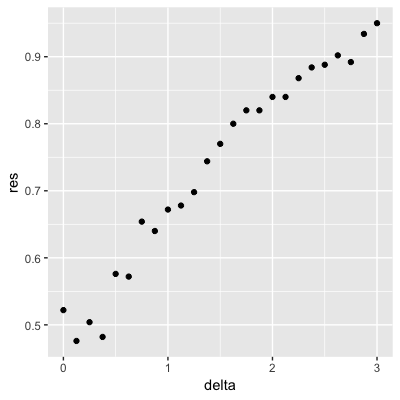

- [ ] B.

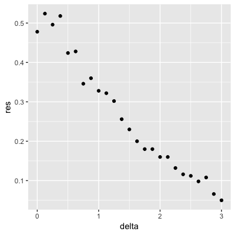

- [ ] C.

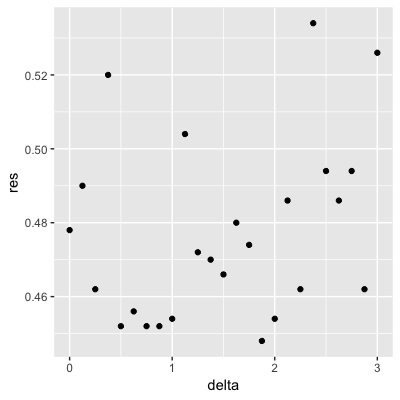

- [ ] D.

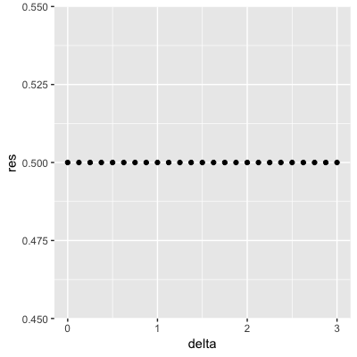

## Introduction to Smoothing

There is a link to the relevant section of the textbook: [Smoothing](https://rafalab.github.io/dsbook/smoothing.html){target="_blank"}

**Key points**

* **Smoothing** is a very powerful technique used all across data analysis. It is designed to detect trends in the presence of noisy data in cases in which the shape of the trend is unknown. 
* The concepts behind smoothing techniques are extremely useful in machine learning because **conditional expectations/probabilities** can be thought of as **trends** of unknown shapes that we need to estimate in the presence of uncertainty.

*Code*

```{r}
data("polls_2008")
qplot(day, margin, data = polls_2008)
```

## Bin Smoothing and Kernels

There is a link to the relevant sections of the textbook: [Bin smoothing](https://rafalab.github.io/dsbook/smoothing.html#bin-smoothing){target="_blank"} and [Kernels](https://rafalab.github.io/dsbook/smoothing.html#kernels){target="_blank"}

**Key points**

* The general idea of smoothing is to group data points into strata in which the value of $f(x)$ can be assumed to be constant. We can make this assumption because we think $f(x)$ changes slowly and, as a result, $f(x)$ is almost constant in small windows of time. 
* This assumption implies that a good estimate for $f(x)$ is the average of the $Y_{i}$ values in the window. The estimate is:

$\hat{f}(x_{0})=\frac{1}{N_{0}}\sum_{i\in{A_{0}}}Y_{i}$

* In smoothing, we call the size of the interval $|x-x_{0}|$ satisfying the particular condition the window size, bandwidth or span.

*Code*

```{r}
# bin smoothers
span <- 7 
fit <- with(polls_2008,ksmooth(day, margin, x.points = day, kernel="box", bandwidth =span))
polls_2008 %>% mutate(smooth = fit$y) %>%
    ggplot(aes(day, margin)) +
    geom_point(size = 3, alpha = .5, color = "grey") + 
    geom_line(aes(day, smooth), color="red")

# kernel
span <- 7
fit <- with(polls_2008, ksmooth(day, margin,  x.points = day, kernel="normal", bandwidth = span))
polls_2008 %>% mutate(smooth = fit$y) %>%
  ggplot(aes(day, margin)) +
  geom_point(size = 3, alpha = .5, color = "grey") + 
  geom_line(aes(day, smooth), color="red")
```

## Local Weighted Regression (loess)

There is a link to the relevant section of the textbook: [Local weighted regression](https://rafalab.github.io/dsbook/smoothing.html#local-weighted-regression-loess){target="_blank"}

**Key points**

* A limitation of the bin smoothing approach is that we need small windows for the approximately constant assumptions to hold which may lead to imprecise estimates of $f(x)$. **Local weighted regression (loess)** permits us to consider larger window sizes.
* One important difference between loess and bin smoother is that we assume the smooth function is locally **linear** in a window instead of constant.
* The result of loess is a smoother fit than bin smoothing because we use larger sample sizes to estimate our local parameters.

*Code*

```{r}
polls_2008 %>% ggplot(aes(day, margin)) +
  geom_point() + 
  geom_smooth(color="red", span = 0.15, method = "loess", method.args = list(degree=1))
```

## Comprehension Check - Smoothing

1. In the Wrangling course of this series, PH125.6x, we used the following code to obtain mortality counts for Puerto Rico for 2015-2018:

```{r}
if(!require(purrr)) install.packages("purrr")
if(!require(pdftools)) install.packages("pdftools")

library(tidyverse)
library(lubridate)
library(purrr)
library(pdftools)
    
fn <- system.file("extdata", "RD-Mortality-Report_2015-18-180531.pdf", package="dslabs")
dat <- map_df(str_split(pdf_text(fn), "\n"), function(s){
	s <- str_trim(s)
	header_index <- str_which(s, "2015")[1]
	tmp <- str_split(s[header_index], "\\s+", simplify = TRUE)
	month <- tmp[1]
	header <- tmp[-1]
	tail_index  <- str_which(s, "Total")
	n <- str_count(s, "\\d+")
	out <- c(1:header_index, which(n==1), which(n>=28), tail_index:length(s))
	s[-out] %>%
		str_remove_all("[^\\d\\s]") %>%
		str_trim() %>%
		str_split_fixed("\\s+", n = 6) %>%
		.[,1:5] %>%
		as_data_frame() %>% 
		setNames(c("day", header)) %>%
		mutate(month = month,
			day = as.numeric(day)) %>%
		gather(year, deaths, -c(day, month)) %>%
		mutate(deaths = as.numeric(deaths))
}) %>%
	mutate(month = recode(month, "JAN" = 1, "FEB" = 2, "MAR" = 3, "APR" = 4, "MAY" = 5, "JUN" = 6, 
                          "JUL" = 7, "AGO" = 8, "SEP" = 9, "OCT" = 10, "NOV" = 11, "DEC" = 12)) %>%
	mutate(date = make_date(year, month, day)) %>%
        dplyr::filter(date <= "2018-05-01")
```

Use the ```loess()``` function to obtain a smooth estimate of the expected number of deaths as a function of date. Plot this resulting smooth function. Make the span about two months long.

Which of the following plots is correct?

```{r}
span <- 60 / as.numeric(diff(range(dat$date)))
fit <- dat %>% mutate(x = as.numeric(date)) %>% loess(deaths ~ x, data = ., span = span, degree = 1)
dat %>% mutate(smooth = predict(fit, as.numeric(date))) %>%
	ggplot() +
	geom_point(aes(date, deaths)) +
	geom_line(aes(date, smooth), lwd = 2, col = "red")
```

- [X] A.

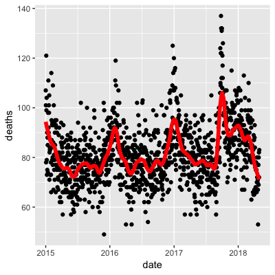

- [ ] B.

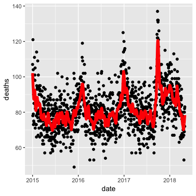

- [ ] C.


- [ ] D.

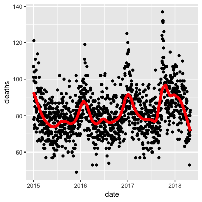

2. Work with the same data as in Q1 to plot smooth estimates against day of the year, all on the same plot, but with different colors for each year.

Which code produces the desired plot?

```{r}
dat %>% 
    mutate(smooth = predict(fit, as.numeric(date)), day = yday(date), year = as.character(year(date))) %>%
    ggplot(aes(day, smooth, col = year)) +
    geom_line(lwd = 2)
```

- [ ] A.

```{r, include=TRUE, eval=FALSE}
dat %>% 
    mutate(smooth = predict(fit), day = yday(date), year = as.character(year(date))) %>%
    ggplot(aes(day, smooth, col = year)) +
    geom_line(lwd = 2)
```

- [ ] B.

```{r, include=TRUE, eval=FALSE}
dat %>% 
    mutate(smooth = predict(fit, as.numeric(date)), day = mday(date), year = as.character(year(date))) %>%
    ggplot(aes(day, smooth, col = year)) +
    geom_line(lwd = 2)
```
 
- [ ] C.
 
```{r, include=TRUE, eval=FALSE}
 dat %>% 
    mutate(smooth = predict(fit, as.numeric(date)), day = yday(date), year = as.character(year(date))) %>%
    ggplot(aes(day, smooth)) +
    geom_line(lwd = 2)
```
        
- [X] D.
 
```{r, include=TRUE, eval=FALSE}
dat %>% 
    mutate(smooth = predict(fit, as.numeric(date)), day = yday(date), year = as.character(year(date))) %>%
    ggplot(aes(day, smooth, col = year)) +
    geom_line(lwd = 2)
```

3. Suppose we want to predict 2s and 7s in the ```mnist_27``` dataset with just the second covariate. Can we do this? On first inspection it appears the data does not have much predictive power.

In fact, if we fit a regular logistic regression the coefficient for ```x_2``` is not significant!

This can be seen using this code:

```{r}
if(!require(broom)) install.packages("broom")

library(broom)
mnist_27$train %>% glm(y ~ x_2, family = "binomial", data = .) %>% tidy()
```
    
Plotting a scatterplot here is not useful since ```y``` is binary:

```{r}
qplot(x_2, y, data = mnist_27$train)
```

Fit a loess line to the data above and plot the results. What do you observe?

```{r}
mnist_27$train %>% 
	mutate(y = ifelse(y=="7", 1, 0)) %>%
	ggplot(aes(x_2, y)) + 
	geom_smooth(method = "loess")
```

- [ ] A. There is no predictive power and the conditional probability is linear.
- [ ] B. There is no predictive power and the conditional probability is non-linear.
- [ ] C. There is predictive power and the conditional probability is linear.
- [X] D. There is predictive power and the conditional probability is non-linear.

## Matrices

There is a link to the relevant section of the textbook: [Matrices](https://rafalab.github.io/dsbook/large-datasets.html#matrix-algebra){target="_blank"}

**Key points**

* The main reason for using matrices is that certain mathematical operations needed to develop efficient code can be performed using techniques from a branch of mathematics called **linear algebra**.
* **Linear algebra** and **matrix notation** are key elements of the language used in academic papers describing machine learning techniques. 

*Code*

```{r}
if(!exists("mnist")) mnist <- read_mnist()

class(mnist$train$images)

x <- mnist$train$images[1:1000,] 
y <- mnist$train$labels[1:1000]
```

## Matrix Notation

There is a link to the relevant section of the textbook: [Matrix notation](https://rafalab.github.io/dsbook/large-datasets.html#notation-2){target="_blank"}

**Key points**

* In matrix algebra, we have three main types of objects: **scalars**, **vectors**, and **matrices**.
	* **Scalar:** $\alpha=1$
	* **Vector:** $X_{1} = \left(\begin{matrix} x_{1,1} \\ \vdots \\ x_{N,1} \\ \end{matrix}\right)$
	* **Matrix:** $X = [X_{1}X_{2}] = \left(\begin{matrix} x_{1,1} & x_{1,2} \\ \vdots & \vdots \\ x_{N,1} & x_{N,2} \\ \end{matrix}\right)$
* In R, we can extract the dimension of a matrix with the function ```dim()```. We can convert a vector into a matrix using the function ```as.matrix()```.

*Code*

```{r}
length(x[,1])
x_1 <- 1:5
x_2 <- 6:10
cbind(x_1, x_2)
dim(x)
dim(x_1)
dim(as.matrix(x_1))
dim(x)
```

## Converting a Vector to a Matrix

There is a link to the relevant section of the textbook: [Converting a vector to a matrix](https://rafalab.github.io/dsbook/large-datasets.html#converting-a-vector-to-a-matrix){target="_blank"}

**Key points**

* In R, we can **convert a vector into a matrix** with the ```matrix()``` function. The matrix is filled in by column, but we can fill by row by using the ```byrow``` argument. The function ```t()``` can be used to directly transpose a matrix. 
* Note that the matrix function **recycles values in the vector** without warning if the product of columns and rows does not match the length of the vector.

*Code*

```{r}
my_vector <- 1:15

# fill the matrix by column
mat <- matrix(my_vector, 5, 3)
mat

# fill by row
mat_t <- matrix(my_vector, 3, 5, byrow = TRUE)
mat_t
identical(t(mat), mat_t)
matrix(my_vector, 5, 5)
grid <- matrix(x[3,], 28, 28)
image(1:28, 1:28, grid)

# flip the image back
image(1:28, 1:28, grid[, 28:1])
```

## Row and Column Summaries and Apply

There is a link to the relevant section of the textbook: [Row and column summaries](https://rafalab.github.io/dsbook/large-datasets.html#row-and-column-summaries){target="_blank"}

**Key points**

* The function ```rowSums()``` computes the sum of each row.
* The function ```rowMeans()``` computes the average of each row.
* We can compute the column sums and averages using the functions ```colSums()``` and ```colMeans()```.
* The **matrixStats** package adds functions that performs operations on each row or column very efficiently, including the functions ```rowSds()``` and ```colSds()```.
* The ```apply()``` function lets you apply any function to a matrix. The first argument is the **matrix**, the second is the **dimension** (1 for rows, 2 for columns), and the third is the **function**. 

*Code*

```{r}
sums <- rowSums(x)
avg <- rowMeans(x)

data_frame(labels = as.factor(y), row_averages = avg) %>%
    qplot(labels, row_averages, data = ., geom = "boxplot")

avgs <- apply(x, 1, mean)
sds <- apply(x, 2, sd)
```

## Filtering Columns Based on Summaries

There is a link to the relevant section of the textbook: [Filtering columns based on summaries](https://rafalab.github.io/dsbook/large-datasets.html#filtering-columns-based-on-summaries){target="_blank"}

**Key points**

* The operations used to extract columns: ```x[,c(351,352)]```.
* The operations used to extract rows: ```x[c(2,3),]```.
* We can also use logical indexes to determine which columns or rows to keep:  ```new_x <- x[ ,colSds(x) > 60]```.
* **Important note:** if you select only one column or only one row, the result is no longer a matrix but a **vector**. We can **preserve the matrix class** by using the argument ```drop=FALSE```. 

*Code*

```{r}
if(!require(matrixStats)) install.packages("matrixStats")

library(matrixStats)

sds <- colSds(x)
qplot(sds, bins = "30", color = I("black"))
image(1:28, 1:28, matrix(sds, 28, 28)[, 28:1])

#extract columns and rows
x[ ,c(351,352)]
x[c(2,3),]
new_x <- x[ ,colSds(x) > 60]
dim(new_x)
class(x[,1])
dim(x[1,])

#preserve the matrix class
class(x[ , 1, drop=FALSE])
dim(x[, 1, drop=FALSE])
```

## Indexing with Matrices and Binarizing the Data

There is a link to the relevant sections of the textbook: [Indexing with matrices](https://rafalab.github.io/dsbook/large-datasets.html#indexing-with-matrices){target="_blank"} and [Binarizing the data](https://rafalab.github.io/dsbook/large-datasets.html#binarizing-the-data){target="_blank"}

**Key points**

* We can use logical operations with matrices:

```{r, include=TRUE, eval=FALSE}
mat <- matrix(1:15, 5, 3)
mat[mat > 6 & mat < 12] <- 0
```

* We can also binarize the data using just matrix operations:

```{r, include=TRUE, eval=FALSE}
bin_x <- x
bin_x[bin_x < 255/2] <- 0 
bin_x[bin_x > 255/2] <- 1
```

*Code*

```{r}
#index with matrices
mat <- matrix(1:15, 5, 3)
as.vector(mat)
qplot(as.vector(x), bins = 30, color = I("black"))
new_x <- x
new_x[new_x < 50] <- 0

mat <- matrix(1:15, 5, 3)
mat[mat < 3] <- 0
mat

mat <- matrix(1:15, 5, 3)
mat[mat > 6 & mat < 12] <- 0
mat

#binarize the data
bin_x <- x
bin_x[bin_x < 255/2] <- 0
bin_x[bin_x > 255/2] <- 1
bin_X <- (x > 255/2)*1
```

## Vectorization for Matrices and Matrix Algebra Operations

There is a link to the relevant sections of the textbook: [Vectorization for matrices](https://rafalab.github.io/dsbook/large-datasets.html#vectorization-for-matrices){target="_blank"} and [Matrix algebra operations](https://rafalab.github.io/dsbook/large-datasets.html#matrix-algebra-operations){target="_blank"}

**Key points**

* We can scale each row of a matrix using this line of code:

```{r, include=TRUE, eval=FALSE}
(x - rowMeans(x)) / rowSds(x)
```

* To scale each column of a matrix, we use this code:

```{r, include=TRUE, eval=FALSE}
t(t(X) - colMeans(X))
```

* We can also use a function called ```sweep()``` that works similarly to ```apply()```. It takes each entry of a vector and subtracts it from the corresponding row or column:

```{r, include=TRUE, eval=FALSE}
X_mean_0 <- sweep(x, 2, colMeans(x))
```

* Matrix multiplication: ```t(x) %*% x```
* The cross product: ```crossprod(x)```
* The inverse of a function: ```solve(crossprod(x))```
* The QR decomposition: ```qr(x)```

*Code*

```{r, include=TRUE, eval=FALSE}
#scale each row of a matrix
(x - rowMeans(x)) / rowSds(x)

#scale each column
t(t(x) - colMeans(x))
```

```{r}
#take each entry of a vector and subtracts it from the corresponding row or column
x_mean_0 <- sweep(x, 2, colMeans(x))

#divide by the standard deviation
x_mean_0 <- sweep(x, 2, colMeans(x))
x_standardized <- sweep(x_mean_0, 2, colSds(x), FUN = "/")
```

## Comprehension Check - Working with Matrices

1. Which line of code correctly creates a 100 by 10 matrix of randomly generated normal numbers and assigns it to ```x```?

- [ ] A. ```x <- matrix(rnorm(1000), 100, 100)```
        
- [X] B. ```x <- matrix(rnorm(100*10), 100, 10)```
        
- [ ] C. ```x <- matrix(rnorm(100*10), 10, 10)```
        
- [ ] D. ```x <- matrix(rnorm(100*10), 10, 100)```

2. Write the line of code that would give you the specified information about the matrix ```x``` that you generated in q1. Do not include any spaces in your line of code.

Dimension of x: ```dim(x)```

Number of rows of x: ```nrow(x)``` or ```dim(x)[1]``` or ```length(x[,1])```
 
Number of columns of x: ```ncol(x)``` or ```dim(x)[2]``` or ```length(x[1,])```

3. Which of the following lines of code would add the scalar 1 to row 1, the scalar 2 to row 2, and so on, for the matrix ```x```? Select ALL that apply.

- [X] A. ```x <- x + seq(nrow(x))```
        
- [ ] B. ```x <- 1:nrow(x)```
        
- [ ] C. ```x <- sweep(x, 2, 1:nrow(x),"+")```
        
- [X] D. ```x <- sweep(x, 1, 1:nrow(x),"+")```
        
4. Which of the following lines of code would add the scalar 1 to column 1, the scalar 2 to column 2, and so on, for the matrix ```x```? Select ALL that apply.

- [ ] A. ```x <- 1:ncol(x)```
        
- [ ] B. ```x <- 1:col(x)```
        
- [X] C. ```x <- sweep(x, 2, 1:ncol(x), FUN = "+")```
 
- [ ] D. ```x <- -x```

5. Which code correctly computes the average of each row of x?

- [ ] A. ```mean(x)```
        
- [ ] B. ```rowMedians(x)```
        
- [ ] C. ```sapply(x,mean)```
       
- [ ] D. ```rowSums(x)```
        
- [X] E. ```rowMeans(x)```
	  
Which code correctly computes the average of each column of x?

- [ ] A. ```mean(x)```
        
- [ ] B. ```sapply(x,mean)```
        
- [X] C. ```colMeans(x)```
        
- [ ] D. ```colMedians(x)```

- [ ] C. ```colSums(x)```

6. For each observation in the mnist training data, compute the proportion of pixels that are in the **grey area**, defined as values between 50 and 205 (but not including 50 and 205). (To visualize this, you can make a boxplot by digit class.)

What proportion of the 60000*784 pixels in the mnist training data are in the grey area overall, defined as values between 50 and 205? Report your answer to at least 3 significant digits.

```{r}
mnist <- read_mnist()
y <- rowMeans(mnist$train$images>50 & mnist$train$images<205)
qplot(as.factor(mnist$train$labels), y, geom = "boxplot")
mean(y) # proportion of pixels
```

# Section 4 - Distance, Knn, Cross Validation, and Generative Models

In the **Distance, kNN, Cross Validation, and Generative Models** section, you will learn about different types of discriminative and generative approaches for machine learning algorithms.

After completing this section, you will be able to:

* Use the **k-nearest neighbors (kNN)** algorithm.
* Understand the problems of **overtraining** and **oversmoothing**.
* Use **cross-validation** to reduce the **true error** and the **apparent error**. 
* Use **generative models** such as **naive Bayes, quadratic discriminant analysis (qda),** and **linear discriminant analysis (lda)** for machine learning.

This section has three parts: **nearest neighbors, cross-validation,** and **generative models**.

## Distance

There is a link to the relevant section of the textbook: [Distance](https://rafalab.github.io/dsbook/large-datasets.html#distance){target="_blank"}

**Key points**

* Most clustering and machine learning techniques rely on being able to define distance between observations, using features or predictors.
* With high dimensional data, a quick way to compute all the distances at once is to use the function ```dist()```, which computes the distance between each row and produces an object of class ```dist()```:

```{r, include=TRUE, eval=FALSE}
d <- dist(x)
```

* We can also compute distances between predictors. If $N$ is the number of observations, the distance between two predictors, say 1 and 2, is:

$\text{dist}(1,2) = \sqrt{\sum_{i=1}^N (x_{i,1} - x_{i,2})^2}$

* To compute the distance between all pairs of the 784 predictors, we can transpose the matrix first and then use dist():

```{r, include=TRUE, eval=FALSE}
d <- dist(t(x))
```

*Code*

```{r}
if(!exists("mnist")) mnist <- read_mnist()
set.seed(0) # if using R 3.5 or earlier
set.seed(0, sample.kind = "Rounding") # if using R 3.6 or later
ind <- which(mnist$train$labels %in% c(2,7)) %>% sample(500)

#the predictors are in x and the labels in y
x <- mnist$train$images[ind,]
y <- mnist$train$labels[ind]

y[1:3]

x_1 <- x[1,]
x_2 <- x[2,]
x_3 <- x[3,]

#distance between two numbers
sqrt(sum((x_1 - x_2)^2))
sqrt(sum((x_1 - x_3)^2))
sqrt(sum((x_2 - x_3)^2))

#compute distance using matrix algebra
sqrt(crossprod(x_1 - x_2))
sqrt(crossprod(x_1 - x_3))
sqrt(crossprod(x_2 - x_3))

#compute distance between each row
d <- dist(x)
class(d)
as.matrix(d)[1:3,1:3]

#visualize these distances
image(as.matrix(d))

#order the distance by labels
image(as.matrix(d)[order(y), order(y)])

#compute distance between predictors
d <- dist(t(x))
dim(as.matrix(d))

d_492 <- as.matrix(d)[492,]

image(1:28, 1:28, matrix(d_492, 28, 28))
```

## Comprehension Check - Distance

1. Load the following dataset:

```{r}
data(tissue_gene_expression)
```

This dataset includes a matrix ```x```:
 
```{r}
dim(tissue_gene_expression$x)
```
    
This matrix has the gene expression levels of 500 genes from 189 biological samples representing seven different tissues. The tissue type is stored in ```y```:

```{r}
table(tissue_gene_expression$y)
```
    
Which of the following lines of code computes the Euclidean distance between each observation and stores it in the object ```d```?

```{r}
d <- dist(tissue_gene_expression$x)
```

- [ ] A. ```d <- dist(tissue_gene_expression$x, distance='maximum')```      

- [ ] B. ```d <- dist(tissue_gene_expression)```        

- [X] C. ```d <- dist(tissue_gene_expression$x)```        

- [ ] D. ```d <- cor(tissue_gene_expression$x)```

2. Using the dataset from Q1, compare the distances between observations 1 and 2 (both cerebellum), observations 39 and 40 (both colon), and observations 73 and 74 (both endometrium).

Distance-wise, are samples from tissues of the same type closer to each other than tissues of different type?

```{r}
ind <- c(1, 2, 39, 40, 73, 74)
as.matrix(d)[ind,ind]
```

- [ ] A. No, the samples from the same tissue type are not necessarily closer.
- [ ] B. The two colon samples are close to each other, but the samples from the other two tissues are not.
- [ ] C. The two cerebellum samples are close to each other, but the samples from the other two tissues are not.
- [X] D. Yes, the samples from the same tissue type are closer to each other.

3. Make a plot of all the distances using the image() function to see if the pattern you observed in Q2 is general.

Which code would correctly make the desired plot?

```{r}
image(as.matrix(d))
```

- [ ] A. ```image(d)```      

- [X] B. ```image(as.matrix(d))```       

- [ ] C. ```d```

- [ ] D. ```image()```

## Knn

There is a link to the relevant section of the textbook: [k-nearest neighbors](https://rafalab.github.io/dsbook/examples-of-algorithms.html#k-nearest-neighbors){target="_blank"}

**Key points**

* **K-nearest neighbors (kNN)** estimates the conditional probabilities in a similar way to bin smoothing. However, kNN is easier to adapt to multiple dimensions.
* Using kNN, for any point $(x_1,x_2)$ for which we want an estimate of $p(x_1,x_2)$, we look for the **k nearest points** to $(x_1,x_2)$ and take an average of the 0s and 1s associated with these points. We refer to the set of points used to compute the average as the **neighborhood**. Larger values of k result in smoother estimates, while smaller values of k result in more flexible and more wiggly estimates. 
* To implement the algorithm, we can use the ```knn3()``` function from the **caret** package. There are two ways to call this function:
1. We need to specify a formula and a data frame. The formula looks like this: $\text{outcome} \sim \text{predictor}_1 + \text{predictor}_2 + \text{predictor}_3$. The ```predict()``` function for ```knn3``` produces a probability for each class.
2. We can also call the function with the first argument being the matrix predictors and the second a vector of outcomes, like this:

```{r, include=TRUE, eval=FALSE}
x <- as.matrix(mnist_27$train[,2:3])
y <- mnist_27$train$y
knn_fit <- knn3(x,y)
```

*Code*

```{r}
data("mnist_27")
mnist_27$test %>% ggplot(aes(x_1, x_2, color = y)) + geom_point()

#logistic regression
library(caret)
fit_glm <- glm(y~x_1+x_2, data=mnist_27$train, family="binomial")
p_hat_logistic <- predict(fit_glm, mnist_27$test)
y_hat_logistic <- factor(ifelse(p_hat_logistic > 0.5, 7, 2))
confusionMatrix(data = y_hat_logistic, reference = mnist_27$test$y)$overall[1]

#fit knn model
knn_fit <- knn3(y ~ ., data = mnist_27$train)

x <- as.matrix(mnist_27$train[,2:3])
y <- mnist_27$train$y
knn_fit <- knn3(x, y)

knn_fit <- knn3(y ~ ., data = mnist_27$train, k=5)

y_hat_knn <- predict(knn_fit, mnist_27$test, type = "class")
confusionMatrix(data = y_hat_knn, reference = mnist_27$test$y)$overall["Accuracy"]
```

## Over-training and Over-smoothing

There is a link to the relevant sections of the textbook: [Over-training](https://rafalab.github.io/dsbook/cross-validation.html#over-training){target="_blank"} and [Over-smoothing](https://rafalab.github.io/dsbook/cross-validation.html#over-smoothing){target="_blank"}

**Key points**

* **Over-training** is the reason that we have higher accuracy in the train set compared to the test set. Over-training is at its worst when we set $k=1$. With $k=1$, the estimate for each $(x_1,x_2)$ in the training set is obtained with just the $y$ corresponding to that point. 
* When we try a larger $k$, the $k$ might be so large that it does not permit enough flexibility. We call this **over-smoothing**.
* Note that if we use the test set to pick this $k$, we should not expect the accompanying accuracy estimate to extrapolate to the real world. This is because even here we broke a golden rule of machine learning: **we selected the $k$ using the test set. Cross validation** also provides an estimate that takes this into account.

*Code*

```{r}
y_hat_knn <- predict(knn_fit, mnist_27$train, type = "class") 
confusionMatrix(data = y_hat_knn, reference = mnist_27$train$y)$overall["Accuracy"]
y_hat_knn <- predict(knn_fit, mnist_27$test, type = "class")  
confusionMatrix(data = y_hat_knn, reference = mnist_27$test$y)$overall["Accuracy"]

#fit knn with k=1
knn_fit_1 <- knn3(y ~ ., data = mnist_27$train, k = 1)
y_hat_knn_1 <- predict(knn_fit_1, mnist_27$train, type = "class")
confusionMatrix(data=y_hat_knn_1, reference=mnist_27$train$y)$overall[["Accuracy"]]

y_hat_knn_1 <- predict(knn_fit_1, mnist_27$test, type = "class")
confusionMatrix(data=y_hat_knn_1, reference=mnist_27$test$y)$overall[["Accuracy"]]

#fit knn with k=401
knn_fit_401 <- knn3(y ~ ., data = mnist_27$train, k = 401)
y_hat_knn_401 <- predict(knn_fit_401, mnist_27$test, type = "class")
confusionMatrix(data=y_hat_knn_401, reference=mnist_27$test$y)$overall["Accuracy"]

#pick the k in knn
ks <- seq(3, 251, 2)
library(purrr)
accuracy <- map_df(ks, function(k){
    fit <- knn3(y ~ ., data = mnist_27$train, k = k)
    y_hat <- predict(fit, mnist_27$train, type = "class")
    cm_train <- confusionMatrix(data = y_hat, reference = mnist_27$train$y)
    train_error <- cm_train$overall["Accuracy"]
    y_hat <- predict(fit, mnist_27$test, type = "class")
    cm_test <- confusionMatrix(data = y_hat, reference = mnist_27$test$y)
    test_error <- cm_test$overall["Accuracy"]
    
tibble(train = train_error, test = test_error)
})


#pick the k that maximizes accuracy using the estimates built on the test data
ks[which.max(accuracy$test)]
max(accuracy$test)
```

## Comprehension Check - Nearest Neighbors

1. Previously, we used logistic regression to predict sex based on height. Now we are going to use knn to do the same. Set the seed to 1, then use the **caret** package to partition the **dslabs** ```heights``` data into a training and test set of equal size. Use the ```sapply()``` function to perform knn with ```k``` values of ```seq(1, 101, 3)``` and calculate F1 scores with the ```F_meas()``` function using the default value of the relevant argument.

What is the max value of ```F_1```?

At what value of ```k``` does the max occur?

```{r}
data("heights")

# set.seed(1) # if using R 3.5 or earlier
set.seed(1, sample.kind = "Rounding") # if using R 3.6 or later
test_index <- createDataPartition(heights$sex, times = 1, p = 0.5, list = FALSE)
test_set <- heights[test_index, ]
train_set <- heights[-test_index, ]     
                
ks <- seq(1, 101, 3)
F_1 <- sapply(ks, function(k){
	fit <- knn3(sex ~ height, data = train_set, k = k)
	y_hat <- predict(fit, test_set, type = "class") %>% 
		factor(levels = levels(train_set$sex))
	F_meas(data = y_hat, reference = test_set$sex)
})
plot(ks, F_1)
max(F_1)
ks[which.max(F_1)]
```

2. Next we will use the same gene expression example used in the Comprehension Check: Distance exercises. You can load it like this:

```{r, include=TRUE, eval=FALSE}
library(dslabs)
library(caret)
data("tissue_gene_expression")
```
    
First, set the seed to 1 and split the data into training and test sets with ```p = 0.5```. Then, report the accuracy you obtain from predicting tissue type using KNN with ```k = seq(1, 11, 2)``` using ```sapply()``` or ```map_df()```. Note: use the ```createDataPartition()``` function outside of ```sapply()``` or ```map_df()```.

```{r}
# set.seed(1) # if using R 3.5 or earlier
set.seed(1, sample.kind = "Rounding") # if using R 3.6 or later
y <- tissue_gene_expression$y
x <- tissue_gene_expression$x
test_index <- createDataPartition(y, list = FALSE)
sapply(seq(1, 11, 2), function(k){
	fit <- knn3(x[-test_index,], y[-test_index], k = k)
	y_hat <- predict(fit, newdata = data.frame(x=x[test_index,]),
				type = "class")
mean(y_hat == y[test_index])
})
```

## K-fold cross validation

There is a link to the relevant section of the textbook: [K-fold cross validation](https://rafalab.github.io/dsbook/cross-validation.html#k-fold-cross-validation){target="_blank"}

**Key points**

* For **$k$-fold cross validation**, we divide the dataset into a training set and a test set. We train our algorithm exclusively on the training set and use the test set only for evaluation purposes. 
* For each set of algorithm parameters being considered, we want an **estimate of the MSE and then we will choose the parameters with the smallest MSE**. In  $k$-fold cross validation, we randomly split the observations into $k$ non-overlapping sets, and repeat the calculation for MSE for each of these sets. Then, we compute the average MSE and obtain an estimate of our loss. Finally, we can select the optimal parameter that minimized the MSE.
* In terms of how to select $k$ for cross validation, **larger values of $k$ are preferable but they will also take much more** computational time. For this reason, the choices of $k=5$ and $k=10$ are common.


## Comprehension Check - Cross-validation

1. Generate a set of random predictors and outcomes using the following code:

```{r}     
# set.seed(1996) #if you are using R 3.5 or earlier
set.seed(1996, sample.kind="Rounding") #if you are using R 3.6 or later
n <- 1000
p <- 10000
x <- matrix(rnorm(n*p), n, p)
colnames(x) <- paste("x", 1:ncol(x), sep = "_")
y <- rbinom(n, 1, 0.5) %>% factor()

x_subset <- x[ ,sample(p, 100)]
```
    
Because ```x``` and ```y``` are completely independent, you should not be able to predict ```y``` using x with accuracy greater than 0.5. Confirm this by running cross-validation using logistic regression to fit the model. Because we have so many predictors, we selected a random sample ```x_subset```. Use the subset when training the model.

Which code correctly performs this cross-validation?

```{r}
fit <- train(x_subset, y, method = "glm")
fit$results
```

- [ ] A.

```{r, include=TRUE, eval=FALSE}
fit <- train(x_subset, y)
fit$results
```

- [X] B.

```{r, include=TRUE, eval=FALSE}
fit <- train(x_subset, y, method = "glm")
fit$results
```     
 
- [ ] C.

```{r, include=TRUE, eval=FALSE}         
fit <- train(y, x_subset, method = "glm")
fit$results
```       
 
- [ ] D.

```{r, include=TRUE, eval=FALSE}       
fit <- test(x_subset, y, method = "glm")
fit$results
```

2. Now, instead of using a random selection of predictors, we are going to search for those that are most predictive of the outcome. We can do this by comparing the values for the $y=1$ group to those in the $y=0$ group, for each predictor, using a t-test. You can do perform this step like this:

```{r}
if(!require(BiocManager)) install.packages("BiocManager")

BiocManager::install("genefilter")
library(genefilter)
tt <- colttests(x, y)
```
    
Which of the following lines of code correctly creates a vector of the p-values called pvals?

```{r}
pvals <- tt$p.value
```

- [ ] A. ```pvals <- tt$dm```
 
- [ ] B. ```pvals <- tt$statistic```
 
- [ ] C. ```pvals <- tt```
 
- [X] D. ```pvals <- tt$p.value```

3. Create an index ```ind``` with the column numbers of the predictors that were "statistically significantly" associated with ```y```. Use a p-value cutoff of 0.01 to define "statistically significantly."

How many predictors survive this cutoff?

```{r}
ind <- which(pvals <= 0.01)
length(ind)
```

4. Now re-run the cross-validation after redefinining ```x_subset``` to be the subset of ```x``` defined by the columns showing "statistically significant" association with ```y```.

What is the accuracy now?

```{r}
x_subset <- x[,ind]
fit <- train(x_subset, y, method = "glm")
fit$results
```

5. Re-run the cross-validation again, but this time using kNN. Try out the following grid ```k = seq(101, 301, 25)``` of tuning parameters. Make a plot of the resulting accuracies.

Which code is correct?

```{r}
fit <- train(x_subset, y, method = "knn", tuneGrid = data.frame(k = seq(101, 301, 25)))
ggplot(fit)
```

- [X] A.

```{r, include=TRUE, eval=FALSE}
fit <- train(x_subset, y, method = "knn", tuneGrid = data.frame(k = seq(101, 301, 25)))
ggplot(fit)
```       

- [ ] B.

```{r, include=TRUE, eval=FALSE}
fit <- train(x_subset, y, method = "knn")
ggplot(fit)
```       

- [ ] C.

```{r, include=TRUE, eval=FALSE}          
fit <- train(x_subset, y, method = "knn", tuneGrid = data.frame(k = seq(103, 301, 25)))
ggplot(fit)
```        
 
- [ ] D.

```{r, include=TRUE, eval=FALSE}           
fit <- train(x_subset, y, method = "knn", tuneGrid = data.frame(k = seq(101, 301, 5)))
ggplot(fit)
```

6. In the previous exercises, we see that despite the fact that ```x``` and ```y``` are completely independent, we were able to predict ```y``` with accuracy higher than 70%. We must be doing something wrong then.

What is it?

- [ ] A. The function ```train()``` estimates accuracy on the same data it uses to train the algorithm.
- [ ] B. We are overfitting the model by including 100 predictors.
- [X] C. We used the entire dataset to select the columns used in the model.
- [ ] D. The high accuracy is just due to random variability.

7. Use the ```train()``` function with kNN to select the best ```k``` for predicting tissue from gene expression on the ```tissue_gene_expression``` dataset from **dslabs**. Try ```k = seq(1,7,2)``` for tuning parameters. For this question, do not split the data into test and train sets (understand this can lead to overfitting, but ignore this for now).

What value of ```k``` results in the highest accuracy?

```{r}
data("tissue_gene_expression")
fit <- with(tissue_gene_expression, train(x, y, method = "knn", tuneGrid = data.frame( k = seq(1, 7, 2))))
ggplot(fit)
fit$results
```

## Bootstrap

There is a link to the relevant section of the textbook: [Bootstrap](https://rafalab.github.io/dsbook/cross-validation.html#bootstrap){target="_blank"}

**Key points**

* When we don't have access to the entire population, we can use **bootstrap** to estimate the population median $m$.
* The bootstrap permits us to **approximate a Monte Carlo simulation** without access to the entire distribution. The general idea is relatively simple. We act as if the observed sample is the population. We then sample datasets (with replacement) of the same sample size as the original dataset. Then we compute the summary statistic, in this case the median, on this bootstrap sample.
* Note that we can use ideas similar to those used in the bootstrap in **cross validation**: instead of dividing the data into equal partitions, we simply bootstrap many times.

*Code*

```{r}
n <- 10^6
income <- 10^(rnorm(n, log10(45000), log10(3)))
qplot(log10(income), bins = 30, color = I("black"))

m <- median(income)
m

set.seed(1)
#use set.seed(1, sample.kind="Rounding") instead if using R 3.6 or later
N <- 250
X <- sample(income, N)
M<- median(X)
M

library(gridExtra)
B <- 10^5
M <- replicate(B, {
    X <- sample(income, N)
    median(X)
})
p1 <- qplot(M, bins = 30, color = I("black"))
p2 <- qplot(sample = scale(M)) + geom_abline()
grid.arrange(p1, p2, ncol = 2)

mean(M)
sd(M)

B <- 10^5
M_star <- replicate(B, {
    X_star <- sample(X, N, replace = TRUE)
    median(X_star)
})

tibble(monte_carlo = sort(M), bootstrap = sort(M_star)) %>%
    qplot(monte_carlo, bootstrap, data = .) + 
    geom_abline()

quantile(M, c(0.05, 0.95))
quantile(M_star, c(0.05, 0.95))

median(X) + 1.96 * sd(X) / sqrt(N) * c(-1, 1)

mean(M) + 1.96 * sd(M) * c(-1,1)

mean(M_star) + 1.96 * sd(M_star) * c(-1, 1)
```

## Comprehension Check - Bootstrap

1. The ```createResample()``` function can be used to create bootstrap samples. For example, we can create the indexes for 10 bootstrap samples for the ```mnist_27``` dataset like this:

```{r}
data(mnist_27)
# set.seed(1995) # if R 3.5 or earlier
set.seed(1995, sample.kind="Rounding") # if R 3.6 or later
indexes <- createResample(mnist_27$train$y, 10)
```

How many times do 3, 4, and 7 appear in the first resampled index?

```{r}
sum(indexes[[1]] == 3)
sum(indexes[[1]] == 4)
sum(indexes[[1]] == 7)
```

2. We see that some numbers appear more than once and others appear no times. This has to be this way for each dataset to be independent. Repeat the exercise for all the resampled indexes.

What is the total number of times that 3 appears in all of the resampled indexes?

```{r}
x=sapply(indexes, function(ind){
	sum(ind == 3)
})
sum(x)
```

3. Generate a random dataset using the following code:

```{r}
y <- rnorm(100, 0, 1)
```
    
Estimate the 75th quantile, which we know is ```qnorm(0.75)```, with the sample quantile: ```quantile(y, 0.75)```.

Now, set the seed to 1 and perform a Monte Carlo simulation with 10,000 repetitions, generating the random dataset and estimating the 75th quantile each time. What is the expected value and standard error of the 75th quantile?

Report all answers to at least 3 decimal digits.

```{r}
# set.seed(1) # # if R 3.5 or earlier
set.seed(1, sample.kind = "Rounding") # if R 3.6 or later
B <- 10000
q_75 <- replicate(B, {
	y <- rnorm(100, 0, 1)
	quantile(y, 0.75)
})

mean(q_75)
sd(q_75)
```

4. In practice, we can't run a Monte Carlo simulation. Use the sample:

```{r}
# set.seed(1) # if R 3.5 or earlier
set.seed(1, sample.kind = "Rounding") # if R 3.6 or later
y <- rnorm(100, 0, 1)
```

Set the seed to 1 again after generating ```y``` and use 10 bootstrap samples to estimate the expected value and standard error of the 75th quantile.

```{r}
# set.seed(1) # if R 3.5 or earlier
set.seed(1, sample.kind = "Rounding") # if R 3.6 or later
y <- rnorm(100, 0, 1)

# set.seed(1) # if R 3.5 or earlier
set.seed(1, sample.kind="Rounding") # if R 3.6 or later
indexes <- createResample(y, 10)
q_75_star <- sapply(indexes, function(ind){
	y_star <- y[ind]
	quantile(y_star, 0.75)
})
mean(q_75_star)
sd(q_75_star)
```

5. Repeat the exercise from Q4 but with 10,000 bootstrap samples instead of 10. Set the seed to 1 first.

```{r}
# set.seed(1) # # if R 3.5 or earlier
set.seed(1, sample.kind = "Rounding") # if R 3.6 or later
indexes <- createResample(y, 10000)
q_75_star <- sapply(indexes, function(ind){
	y_star <- y[ind]
	quantile(y_star, 0.75)
})
mean(q_75_star)
sd(q_75_star)
```

6. When doing bootstrap sampling, the simulated samples are drawn from the empirical distribution of the original data.

True or False: The bootstrap is particularly useful in situations when we do not have access to the distribution or it is unknown.

- [X] A. True
- [ ] B. False

## Generative Models

There is a link to the relevant section of the textbook: [Generative models](https://rafalab.github.io/dsbook/examples-of-algorithms.html#generative-models){target="_blank"}

**Key points

* **Discriminative approaches** estimate the conditional probability directly and do not consider the distribution of the predictors. 
* **Generative models** are methods that model the joint distribution and $X$ (we model how the entire data, $X$ and $Y$, are generated).

## Naive Bayes

There is a link to the relevant section of the textbook: [Naive Bayes](https://rafalab.github.io/dsbook/examples-of-algorithms.html#naive-bayes){target="_blank"}

**Key points**

* Bayes' rule: 

$p(x) = Pr(Y = 1|X = x) = \frac{f_{X|Y=1}(X)Pr(Y = 1)}{f_{X|Y=0}(X)Pr(Y = 0) + f_{X|Y=1}(X)Pr(Y = 1)}$

with $f_{X|Y=1}$ and $f_{X|Y=0}$ representing the distribution functions of the predictor $X$ for the two classes $Y=1$ and $Y=0$. 

* The **Naive Bayes** approach is similar to the logistic regression prediction mathematically. However, we leave the demonstration to a more advanced text, such as [The Elements of Statistical Learning by Hastie, Tibshirani, and Friedman](https://web.stanford.edu/~hastie/Papers/ESLII.pdf){target="_blank"}.

*Code*

```{r}
# Generating train and test set
data("heights")
y <- heights$height
set.seed(2)
test_index <- createDataPartition(y, times = 1, p = 0.5, list = FALSE)
train_set <- heights %>% slice(-test_index)
test_set <- heights %>% slice(test_index)

# Estimating averages and standard deviations
params <- train_set %>%
 group_by(sex) %>%
 summarize(avg = mean(height), sd = sd(height))
params

# Estimating the prevalence
pi <- train_set %>% summarize(pi=mean(sex=="Female")) %>% pull(pi)
pi

# Getting an actual rule
x <- test_set$height
f0 <- dnorm(x, params$avg[2], params$sd[2])
f1 <- dnorm(x, params$avg[1], params$sd[1])
p_hat_bayes <- f1*pi / (f1*pi + f0*(1 - pi))
```

## Controlling Prevalence

There is a link to the relevant section of the textbook: [Controlling prevalence](https://rafalab.github.io/dsbook/examples-of-algorithms.html#controlling-prevalence){target="_blank"}

**Key points**

* The Naive Bayes approach includes a **parameter to account for differences in prevalence** $\pi = Pr(Y = 1)$. If we use hats to denote the estimates, we can write $\hat{p(x)}$ as: 

$\hat{p}(x)= \frac{\hat{f}_{X|Y=1}(x) \hat{\pi}}{ \hat{f}_{X|Y=0}(x)(1-\hat{\pi}) + \hat{f}_{X|Y=1}(x)\hat{\pi} }$

* The Naive Bayes approach gives us a direct way to correct the imbalance between sensitivity and specificity by simply forcing $\hat{\pi}$ to be whatever value we want it to be in order to better **balance specificity and sensitivity**. 

*Code*

```{r}
# Computing sensitivity
y_hat_bayes <- ifelse(p_hat_bayes > 0.5, "Female", "Male")
sensitivity(data = factor(y_hat_bayes), reference = factor(test_set$sex))

# Computing specificity
specificity(data = factor(y_hat_bayes), reference = factor(test_set$sex))

# Changing the cutoff of the decision rule
p_hat_bayes_unbiased <- f1 * 0.5 / (f1 * 0.5 + f0 * (1 - 0.5))
y_hat_bayes_unbiased <- ifelse(p_hat_bayes_unbiased > 0.5, "Female", "Male")
sensitivity(data = factor(y_hat_bayes_unbiased), reference = factor(test_set$sex))
specificity(data = factor(y_hat_bayes_unbiased), reference = factor(test_set$sex))

# Draw plot
qplot(x, p_hat_bayes_unbiased, geom = "line") +
 geom_hline(yintercept = 0.5, lty = 2) +
 geom_vline(xintercept = 67, lty = 2)
```

## qda and lda

There is a link to the relevant sections of the textbook: [Quadratic discriminant analysis](https://rafalab.github.io/dsbook/examples-of-algorithms.html#quadratic-discriminant-analysis){target="_blank"} and [Linear discriminant analysis](https://rafalab.github.io/dsbook/examples-of-algorithms.html#linear-discriminant-analysis){target="_blank"}

**Key points**

* **Quadratic discriminant analysis (QDA)** is a version of Naive Bayes in which we assume that the distributions $p_{X|Y=1}(x)$ and $p_{X|Y=0}(x)$ are multivariate normal. 
* QDA can work well with a few predictors, but it becomes **harder to use as the number of predictors increases**. Once the number of parameters approaches the size of our data, the method becomes impractical due to overfitting.
* Forcing the assumption that all predictors share the same standard deviations and correlations, the boundary will be a line, just as with logistic regression. For this reason, we call the method **linear discriminant analysis (LDA)**.
* In the case of LDA, the lack of flexibility **does not permit us to capture the non-linearity** in the true conditional probability function.

*Code*

**QDA**

```{r}
# Load data
data("mnist_27")

# Estimate parameters from the data
params <- mnist_27$train %>%
 group_by(y) %>%
 summarize(avg_1 = mean(x_1), avg_2 = mean(x_2),
        sd_1 = sd(x_1), sd_2 = sd(x_2),
        r = cor(x_1, x_2))

# Contour plots
mnist_27$train %>% mutate(y = factor(y)) %>%
 ggplot(aes(x_1, x_2, fill = y, color = y)) +
 geom_point(show.legend = FALSE) +
 stat_ellipse(type="norm", lwd = 1.5)

# Fit model
library(caret)
train_qda <- train(y ~., method = "qda", data = mnist_27$train)
# Obtain predictors and accuracy
y_hat <- predict(train_qda, mnist_27$test)
confusionMatrix(data = y_hat, reference = mnist_27$test$y)$overall["Accuracy"]

# Draw separate plots for 2s and 7s
mnist_27$train %>% mutate(y = factor(y)) %>%
 ggplot(aes(x_1, x_2, fill = y, color = y)) +
 geom_point(show.legend = FALSE) +
 stat_ellipse(type="norm") +
 facet_wrap(~y)
```

**LDA**

```{r}
params <- mnist_27$train %>%
 group_by(y) %>%
 summarize(avg_1 = mean(x_1), avg_2 = mean(x_2),
        sd_1 = sd(x_1), sd_2 = sd(x_2),
        r = cor(x_1, x_2))
params <- params %>% mutate(sd_1 = mean(sd_1), sd_2 = mean(sd_2), r = mean(r))
train_lda <- train(y ~., method = "lda", data = mnist_27$train)
y_hat <- predict(train_lda, mnist_27$test)
confusionMatrix(data = y_hat, reference = mnist_27$test$y)$overall["Accuracy"]
```

## Case Study - More than Three Classes

There is a link to the relevant section of the textbook: [Case study: more than three classes](https://rafalab.github.io/dsbook/examples-of-algorithms.html#case-study-more-than-three-classes){target="_blank"}

**Key points**

* In this case study, we will briefly give a slightly more complex example: one with **3 classes instead of 2**. Then we will fit QDA, LDA, and KNN models for prediction.
* Generative models can be very powerful, but only when we are able to **successfully approximate the joint distribution** of predictors conditioned on each class.

*Code*

```{r}
if(!exists("mnist"))mnist <- read_mnist()

set.seed(3456)    #use set.seed(3456, sample.kind="Rounding") in R 3.6 or later
index_127 <- sample(which(mnist$train$labels %in% c(1,2,7)), 2000)
y <- mnist$train$labels[index_127] 
x <- mnist$train$images[index_127,]
index_train <- createDataPartition(y, p=0.8, list = FALSE)

# get the quadrants
# temporary object to help figure out the quadrants
row_column <- expand.grid(row=1:28, col=1:28)
upper_left_ind <- which(row_column$col <= 14 & row_column$row <= 14)
lower_right_ind <- which(row_column$col > 14 & row_column$row > 14)

# binarize the values. Above 200 is ink, below is no ink
x <- x > 200 

# cbind proportion of pixels in upper right quadrant and proportion of pixels in lower right quadrant
x <- cbind(rowSums(x[ ,upper_left_ind])/rowSums(x),
           rowSums(x[ ,lower_right_ind])/rowSums(x)) 

train_set <- data.frame(y = factor(y[index_train]),
                        x_1 = x[index_train,1],
                        x_2 = x[index_train,2])

test_set <- data.frame(y = factor(y[-index_train]),
                       x_1 = x[-index_train,1],
                       x_2 = x[-index_train,2])

train_set %>%  ggplot(aes(x_1, x_2, color=y)) + geom_point()

train_qda <- train(y ~ ., method = "qda", data = train_set)
predict(train_qda, test_set, type = "prob") %>% head()
predict(train_qda, test_set) %>% head()
confusionMatrix(predict(train_qda, test_set), test_set$y)$table
confusionMatrix(predict(train_qda, test_set), test_set$y)$overall["Accuracy"]
train_lda <- train(y ~ ., method = "lda", data = train_set)
confusionMatrix(predict(train_lda, test_set), test_set$y)$overall["Accuracy"]
train_knn <- train(y ~ ., method = "knn", tuneGrid = data.frame(k = seq(15, 51, 2)),
    data = train_set)
confusionMatrix(predict(train_knn, test_set), test_set$y)$overall["Accuracy"]
train_set %>% mutate(y = factor(y)) %>% ggplot(aes(x_1, x_2, fill = y, color=y)) + geom_point(show.legend = FALSE) + stat_ellipse(type="norm")
```

## Comprehension Check - Generative Models

In the following exercises, we are going to apply LDA and QDA to the ```tissue_gene_expression``` dataset from **dslabs**. We will start with simple examples based on this dataset and then develop a realistic example.

1. Create a dataset of samples from just cerebellum and hippocampus, two parts of the brain, and a predictor matrix with 10 randomly selected columns using the following code:

```{r}
data("tissue_gene_expression")
      
# set.seed(1993) #if using R 3.5 or earlier
set.seed(1993, sample.kind="Rounding") # if using R 3.6 or later
ind <- which(tissue_gene_expression$y %in% c("cerebellum", "hippocampus"))
y <- droplevels(tissue_gene_expression$y[ind])
x <- tissue_gene_expression$x[ind, ]
x <- x[, sample(ncol(x), 10)]
```
    
Use the ```train()``` function to estimate the accuracy of LDA. For this question, use the version of ```x``` and ```y``` created with the code above: do not split them or ```tissue_gene_expression``` into training and test sets (understand this can lead to overfitting). Report the accuracy from the ```train()``` results (do not make predictions).

What is the accuracy? Enter your answer as a percentage or decimal (eg "50%" or "0.50") to at least the thousandths place.

```{r}
fit_lda <- train(x, y, method = "lda")
fit_lda$results["Accuracy"]
```

2. In this case, LDA fits two 10-dimensional normal distributions. Look at the fitted model by looking at the ```finalModel``` component of the result of ```train()```. Notice there is a component called ```means``` that includes the estimated means of both distributions. Plot the mean vectors against each other and determine which predictors (genes) appear to be driving the algorithm.

Which TWO genes appear to be driving the algorithm (i.e. the two genes with the highest means)?

```{r}
t(fit_lda$finalModel$means) %>% data.frame() %>%
	mutate(predictor_name = rownames(.)) %>%
	ggplot(aes(cerebellum, hippocampus, label = predictor_name)) +
	geom_point() +
	geom_text() +
	geom_abline()
```

- [ ] A. PLCB1
- [X] B. RAB1B
- [ ] C. MSH4
- [X] D. OAZ2
- [ ] E. SPI1
- [ ] F. SAPCD1
- [ ] G. HEMK1

3. Repeat the exercise in Q1 with QDA.

Create a dataset of samples from just cerebellum and hippocampus, two parts of the brain, and a predictor matrix with 10 randomly selected columns using the following code:

```{r}
data("tissue_gene_expression")
      
set.seed(1993) #set.seed(1993, sample.kind="Rounding") if using R 3.6 or later
ind <- which(tissue_gene_expression$y %in% c("cerebellum", "hippocampus"))
y <- droplevels(tissue_gene_expression$y[ind])
x <- tissue_gene_expression$x[ind, ]
x <- x[, sample(ncol(x), 10)]
```
    
Use the ```train()``` function to estimate the accuracy of QDA. For this question, use the version of ```x``` and ```y``` created above instead of the default from ```tissue_gene_expression```. Do not split them into training and test sets (understand this can lead to overfitting).

What is the accuracy?

```{r}
fit_qda <- train(x, y, method = "qda")
fit_qda$results["Accuracy"]
```

4. Which TWO genes drive the algorithm when using QDA instead of LDA (i.e. the two genes with the highest means)?

```{r}
t(fit_qda$finalModel$means) %>% data.frame() %>%
	mutate(predictor_name = rownames(.)) %>%
	ggplot(aes(cerebellum, hippocampus, label = predictor_name)) +
	geom_point() +
	geom_text() +
	geom_abline()
```

- [ ] A. PLCB1
- [X] B. RAB1B
- [ ] C. MSH4
- [X] D. OAZ2
- [ ] E. SPI1
- [ ] F. SAPCD1
- [ ] G. HEMK1

5. One thing we saw in the previous plots is that the values of the predictors correlate in both groups: some predictors are low in both groups and others high in both groups. The mean value of each predictor found in ```colMeans(x)``` is not informative or useful for prediction and often for purposes of interpretation, it is useful to center or scale each column. This can be achieved with the ```preProcess``` argument in ```train()```. Re-run LDA with ```preProcess = "center"```. Note that accuracy does not change, but it is now easier to identify the predictors that differ more between groups than based on the plot made in Q2.

Which TWO genes drive the algorithm after performing the scaling?

```{r}
fit_lda <- train(x, y, method = "lda", preProcess = "center")
fit_lda$results["Accuracy"]
t(fit_lda$finalModel$means) %>% data.frame() %>%
	mutate(predictor_name = rownames(.)) %>%
	ggplot(aes(predictor_name, hippocampus)) +
	geom_point() +
	coord_flip()
```

- [ ] A. C21orf62
- [ ] B. PLCB1
- [ ] C. RAB1B
- [ ] D. MSH4
- [X] E. OAZ2
- [X] F. SPI1
- [ ] G. SAPCD1
- [ ] H. IL18R1

You can see that it is different genes driving the algorithm now. This is because the predictor means change.
In the previous exercises we saw that both LDA and QDA approaches worked well. For further exploration of the data, you can plot the predictor values for the two genes with the largest differences between the two groups in a scatter plot to see how they appear to follow a bivariate distribution as assumed by the LDA and QDA approaches, coloring the points by the outcome, using the following code:

```{r}
d <- apply(fit_lda$finalModel$means, 2, diff)
ind <- order(abs(d), decreasing = TRUE)[1:2]
plot(x[, ind], col = y)
```

6. Now we are going to increase the complexity of the challenge slightly. Repeat the LDA analysis from Q5 but using all tissue types. Use the following code to create your dataset:

```{r}
data("tissue_gene_expression")
           
# set.seed(1993) # if using R 3.5 or earlier
set.seed(1993, sample.kind="Rounding") # if using R 3.6 or later
y <- tissue_gene_expression$y
x <- tissue_gene_expression$x
x <- x[, sample(ncol(x), 10)]
```

What is the accuracy using LDA?

```{r}
fit_lda <- train(x, y, method = "lda", preProcess = c("center"))
fit_lda$results["Accuracy"]
```

# Section 5 - Classification with More than Two Classes and the Caret Package

In the **Classification with More than Two Classes and the Caret Package** section, you will learn how to overcome the curse of dimensionality using methods that adapt to higher dimensions and how to use the caret package to implement many different machine learning algorithms.

After completing this section, you will be able to:

* Use **classification and regression trees**.
* Use **classification (decision) trees**.
* Apply **random forests** to address the shortcomings of decision trees. 
* Use the **caret** package to implement a variety of machine learning algorithms.

This section has three parts: **classification with more than two classes, caret package**, and a **set of exercises** on the Titanic.

## Trees Motivation

There is a link to the relevant section of the textbook: [The curse of dimensionality](https://rafalab.github.io/dsbook/examples-of-algorithms.html#the-curse-of-dimensionality){target="_blank"}

**Key points**

* LDA and QDA are not **meant to be used with many predictors $p$** because the number of parameters needed to be estimated becomes too large.
* **Curse of dimensionality:** For kernel methods such as kNN or local regression, when they have multiple predictors used,  the span/neighborhood/window made to include a given percentage of the data become large. With larger neighborhoods, our methods lose flexibility. The dimension here refers to the fact that when we have $p$ predictors, the distance between two observations is computed in $p$-dimensional space.

## Classification and Regression Trees (CART)

There is a link to the relevant sections of the textbook: [CART motivation](https://rafalab.github.io/dsbook/examples-of-algorithms.html#cart-motivation){target="_blank"} and [Regression trees](https://rafalab.github.io/dsbook/examples-of-algorithms.html#regression-trees){target="_blank"}

**Key points**

* A tree is basically a **flow chart of yes or no questions**. The general idea of the methods we are describing is to define an algorithm that uses data to create these trees with predictions at the ends, referred to as nodes.
* When the outcome is continuous, we call the decision tree method a **regression tree**.
* Regression and decision trees operate by predicting an outcome variable $Y$ by **partitioning the predictors**.
* The general idea here is to **build a decision tree** and, at end of each node, obtain a predictor $\hat{y}$. Mathematically, we are **partitioning the predictor space** into $J$ non-overlapping regions, $R_{1}$, $R_{2}$, ..., $R_{J}$ and then for any predictor $x$ that falls within region $R_{j}$, estimate $f(x)$ with the average of the training observations $y_{i}$ for which the associated predictor $x_{i}$ in also in $R_{j}$.
* To pick $j$ and its value $s$, we find the pair that **minimizes the residual sum of squares (RSS)**:

$\sum_{i: x_{i}R_{1}(j,s)}(y_{i} - \hat{y}_{R_{1}})^2 + \sum_{i: x_{i}R_{2}(j,s)}(y_{i} - \hat{y}_{R_{2}})^2$

* To fit the regression tree model, we can use the ```rpart()``` function in the **rpart** package.
* Two common parameters used for partition decision are the **complexity parameter** (```cp```) and the **minimum number of observations required in a partition** before partitioning it further (```minsplit``` in the **rpart** package). 
* If we already have a tree and want to apply a higher ```cp``` value, we can use the ```prune()``` function. We call this pruning a tree because we are snipping off partitions that do not meet a cp criterion. 

*Code*

```{r}
# Load data
data("olive")
olive %>% as_tibble()
table(olive$region)
olive <- dplyr::select(olive, -area)

# Predict region using KNN
fit <- train(region ~ .,  method = "knn", 
             tuneGrid = data.frame(k = seq(1, 15, 2)), 
             data = olive)
ggplot(fit)

# Plot distribution of each predictor stratified by region
olive %>% gather(fatty_acid, percentage, -region) %>%
  ggplot(aes(region, percentage, fill = region)) +
  geom_boxplot() +
  facet_wrap(~fatty_acid, scales = "free") +
  theme(axis.text.x = element_blank())

# plot values for eicosenoic and linoleic
p <- olive %>% 
  ggplot(aes(eicosenoic, linoleic, color = region)) + 
  geom_point()
p + geom_vline(xintercept = 0.065, lty = 2) + 
  geom_segment(x = -0.2, y = 10.54, xend = 0.065, yend = 10.54, color = "black", lty = 2)

# load data for regression tree
data("polls_2008")
qplot(day, margin, data = polls_2008)

if(!require(rpart)) install.packages("rpart")

library(rpart)
fit <- rpart(margin ~ ., data = polls_2008)

# visualize the splits 
plot(fit, margin = 0.1)
text(fit, cex = 0.75)
polls_2008 %>% 
  mutate(y_hat = predict(fit)) %>% 
  ggplot() +
  geom_point(aes(day, margin)) +
  geom_step(aes(day, y_hat), col="red")

# change parameters
fit <- rpart(margin ~ ., data = polls_2008, control = rpart.control(cp = 0, minsplit = 2))
polls_2008 %>% 
  mutate(y_hat = predict(fit)) %>% 
  ggplot() +
  geom_point(aes(day, margin)) +
  geom_step(aes(day, y_hat), col="red")

# use cross validation to choose cp
train_rpart <- train(margin ~ ., method = "rpart", tuneGrid = data.frame(cp = seq(0, 0.05, len = 25)), data = polls_2008)
ggplot(train_rpart)

# access the final model and plot it
plot(train_rpart$finalModel, margin = 0.1)
text(train_rpart$finalModel, cex = 0.75)
polls_2008 %>% 
  mutate(y_hat = predict(train_rpart)) %>% 
  ggplot() +
  geom_point(aes(day, margin)) +
  geom_step(aes(day, y_hat), col="red")

# prune the tree 
pruned_fit <- prune(fit, cp = 0.01)
```

## Classification (Decision) Trees

There is a link to the relevant section of the textbook: [Classification (decision) trees](https://rafalab.github.io/dsbook/examples-of-algorithms.html#classification-decision-trees){target="_blank"}

**Key points**

* **Classification trees**, or decision trees, are used in prediction problems where the **outcome is categorical**. 
* Decision trees form predictions by calculating **which class is the most common** among the training set observations within the partition, rather than taking the average in each partition.
* Two of the more popular metrics to choose the partitions are the **Gini index** and **entropy**.

$\text{Gini}(j) = \sum_{k=1}^K\hat{p}_{j,k}(1 - \hat{p}_{j,k})$

$\text{entropy}(j) = - \sum_{k=1}^K\hat{p}_{j,k}log(\hat{p}_{j,k}), \text{with } 0 \times \log(0) \text{defined as } 0$

* Pros: Classification trees are highly interpretable and easy to visualize.They can model human decision processes and don’t require use of dummy predictors for categorical variables.
* Cons: The approach via recursive partitioning can easily over-train and is therefore a bit harder to train than. Furthermore, in terms of accuracy, it is rarely the best performing method since it is not very flexible and is highly unstable to changes in training data. 

*Code*

```{r}
# fit a classification tree and plot it
train_rpart <- train(y ~ .,
              method = "rpart",
              tuneGrid = data.frame(cp = seq(0.0, 0.1, len = 25)),
              data = mnist_27$train)
plot(train_rpart)

# compute accuracy
confusionMatrix(predict(train_rpart, mnist_27$test), mnist_27$test$y)$overall["Accuracy"]
```

## Random Forests

There is a link to the relevant section of the textbook: [Random forests](https://rafalab.github.io/dsbook/examples-of-algorithms.html#random-forests){target="_blank"}

**Key points**

* **Random forests** are a very popular machine learning approach that addresses the shortcomings of decision trees. The goal is to improve prediction performance and reduce instability by **averaging multiple decision trees** (a forest of trees constructed with randomness).
* The general idea of random forests is to generate many predictors, each using regression or classification trees, and then **forming a final prediction based on the average prediction of all these trees**. To assure that the individual trees are not the same, we use the **bootstrap to induce randomness**. 
* A **disadvantage** of random forests is that we **lose interpretability**.
* An approach that helps with interpretability is to examine **variable importance**. To define variable importance we **count how often a predictor is used in the individual trees**. The **caret** package includes the function ```varImp``` that extracts variable importance from any model in which the calculation is implemented. 

*Code*

```{r}
if(!require(randomForest)) install.packages("randomForest")
if(!require(Rborist)) install.packages("Rborist")

library(randomForest)
fit <- randomForest(margin~., data = polls_2008) 
plot(fit)

polls_2008 %>%
  mutate(y_hat = predict(fit, newdata = polls_2008)) %>% 
  ggplot() +
  geom_point(aes(day, margin)) +
  geom_line(aes(day, y_hat), col="red")

train_rf <- randomForest(y ~ ., data=mnist_27$train)
confusionMatrix(predict(train_rf, mnist_27$test), mnist_27$test$y)$overall["Accuracy"]

# use cross validation to choose parameter
train_rf_2 <- train(y ~ .,
      method = "Rborist",
      tuneGrid = data.frame(predFixed = 2, minNode = c(3, 50)),
      data = mnist_27$train)
confusionMatrix(predict(train_rf_2, mnist_27$test), mnist_27$test$y)$overall["Accuracy"]
```

## Comprehension Check - Trees and Random Forests

1. Create a simple dataset where the outcome grows 0.75 units on average for every increase in a predictor, using this code:

```{r}
n <- 1000
sigma <- 0.25
# set.seed(1) # if using R 3.5 or ealier
set.seed(1, sample.kind = "Rounding") # if using R 3.6 or later
x <- rnorm(n, 0, 1)
y <- 0.75 * x + rnorm(n, 0, sigma)
dat <- data.frame(x = x, y = y)
```

Which code correctly uses rpart() to fit a regression tree and saves the result to fit?

- [ ] A. ```fit <- rpart(y ~ .)```

- [ ] B. ```fit <- rpart(y, ., data = dat)``` 
        
- [ ] C. ```fit <- rpart(x ~ ., data = dat)``` 
        
- [X] D. ```fit <- rpart(y ~ ., data = dat)```

2. Which of the following plots has the same tree shape obtained in Q1?

```{r}
fit <- rpart(y ~ ., data = dat)
plot(fit)
text(fit)
```

- [ ] A.

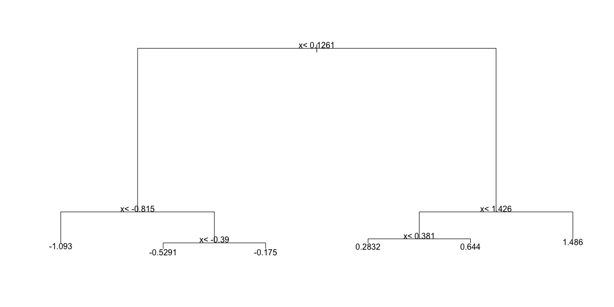

- [ ] B.

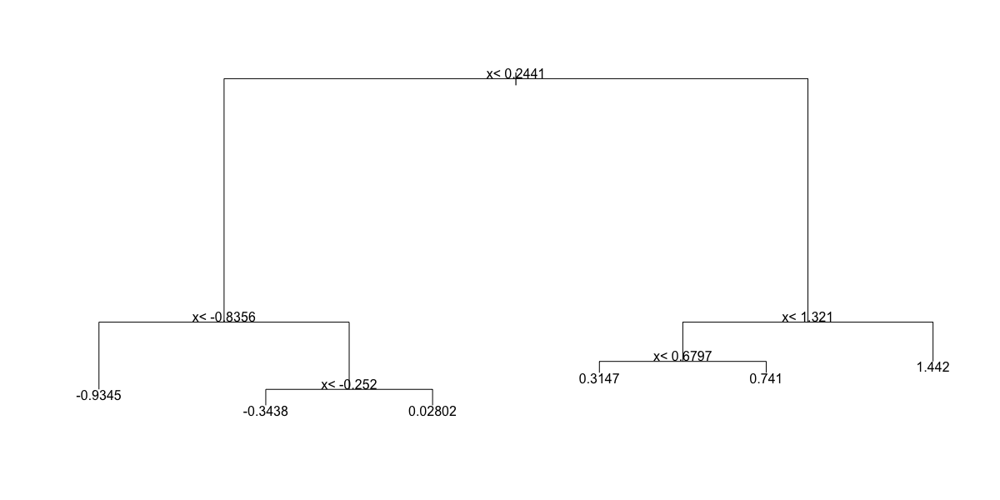

- [ ] C.

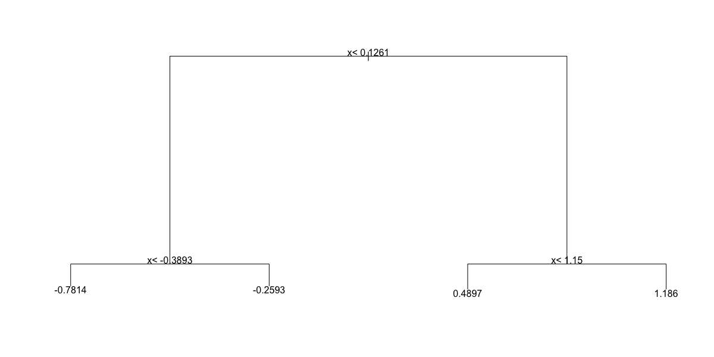

- [X] D.

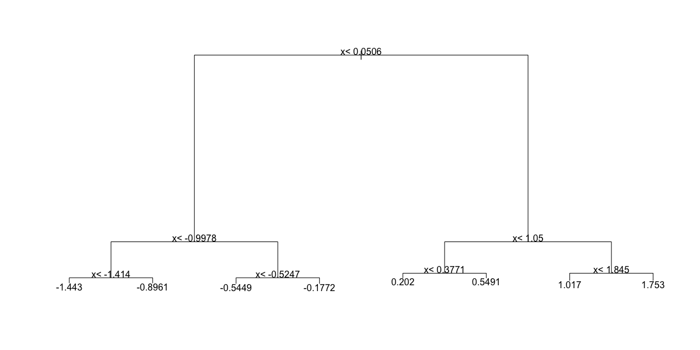

3. Below is most of the code to make a scatter plot of ```y``` versus ```x``` along with the predicted values based on the fit.

```{r, include=TRUE, eval=FALSE}
dat %>% 
mutate(y_hat = predict(fit)) %>% 
ggplot() +
geom_point(aes(x, y)) +
#BLANK
```    

Which line of code should be used to replace #BLANK in the code above?

```{r}
dat %>% 
mutate(y_hat = predict(fit)) %>% 
ggplot() +
geom_point(aes(x, y)) +
geom_step(aes(x, y_hat), col=2)
```

- [X] A. ```geom_step(aes(x, y_hat), col=2)```
        
- [ ] B. ```geom_smooth(aes(y_hat, x), col=2)```
        
- [ ] C. ```geom_quantile(aes(x, y_hat), col=2)```

- [ ] D. ```geom_step(aes(y_hat, x), col=2)```

4. Now run Random Forests instead of a regression tree using ```randomForest()``` from the **randomForest** package, and remake the scatterplot with the prediction line. Part of the code is provided for you below.

```{r, include=TRUE, eval=FALSE}    
library(randomForest)
fit <- #BLANK 
dat %>% 
	mutate(y_hat = predict(fit)) %>% 
	ggplot() +
	geom_point(aes(x, y)) +
	geom_step(aes(x, y_hat), col = "red")
```
 
What code should replace #BLANK in the provided code?

```{r}    
library(randomForest)
fit <- randomForest(y ~ x, data = dat) 
dat %>% 
	mutate(y_hat = predict(fit)) %>% 
	ggplot() +
	geom_point(aes(x, y)) +
	geom_step(aes(x, y_hat), col = "red")
```

- [X] A. ```randomForest(y ~ x, data = dat)```
        
- [ ] B. ```randomForest(x ~ y, data = dat)```
        
- [ ] C. ```randomForest(y ~ x, data = data)```
        
- [ ] D. ```randomForest(x ~ y)```

5. Use the ```plot()``` function to see if the Random Forest from Q4 has converged or if we need more trees.

Which of these graphs is most similar to the one produced by plotting the random forest? Note that there may be slight differences due to the seed not being set.

```{r}
plot(fit)
```

- [ ] A.

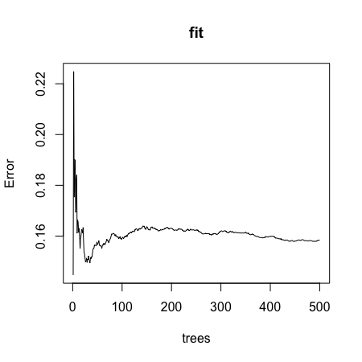

- [ ] B.

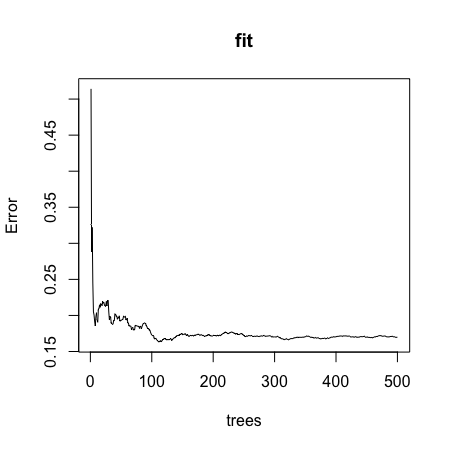

- [X] C.

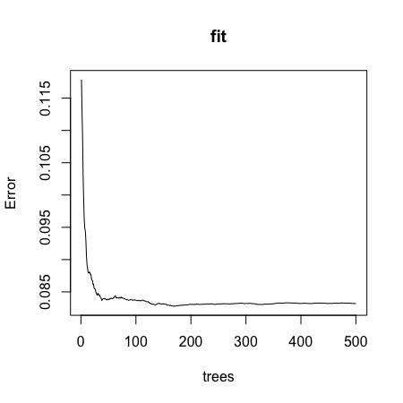

- [ ] D.

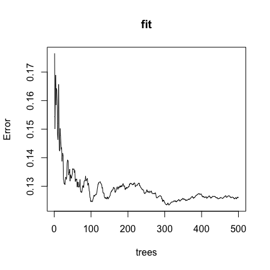

6. It seems that the default values for the Random Forest result in an estimate that is too flexible (unsmooth). Re-run the Random Forest but this time with a node size of 50 and a maximum of 25 nodes. Remake the plot.

Part of the code is provided for you below.

```{r, include=TRUE, eval=FALSE}  
library(randomForest)
fit <- #BLANK
dat %>% 
	mutate(y_hat = predict(fit)) %>% 
	ggplot() +
	geom_point(aes(x, y)) +
	geom_step(aes(x, y_hat), col = "red")
```   

What code should replace #BLANK in the provided code?

```{r}  
library(randomForest)
fit <- randomForest(y ~ x, data = dat, nodesize = 50, maxnodes = 25)
dat %>% 
	mutate(y_hat = predict(fit)) %>% 
	ggplot() +
	geom_point(aes(x, y)) +
	geom_step(aes(x, y_hat), col = "red")
```   

- [ ] A. ```randomForest(y ~ x, data = dat, nodesize = 25, maxnodes = 25)```   
 
- [ ] B. ```randomForest(y ~ x, data = dat, nodes = 50, max = 25)```
        
- [ ] C. ```randomForest(x ~ y, data = dat, nodes = 50, max = 25)```
        
- [X] D. ```randomForest(y ~ x, data = dat, nodesize = 50, maxnodes = 25)```
        
- [ ] E. ```randomForest(x ~ y, data = dat, nodesize = 50, maxnodes = 25)```

## Caret Package

There is a link to the relevant section of the textbook: [The caret package](https://rafalab.github.io/dsbook/caret.html){target="_blank"}

**Caret package links**

[http://topepo.github.io/caret/available-models.html](http://topepo.github.io/caret/available-models.html){target="_blank"}

[http://topepo.github.io/caret/train-models-by-tag.html](http://topepo.github.io/caret/train-models-by-tag.html){target="_blank"}

**Key points**

* The **caret** package helps provides a uniform interface and standardized syntax for the many different machine learning packages in R. Note that **caret** does not automatically install the packages needed.

*Code*

```{r}
data("mnist_27")

train_glm <- train(y ~ ., method = "glm", data = mnist_27$train)
train_knn <- train(y ~ ., method = "knn", data = mnist_27$train)

y_hat_glm <- predict(train_glm, mnist_27$test, type = "raw")
y_hat_knn <- predict(train_knn, mnist_27$test, type = "raw")

confusionMatrix(y_hat_glm, mnist_27$test$y)$overall[["Accuracy"]]
confusionMatrix(y_hat_knn, mnist_27$test$y)$overall[["Accuracy"]]
```

## Tuning Parameters with Caret

There is a link to the relevant section of the textbook: [Cross validation](https://rafalab.github.io/dsbook/caret.html#caret-cv){target="_blank"}

**Key points**

* The ```train()``` function automatically uses cross-validation to decide among a few default values of a tuning parameter.
* The ```getModelInfo()``` and ```modelLookup()``` functions can be used to learn more about a model and the parameters that can be optimized.
* We can use the ```tunegrid()``` parameter in the ```train()``` function to select a grid of values to be compared.
* The ```trControl``` parameter and ```trainControl()``` function can be used to change the way cross-validation is performed.
* Note that **not all parameters in machine learning algorithms are tuned**. We use the ```train()``` function to only optimize parameters that are tunable.

*Code*

```{r}
getModelInfo("knn")
modelLookup("knn")

train_knn <- train(y ~ ., method = "knn", data = mnist_27$train)
ggplot(train_knn, highlight = TRUE)

train_knn <- train(y ~ ., method = "knn", 
                   data = mnist_27$train,
                   tuneGrid = data.frame(k = seq(9, 71, 2)))
ggplot(train_knn, highlight = TRUE)
train_knn$bestTune
train_knn$finalModel
confusionMatrix(predict(train_knn, mnist_27$test, type = "raw"),
                mnist_27$test$y)$overall["Accuracy"]

control <- trainControl(method = "cv", number = 10, p = .9)
train_knn_cv <- train(y ~ ., method = "knn", 
                      data = mnist_27$train,
                      tuneGrid = data.frame(k = seq(9, 71, 2)),
                      trControl = control)
ggplot(train_knn_cv, highlight = TRUE)

train_knn$results %>% 
     ggplot(aes(x = k, y = Accuracy)) +
     geom_line() +
     geom_point() +
     geom_errorbar(aes(x = k, 
                       ymin = Accuracy - AccuracySD,
                       ymax = Accuracy + AccuracySD))

plot_cond_prob <- function(p_hat=NULL){
     tmp <- mnist_27$true_p
     if(!is.null(p_hat)){
          tmp <- mutate(tmp, p=p_hat)
     }
     tmp %>% ggplot(aes(x_1, x_2, z=p, fill=p)) +
     geom_raster(show.legend = FALSE) +
          scale_fill_gradientn(colors=c("#F8766D","white","#00BFC4")) +
          stat_contour(breaks=c(0.5),color="black")
}

plot_cond_prob(predict(train_knn, mnist_27$true_p, type = "prob")[,2])

if(!require(gam)) install.packages("gam")
modelLookup("gamLoess")
```

```{r, include=TRUE, eval=FALSE}
grid <- expand.grid(span = seq(0.15, 0.65, len = 10), degree = 1)

train_loess <- train(y ~ ., 
               method = "gamLoess",
               tuneGrid=grid,
               data = mnist_27$train)
ggplot(train_loess, highlight = TRUE)

confusionMatrix(data = predict(train_loess, mnist_27$test), 
                reference = mnist_27$test$y)$overall["Accuracy"]

p1 <- plot_cond_prob(predict(train_loess, mnist_27$true_p, type = "prob")[,2])
p1
```

## Comprehension Check - Caret Package

1. Load the **rpart** package and then use the ```caret::train()``` function with ```method = "rpart"``` to fit a classification tree to the ```tissue_gene_expression``` dataset. Try out ```cp``` values of ```seq(0, 0.1, 0.01)```. Plot the accuracies to report the results of the best model. Set the seed to 1991.

Which value of cp gives the highest accuracy? ```0```
          
```{r}
set.seed(1991, sample.kind = "Rounding") # if using R 3.6 or later
data("tissue_gene_expression")
    
fit <- with(tissue_gene_expression, 
                train(x, y, method = "rpart",
                      tuneGrid = data.frame(cp = seq(0, 0.1, 0.01))))
    
ggplot(fit)
```

2. Note that there are only 6 placentas in the dataset. By default, ```rpart``` requires 20 observations before splitting a node. That means that it is difficult to have a node in which placentas are the majority. Rerun the analysis you did in Q1 with ```caret::train()```, but this time with ```method = "rpart"``` and allow it to split any node by using the argument ```control = rpart.control(minsplit = 0)```. Look at the confusion matrix again to determine whether the accuracy increases. Again, set the seed to 1991.

What is the accuracy now?

```{r}
# set.seed(1991) # if using R 3.5 or earlier
set.seed(1991, sample.kind = "Rounding") # if using R 3.6 or later

fit_rpart <- with(tissue_gene_expression, 
                      train(x, y, method = "rpart",
                            tuneGrid = data.frame(cp = seq(0, 0.10, 0.01)),
                            control = rpart.control(minsplit = 0)))
ggplot(fit_rpart)
confusionMatrix(fit_rpart)
```

3. Plot the tree from the best fitting model of the analysis you ran in Q2.

Which gene is at the first split?

```{r}
plot(fit_rpart$finalModel)
text(fit_rpart$finalModel)
```

- [ ] A. B3GNT4
- [ ] B. CAPN3
- [ ] C. CES2
- [ ] D. CFHR4
- [ ] E. CLIP3
- [X] F. GPA33
- [ ] G. HRH1

4. We can see that with just seven genes, we are able to predict the tissue type. Now let's see if we can predict the tissue type with even fewer genes using a Random Forest. Use the ```train()``` function and the ```rf``` method to train a Random Forest model and save it to an object called ```fit```. Try out values of ```mtry``` ranging from ```seq(50, 200, 25)``` (you can also explore other values on your own). What ```mtry``` value maximizes accuracy? To permit small ```nodesize``` to grow as we did with the classification trees, use the following argument: ```nodesize = 1```.

Note: This exercise will take some time to run. If you want to test out your code first, try using smaller values with ```ntree```. Set the seed to 1991 again.

What value of mtry maximizes accuracy? ```100```

```{r}          
# set.seed(1991) # if using R 3.5 or earlier
set.seed(1991, sample.kind = "Rounding") # if using R 3.6 or later
library(randomForest)
fit <- with(tissue_gene_expression, 
                train(x, y, method = "rf", 
                      nodesize = 1,
                      tuneGrid = data.frame(mtry = seq(50, 200, 25))))
    
ggplot(fit)
```

5. Use the function ```varImp()``` on the output of ```train()``` and save it to an object called ```imp```:

```{r, include=TRUE, eval=FALSE}
imp <- #BLANK
imp
```

What should replace #BLANK in the code above?

```{r}
imp <- varImp(fit)
imp
```

6. The ```rpart()``` model we ran above in Q2 produced a tree that used just seven predictors. Extracting the predictor names is not straightforward, but can be done. If the output of the call to train was ```fit_rpart```, we can extract the names like this:
1/1 point (graded)

```{r}      
tree_terms <- as.character(unique(fit_rpart$finalModel$frame$var[!(fit_rpart$finalModel$frame$var == "<leaf>")]))
tree_terms
```
    
Calculate the variable importance in the Random Forest call from Q4 for these seven predictors and examine where they rank.

What is the importance of the CFHR4 gene in the Random Forest call? ```35.0```

What is the rank of the CFHR4 gene in the Random Forest call? ```7```

```{r}
data_frame(term = rownames(imp$importance), 
	   importance = imp$importance$Overall) %>%
mutate(rank = rank(-importance)) %>% arrange(desc(importance)) %>%
filter(term %in% tree_terms)
```

## Titanic Exercises - Part 1

These exercises cover everything you have learned in this course so far. You will use the background information to provided to train a number of different types of models on this dataset.

**Background**

The Titanic was a British ocean liner that struck an iceberg and sunk on its maiden voyage in 1912 from the United Kingdom to New York. More than 1,500 of the estimated 2,224 passengers and crew died in the accident, making this one of the largest maritime disasters ever outside of war. The ship carried a wide range of passengers of all ages and both genders, from luxury travelers in first-class to immigrants in the lower classes. However, not all passengers were equally likely to survive the accident. You will use real data about a selection of 891 passengers to predict which passengers survived.

```{r}
if(!require(titanic)) install.packages("titanic")

library(titanic)    # loads titanic_train data frame

# 3 significant digits
options(digits = 3)

# clean the data - `titanic_train` is loaded with the titanic package
titanic_clean <- titanic_train %>%
    mutate(Survived = factor(Survived),
           Embarked = factor(Embarked),
           Age = ifelse(is.na(Age), median(Age, na.rm = TRUE), Age), # NA age to median age
           FamilySize = SibSp + Parch + 1) %>%    # count family members
    dplyr::select(Survived,  Sex, Pclass, Age, Fare, SibSp, Parch, FamilySize, Embarked)
```

1. Training and test sets

Split ```titanic_clean``` into test and training sets - after running the setup code, it should have 891 rows and 9 variables.

Set the seed to 42, then use the **caret** package to create a 20% data partition based on the ```Survived``` column. Assign the 20% partition to ```test_set``` and the remaining 80% partition to ```train_set```.

How many observations are in the training set?

```{r}          
#set.seed(42) # if using R 3.5 or earlier
set.seed(42, sample.kind = "Rounding") # if using R 3.6 or later
test_index <- createDataPartition(titanic_clean$Survived, times = 1, p = 0.2, list = FALSE) # create a 20% test set
test_set <- titanic_clean[test_index,]
train_set <- titanic_clean[-test_index,]

nrow(train_set)
```
        
How many observations are in the test set?

```{r}
nrow(test_set)
```
        
What proportion of individuals in the training set survived?

```{r}
mean(train_set$Survived == 1)
```

2. Baseline prediction by guessing the outcome

The simplest prediction method is randomly guessing the outcome without using additional predictors. These methods will help us determine whether our machine learning algorithm performs better than chance. How accurate are two methods of guessing Titanic passenger survival?

Set the seed to 3. For each individual in the test set, randomly guess whether that person survived or not by sampling from the vector ```c(0,1)``` (Note: use the default argument setting of prob from the ```sample``` function).

What is the accuracy of this guessing method?

```{r}          
#set.seed(3)
set.seed(3, sample.kind = "Rounding")
# guess with equal probability of survival
guess <- sample(c(0,1), nrow(test_set), replace = TRUE)
mean(guess == test_set$Survived)
```

3a. Predicting survival by sex

Use the training set to determine whether members of a given sex were more likely to survive or die. Apply this insight to generate survival predictions on the test set.

What proportion of training set females survived?

```{r}
train_set %>%
    group_by(Sex) %>%
    summarize(Survived = mean(Survived == 1)) %>%
    filter(Sex == "female") %>%
    pull(Survived)
```       

What proportion of training set males survived?

```{r}
train_set %>%
    group_by(Sex) %>%
    summarize(Survived = mean(Survived == 1)) %>%
    filter(Sex == "male") %>%
    pull(Survived)
``` 

3b. Predicting survival by sex

Predict survival using sex on the test set: if the survival rate for a sex is over 0.5, predict survival for all individuals of that sex, and predict death if the survival rate for a sex is under 0.5.

What is the accuracy of this sex-based prediction method on the test set?

```{r}          
sex_model <- ifelse(test_set$Sex == "female", 1, 0)    # predict Survived=1 if female, 0 if male
mean(sex_model == test_set$Survived)    # calculate accuracy
``` 

4a. Predicting survival by passenger class

In the training set, which class(es) (Pclass) were passengers more likely to survive than die?

```{r}          
train_set %>%
    group_by(Pclass) %>%
    summarize(Survived = mean(Survived == 1))
```

Select ALL that apply.

- [X] A. 1
- [ ] B. 2
- [ ] C. 3

4b. Predicting survival by passenger class

Predict survival using passenger class on the test set: predict survival if the survival rate for a class is over 0.5, otherwise predict death.

What is the accuracy of this class-based prediction method on the test set?

```{r}          
class_model <- ifelse(test_set$Pclass == 1, 1, 0)    # predict survival only if first class
mean(class_model == test_set$Survived)    # calculate accuracy
```

4c. Predicting survival by passenger class

Use the training set to group passengers by both sex and passenger class.

Which sex and class combinations were more likely to survive than die?

```{r}
train_set %>%
    group_by(Sex, Pclass) %>%
    summarize(Survived = mean(Survived == 1)) %>%
    filter(Survived > 0.5)
```

Select ALL that apply.

- [X] A. female 1st class
- [X] B. female 2nd class
- [ ] C. female 3rd class
- [ ] D. male 1st class
- [ ] E. male 2nd class
- [ ] F. male 3rd class

4d. Predicting survival by passenger class

Predict survival using both sex and passenger class on the test set. Predict survival if the survival rate for a sex/class combination is over 0.5, otherwise predict death.

What is the accuracy of this sex- and class-based prediction method on the test set?

```{r}
sex_class_model <- ifelse(test_set$Sex == "female" & test_set$Pclass != 3, 1, 0)
mean(sex_class_model == test_set$Survived)
```

5a. Confusion matrix

Use the ```confusionMatrix()``` function to create confusion matrices for the sex model, class model, and combined sex and class model. You will need to convert predictions and survival status to factors to use this function.

```{r}
confusionMatrix(data = factor(sex_model), reference = factor(test_set$Survived))
confusionMatrix(data = factor(class_model), reference = factor(test_set$Survived))
confusionMatrix(data = factor(sex_class_model), reference = factor(test_set$Survived))
```

What is the "positive" class used to calculate confusion matrix metrics?

- [X] A. 0
- [ ] B. 1

Which model has the highest sensitivity?

- [ ] A. sex only
- [ ] B. class only
- [X] C. sex and class combined

Which model has the highest specificity?

- [X] A. sex only
- [ ] B. class only
- [ ] C. sex and class combined

Which model has the highest balanced accuracy?

- [X] A. sex only
- [ ] B. class only
- [ ] C. sex and class combined

5b. Confusion matrix

What is the maximum value of balanced accuracy? ```0.806``` 

6. F1 scores

Use the ```F_meas()``` function to calculate $F_1$ scores for the sex model, class model, and combined sex and class model. You will need to convert predictions to factors to use this function.

Which model has the highest $F_1$ score?

```{r}
F_meas(data = factor(sex_model), reference = test_set$Survived)
F_meas(data = factor(class_model), reference = test_set$Survived)
F_meas(data = factor(sex_class_model), reference = test_set$Survived)
```

- [ ] A. sex only
- [ ] B. class only
- [X] C. sex and class combined

What is the maximum value of the $F_1$ score? ```0.872``` 

## Titanic Exercises - Part 2

7. Survival by fare - LDA and QDA

Set the seed to 1. Train a model using linear discriminant analysis (LDA) with the **caret** ```lda``` method using fare as the only predictor.

What is the accuracy on the test set for the LDA model?

```{r}
#set.seed(1) # if using R 3.5 or earlier
set.seed(1, sample.kind = "Rounding") # if using R 3.6 or later
train_lda <- train(Survived ~ Fare, method = "lda", data = train_set)
lda_preds <- predict(train_lda, test_set)
mean(lda_preds == test_set$Survived)
```

Set the seed to 1. Train a model using quadratic discriminant analysis (QDA) with the **caret** ```qda``` method using fare as the only predictor.

What is the accuracy on the test set for the QDA model?

```{r}
#set.seed(1) # if using R 3.5 or earlier
set.seed(1, sample.kind = "Rounding") # if using R 3.6 or later
train_qda <- train(Survived ~ Fare, method = "qda", data = train_set)
qda_preds <- predict(train_qda, test_set)
mean(qda_preds == test_set$Survived)
```

Note: when training models for Titanic Exercises Part 2, please use the S3 method for class formula rather than the default S3 method of **caret** ```train()``` (see ```?caret::train``` for details).

8. Logistic regression models

Set the seed to 1. Train a logistic regression model with the **caret** ```glm``` method using age as the only predictor.

What is the accuracy of your model (using age as the only predictor) on the test set ?

```{r}
#set.seed(1) # if using R 3.5 or earlier
set.seed(1, sample.kind = "Rounding") # if using R 3.6 or later
train_glm_age <- train(Survived ~ Age, method = "glm", data = train_set)
glm_preds_age <- predict(train_glm_age, test_set)
mean(glm_preds_age == test_set$Survived)
```

Set the seed to 1. Train a logistic regression model with the **caret** ```glm``` method using four predictors: sex, class, fare, and age.

What is the accuracy of your model (using these four predictors) on the test set?

```{r}
#set.seed(1) # if using R 3.5 or earlier
set.seed(1, sample.kind = "Rounding") # if using R 3.6 or later
train_glm <- train(Survived ~ Sex + Pclass + Fare + Age, method = "glm", data = train_set)
glm_preds <- predict(train_glm, test_set)
mean(glm_preds == test_set$Survived)
```

Set the seed to 1. Train a logistic regression model with the **caret** ```glm``` method using all predictors. Ignore warnings about rank-deficient fit.

What is the accuracy of your model (using all predictors) on the test set?

```{r}
#set.seed(1) # if using R 3.5 or earlier
set.seed(1, sample.kind = "Rounding") # if using R 3.6 or later
train_glm_all <- train(Survived ~ ., method = "glm", data = train_set)
glm_all_preds <- predict(train_glm_all, test_set)
mean(glm_all_preds == test_set$Survived)
```

9a. kNN model

Set the seed to 6. Train a kNN model on the training set using the **caret** ```train``` function. Try tuning with ```k = seq(3, 51, 2)```.

What is the optimal value of the number of neighbors ```k```?

```{r}
#set.seed(6)
set.seed(6, sample.kind = "Rounding") # if using R 3.6 or later
train_knn <- train(Survived ~ .,
                   method = "knn",
                   data = train_set,
                   tuneGrid = data.frame(k = seq(3, 51, 2)))
train_knn$bestTune
```

9b. kNN model

Plot the kNN model to investigate the relationship between the number of neighbors and accuracy on the training set.

Of these values of $k$, which yields the highest accuracy?

```{r}
ggplot(train_knn)
```

- [ ] A. 7
- [X] B. 11
- [ ] C. 17
- [ ] D. 21

9c. kNN model

What is the accuracy of the kNN model on the test set?

```{r}
knn_preds <- predict(train_knn, test_set)
mean(knn_preds == test_set$Survived)
```

10. Cross-validation

Set the seed to 8 and train a new kNN model. Instead of the default training control, use 10-fold cross-validation where each partition consists of 10% of the total. Try tuning with ```k = seq(3, 51, 2)```.

What is the optimal value of ```k``` using cross-validation?

```{r}
#set.seed(8)
set.seed(8, sample.kind = "Rounding")    # simulate R 3.5
train_knn_cv <- train(Survived ~ .,
                   method = "knn",
                   data = train_set,
                   tuneGrid = data.frame(k = seq(3, 51, 2)),
                   trControl = trainControl(method = "cv", number = 10, p = 0.9))
train_knn_cv$bestTune
```

What is the accuracy on the test set using the cross-validated kNN model?

```{r}
knn_cv_preds <- predict(train_knn_cv, test_set)
mean(knn_cv_preds == test_set$Survived)
```

11a. Classification tree model

Set the seed to 10. Use **caret** to train a decision tree with the ```rpart``` method. Tune the complexity parameter with ```cp = seq(0, 0.05, 0.002)```.

What is the optimal value of the complexity parameter (```cp```)?

```{r}
#set.seed(10)
set.seed(10, sample.kind = "Rounding")    # simulate R 3.5
train_rpart <- train(Survived ~ ., 
                     method = "rpart",
                     tuneGrid = data.frame(cp = seq(0, 0.05, 0.002)),
                     data = train_set)
train_rpart$bestTune
```

What is the accuracy of the decision tree model on the test set?

```{r}
rpart_preds <- predict(train_rpart, test_set)
mean(rpart_preds == test_set$Survived)
```

11b. Classification tree model

Inspect the final model and plot the decision tree.

```{r}
train_rpart$finalModel # inspect final model

# make plot of decision tree
plot(train_rpart$finalModel, margin = 0.1)
text(train_rpart$finalModel)
```

Which variables are used in the decision tree?

Select ALL that apply.

- [ ] A. Survived
- [X] B. Sex
- [X] C. Pclass
- [X] D. Age
- [X] E. Fare
- [ ] F. Parch
- [ ] G. Embarked

11c. Classification tree model

Using the decision rules generated by the final model, predict whether the following individuals would survive.

- A 28-year-old male ```would NOT survive```
- A female in the second passenger class ```would survive```
- A third-class female who paid a fare of $8 ```would survive```
- A 5-year-old male with 4 siblings ```would NOT survive```
- A third-class female who paid a fare of $25 ```would NOT survive```
- A first-class 17-year-old female with 2 siblings ```would survive```
- A first-class 17-year-old male with 2 siblings ```would NOT survive```

12. Random forest model

Set the seed to 14. Use the **caret** ```train()``` function with the ```rf``` method to train a random forest. Test values of ```mtry = seq(1:7)```. Set ```ntree``` to 100.

What ```mtry``` value maximizes accuracy?

```{r}
#set.seed(14)
set.seed(14, sample.kind = "Rounding")    # simulate R 3.5
train_rf <- train(Survived ~ .,
                  data = train_set,
                  method = "rf",
                  ntree = 100,
                  tuneGrid = data.frame(mtry = seq(1:7)))
train_rf$bestTune
``` 

What is the accuracy of the random forest model on the test set?

```{r}
rf_preds <- predict(train_rf, test_set)
mean(rf_preds == test_set$Survived)
```

Use ```varImp()``` on the random forest model object to determine the importance of various predictors to the random forest model.

What is the most important variable?

```{r}
varImp(train_rf)    # first row
```

# Section 6 - Model Fitting and Recommendation Systems Overview

In the **Model Fitting and Recommendation Systems** section, you will learn how to apply the machine learning algorithms you have learned.

After completing this section, you will be able to:

* Apply the methods we have learned to an example, the **MNIST digits**.
* Build a **movie recommendation system** using machine learning.
* Penalize large estimates that come from small sample sizes using **regularization**.

This section has three parts: **case study: MNIST, recommendation systems**, and **regularization**.

## Case Study: MNIST

There is a link to the relevant section of the textbook: [Machine learning in practice](https://rafalab.github.io/dsbook/machine-learning-in-practice.html){target="_blank"}

**Key points**

* We will apply what we have learned in the course on the Modified National Institute of Standards and Technology database (MNIST) digits, a popular dataset used in machine learning competitions. 

*Code*

```{r}
mnist <- read_mnist()

names(mnist)
dim(mnist$train$images)

class(mnist$train$labels)
table(mnist$train$labels)

# sample 10k rows from training set, 1k rows from test set
set.seed(123)
index <- sample(nrow(mnist$train$images), 10000)
x <- mnist$train$images[index,]
y <- factor(mnist$train$labels[index])

index <- sample(nrow(mnist$test$images), 1000)
#note that the line above is the corrected code - code in video at 0:52 is incorrect
x_test <- mnist$test$images[index,]
y_test <- factor(mnist$test$labels[index])
```

## Preprocessing MNIST Data

There is a link to the relevant section of the textbook: [Preprocessing](https://rafalab.github.io/dsbook/machine-learning-in-practice.html#preprocessing){target="_blank"}

**Key points**

* Common **preprocessing steps include:
1. standardizing or transforming predictors and
2. removing predictors that are not useful, are highly correlated with others, have very few non-unique values, or have close to zero variation. 

*Code*

```{r}
sds <- colSds(x)
qplot(sds, bins = 256, color = I("black"))

nzv <- nearZeroVar(x)
image(matrix(1:784 %in% nzv, 28, 28))

col_index <- setdiff(1:ncol(x), nzv)
length(col_index)
```

## Model Fitting for MNIST Data

There is a link to the relevant section of the textbook: [k-nearest neighbor and random forest](https://rafalab.github.io/dsbook/machine-learning-in-practice.html#k-nearest-neighbor-and-random-forest){target="_blank"}

**Key points**

* The **caret** package requires that we **add column names** to the feature matrices.
* In general, it is a good idea to **test out a small subset of the data** first to get an idea of how long your code will take to run.

*Code*

```{r}
colnames(x) <- 1:ncol(mnist$train$images)
colnames(x_test) <- colnames(x)

control <- trainControl(method = "cv", number = 10, p = .9)
train_knn <- train(x[,col_index], y,
                                method = "knn", 
                                tuneGrid = data.frame(k = c(1,3,5,7)),
                                trControl = control)
ggplot(train_knn)

n <- 1000
b <- 2
index <- sample(nrow(x), n)
control <- trainControl(method = "cv", number = b, p = .9)
train_knn <- train(x[index ,col_index], y[index],
                   method = "knn",
                   tuneGrid = data.frame(k = c(3,5,7)),
                   trControl = control)
fit_knn <- knn3(x[ ,col_index], y,  k = 3)

y_hat_knn <- predict(fit_knn,
                     x_test[, col_index],
                     type="class")
cm <- confusionMatrix(y_hat_knn, factor(y_test))
cm$overall["Accuracy"]

cm$byClass[,1:2]

control <- trainControl(method="cv", number = 5, p = 0.8)
grid <- expand.grid(minNode = c(1,5) , predFixed = c(10, 15, 25, 35, 50))
train_rf <-  train(x[, col_index], y,
                   method = "Rborist",
                   nTree = 50,
                   trControl = control,
                   tuneGrid = grid,
                   nSamp = 5000)
ggplot(train_rf)
train_rf$bestTune

fit_rf <- Rborist(x[, col_index], y,
                  nTree = 1000,
                  minNode = train_rf$bestTune$minNode,
                  predFixed = train_rf$bestTune$predFixed)

y_hat_rf <- factor(levels(y)[predict(fit_rf, x_test[ ,col_index])$yPred])
cm <- confusionMatrix(y_hat_rf, y_test)
cm$overall["Accuracy"]

rafalib::mypar(3,4)
for(i in 1:12){
     image(matrix(x_test[i,], 28, 28)[, 28:1], 
           main = paste("Our prediction:", y_hat_rf[i]),
           xaxt="n", yaxt="n")
}
```

## Variable Importance

There is a link to the relevant sections of the textbook: [Variable importance](https://rafalab.github.io/dsbook/machine-learning-in-practice.html#variable-importance){target="_blank"} and [Visual assessments](https://rafalab.github.io/dsbook/machine-learning-in-practice.html#visual-assessments){target="_blank"}

**Key points**

* The **Rborist** package does not currently support variable importance calculations, but the **randomForest** package does.
* An important part of data science is visualizing results to determine why we are failing.

*Code*

```{r}
x <- mnist$train$images[index,]
y <- factor(mnist$train$labels[index])
rf <- randomForest(x, y,  ntree = 50)
imp <- importance(rf)
imp

image(matrix(imp, 28, 28))

p_max <- predict(fit_knn, x_test[,col_index])
p_max <- apply(p_max, 1, max)
ind  <- which(y_hat_knn != y_test)
ind <- ind[order(p_max[ind], decreasing = TRUE)]
rafalib::mypar(3,4)
for(i in ind[1:12]){
    image(matrix(x_test[i,], 28, 28)[, 28:1],
                 main = paste0("Pr(",y_hat_knn[i],")=",round(p_max[i], 2),
                                                                        " but is a ",y_test[i]),
                 xaxt="n", yaxt="n")
}

p_max <- predict(fit_rf, x_test[,col_index])$census  
p_max <- p_max / rowSums(p_max)
p_max <- apply(p_max, 1, max)
ind  <- which(y_hat_rf != y_test)
ind <- ind[order(p_max[ind], decreasing = TRUE)]
rafalib::mypar(3,4)
for(i in ind[1:12]){
    image(matrix(x_test[i,], 28, 28)[, 28:1], 
                 main = paste0("Pr(",y_hat_rf[i],")=",round(p_max[i], 2),
                               " but is a ",y_test[i]),
                 xaxt="n", yaxt="n")
}
```

## Ensembles

There is a link to the relevant sections of the textbook: [Ensembles](https://rafalab.github.io/dsbook/machine-learning-in-practice.html#ensembles){target="_blank"}

**Key points**

* **Ensembles** combine multiple machine learning algorithms into one model to improve predictions.

*Code*

```{r}
p_rf <- predict(fit_rf, x_test[,col_index])$census
p_rf <- p_rf / rowSums(p_rf)
p_knn <- predict(fit_knn, x_test[,col_index])
p <- (p_rf + p_knn)/2
y_pred <- factor(apply(p, 1, which.max)-1)
confusionMatrix(y_pred, y_test)
```

## Comprehension Check - Ensembles

1. Use the training set to build a model with several of the models available from the caret package. We will test out 10 of the most common machine learning models in this exercise:

```{r}
models <- c("glm", "lda", "naive_bayes", "svmLinear", "knn", "gamLoess", "multinom", "qda", "rf", "adaboost")
```
    
Apply all of these models using ```train()``` with all the default parameters. You may need to install some packages. Keep in mind that you will probably get some warnings. Also, it will probably take a while to train all of the models - be patient!

Run the following code to train the various models:

```{r}
# set.seed(1) # if using R 3.5 or earlier
set.seed(1, sample.kind = "Rounding") # if using R 3.6 or later
data("mnist_27")

fits <- lapply(models, function(model){ 
	print(model)
	train(y ~ ., method = model, data = mnist_27$train)
}) 
    
names(fits) <- models
```

Did you train all of the models?

- [X] A. Yes
- [ ] B. No

2. Now that you have all the trained models in a list, use ```sapply()``` or ```map()``` to create a matrix of predictions for the test set. You should end up with a matrix with ```length(mnist_27$test$y)``` rows and ```length(models)``` columns.

What are the dimensions of the matrix of predictions?

```{r}
pred <- sapply(fits, function(object) 
	predict(object, newdata = mnist_27$test))
dim(pred)
```

3. Now compute accuracy for each model on the test set.

Report the mean accuracy across all models.

```{r}
acc <- colMeans(pred == mnist_27$test$y)
acc
mean(acc)
```

4. Next, build an ensemble prediction by majority vote and compute the accuracy of the ensemble. Vote 7 if more than 50% of the models are predicting a 7, and 2 otherwise.

What is the accuracy of the ensemble?

```{r}
votes <- rowMeans(pred == "7")
y_hat <- ifelse(votes > 0.5, "7", "2")
mean(y_hat == mnist_27$test$y)
```

5. In Q3, we computed the accuracy of each method on the test set and noticed that the individual accuracies varied.

How many of the individual methods do better than the ensemble?

Which individual methods perform better than the ensemble?

```{r}
ind <- acc > mean(y_hat == mnist_27$test$y)
sum(ind)
models[ind]
```

- [ ] A. glm
- [ ] B. lda
- [ ] C. naive_bayes
- [ ] D. svmLinear
- [X] E. knn
- [X] F. gamLoess
- [ ] G. multinom
- [X] H. qda
- [ ] I. rf
- [ ] J. adaboost

6. It is tempting to remove the methods that do not perform well and re-do the ensemble. The problem with this approach is that we are using the test data to make a decision. However, we could use the minimum accuracy estimates obtained from cross validation with the training data for each model from ```fit$results$Accuracy```. Obtain these estimates and save them in an object. Report the mean of these training set accuracy estimates.

What is the mean of these training set accuracy estimates?

```{r}
acc_hat <- sapply(fits, function(fit) min(fit$results$Accuracy))
mean(acc_hat)
```

7. Now let's only consider the methods with an estimated accuracy of greater than or equal to 0.8 when constructing the ensemble. Vote 7 if 50% or more of the models are predicting a 7, and 2 otherwise.

What is the accuracy of the ensemble now?

```{r}
ind <- acc_hat >= 0.8
votes <- rowMeans(pred[,ind] == "7")
y_hat <- ifelse(votes>=0.5, 7, 2)
mean(y_hat == mnist_27$test$y)
```

## Recommendation Systems

There is a link to the relevant section of the textbook: [Recommendation systems](https://rafalab.github.io/dsbook/large-datasets.html#recommendation-systems){target="_blank"}

**Netflix Challenge links**

For more information about the "Netflix Challenge," you can check out these sites:

* [https://bits.blogs.nytimes.com/2009/09/21/netflix-awards-1-million-prize-and-starts-a-new-contest/](https://bits.blogs.nytimes.com/2009/09/21/netflix-awards-1-million-prize-and-starts-a-new-contest/)
* [http://blog.echen.me/2011/10/24/winning-the-netflix-prize-a-summary/](http://blog.echen.me/2011/10/24/winning-the-netflix-prize-a-summary/)
* [https://www.netflixprize.com/assets/GrandPrize2009_BPC_BellKor.pdf](https://www.netflixprize.com/assets/GrandPrize2009_BPC_BellKor.pdf)

**Key points**

* **Recommendation systems** are more complicated machine learning challenges because each outcome has a different set of predictors. For example, different users rate a different number of movies and rate different movies.
* To compare different models or to see how well we’re doing compared to a baseline, we will use **root mean squared error (RMSE) as our loss function**. We can interpret RMSE similar to standard deviation.
* If $N$ is the number of user-movie combinations, $y_{u, i}$ is the rating for movie $i$ by user $u$, and $\hat{y}_{u, i}$ is our prediction, then **RMSE is defined as follows**:

$\sqrt{ \frac{1}{N} \sum_{u, i} ( \hat{y}_{u, i} - y_{u, i} )^2}$

*Code*

```{r}
data("movielens")

head(movielens)

movielens %>%
     summarize(n_users = n_distinct(userId),
               n_movies = n_distinct(movieId))

keep <- movielens %>%
     dplyr::count(movieId) %>%
     top_n(5) %>%
     pull(movieId)
tab <- movielens %>%
     filter(userId %in% c(13:20)) %>% 
     filter(movieId %in% keep) %>% 
     dplyr::select(userId, title, rating) %>% 
     spread(title, rating)
tab %>% knitr::kable()

users <- sample(unique(movielens$userId), 100)
rafalib::mypar()
movielens %>% filter(userId %in% users) %>% 
     dplyr::select(userId, movieId, rating) %>%
     mutate(rating = 1) %>%
     spread(movieId, rating) %>% dplyr::select(sample(ncol(.), 100)) %>% 
     as.matrix() %>% t(.) %>%
     image(1:100, 1:100,. , xlab="Movies", ylab="Users")
abline(h=0:100+0.5, v=0:100+0.5, col = "grey")

movielens %>% 
     dplyr::count(movieId) %>% 
     ggplot(aes(n)) + 
     geom_histogram(bins = 30, color = "black") + 
     scale_x_log10() + 
     ggtitle("Movies")

movielens %>%
     dplyr::count(userId) %>% 
     ggplot(aes(n)) + 
     geom_histogram(bins = 30, color = "black") + 
     scale_x_log10() +
     ggtitle("Users")

library(caret)
set.seed(755)
test_index <- createDataPartition(y = movielens$rating, times = 1,
                                  p = 0.2, list = FALSE)
train_set <- movielens[-test_index,]
test_set <- movielens[test_index,]

test_set <- test_set %>% 
     semi_join(train_set, by = "movieId") %>%
     semi_join(train_set, by = "userId")

RMSE <- function(true_ratings, predicted_ratings){
     sqrt(mean((true_ratings - predicted_ratings)^2))
}
```

## Building the Recommendation System

There is a link to the relevant sections of the textbook: [A first model](https://rafalab.github.io/dsbook/large-datasets.html#a-first-model){target="_blank"},[Modeling movie effects](https://rafalab.github.io/dsbook/large-datasets.html#modeling-movie-effects){target="_blank"} and [User effects](https://rafalab.github.io/dsbook/large-datasets.html#user-effects){target="_blank"}

**Key points**

* We start with a model that **assumes the same rating for all movies and all users**, with all the differences explained by random variation: If $\mu$ represents the true rating for all movies and users and $\epsilon$ represents independent errors sampled from the same distribution centered at zero, then: 

$Y_{u, i} = \mu + \epsilon_{u, i}$

* In this case, the **least squares estimate of $\mu$** — the estimate that minimizes the root mean squared error — is the average rating of all movies across all users.
* We can improve our model by adding a term, $b_i$, that represents the **average rating for movie $i$**:

$Y_{u, i} = \mu + b_i + \epsilon_{u, i}$

$b_i$ is the average of $Y_{u, i}$ minus the overall mean for each movie $i$.

We can further improve our model by adding $b_u$, the **user-specific effect**:

$Y_{u, i} = \mu + b_i + b_u + \epsilon_{u, i}$

* Note that because there are thousands of $b$'s, the ```lm()``` function will be very slow or cause R to crash, so **we don’t recommend using linear regression to calculate these effects**.

*Code*

```{r}
mu_hat <- mean(train_set$rating)
mu_hat

naive_rmse <- RMSE(test_set$rating, mu_hat)
naive_rmse

predictions <- rep(2.5, nrow(test_set))
RMSE(test_set$rating, predictions)

rmse_results <- data_frame(method = "Just the average", RMSE = naive_rmse)

# fit <- lm(rating ~ as.factor(userId), data = movielens)
mu <- mean(train_set$rating) 
movie_avgs <- train_set %>% 
     group_by(movieId) %>% 
     summarize(b_i = mean(rating - mu))

movie_avgs %>% qplot(b_i, geom ="histogram", bins = 10, data = ., color = I("black"))

predicted_ratings <- mu + test_set %>% 
     left_join(movie_avgs, by='movieId') %>%
     .$b_i

model_1_rmse <- RMSE(predicted_ratings, test_set$rating)
rmse_results <- bind_rows(rmse_results,
                          data_frame(method="Movie Effect Model",
                                     RMSE = model_1_rmse ))

rmse_results %>% knitr::kable()

train_set %>% 
     group_by(userId) %>% 
     summarize(b_u = mean(rating)) %>% 
     filter(n()>=100) %>%
     ggplot(aes(b_u)) + 
     geom_histogram(bins = 30, color = "black")

# lm(rating ~ as.factor(movieId) + as.factor(userId))
user_avgs <- test_set %>% 
     left_join(movie_avgs, by='movieId') %>%
     group_by(userId) %>%
     summarize(b_u = mean(rating - mu - b_i))

predicted_ratings <- test_set %>% 
     left_join(movie_avgs, by='movieId') %>%
     left_join(user_avgs, by='userId') %>%
     mutate(pred = mu + b_i + b_u) %>%
     .$pred

model_2_rmse <- RMSE(predicted_ratings, test_set$rating)
rmse_results <- bind_rows(rmse_results,
                          data_frame(method="Movie + User Effects Model",  
                                     RMSE = model_2_rmse ))
rmse_results %>% knitr::kable()
```

## Comprehension Check - Recommendation Systems

The following exercises all work with the movielens data, which can be loaded using the following code:

```{r}
data("movielens")
```

1. Compute the number of ratings for each movie and then plot it against the year the movie came out using a boxplot for each year. Use the square root transformation on the y-axis (number of ratings) when creating your plot.

What year has the highest median number of ratings? ```1995```

```{r}
movielens %>% group_by(movieId) %>%
	summarize(n = n(), year = as.character(first(year))) %>%
	qplot(year, n, data = ., geom = "boxplot") +
	coord_trans(y = "sqrt") +
    theme(axis.text.x = element_text(angle = 90, hjust = 1))
```

2. We see that, on average, movies that came out after 1993 get more ratings. We also see that with newer movies, starting in 1993, the number of ratings decreases with year: the more recent a movie is, the less time users have had to rate it.

Among movies that came out in 1993 or later, select the top 25 movies with the highest average number of ratings per year (n/year), and caculate the average rating of each of them. To calculate number of ratings per year, use 2018 as the end year.

What is the average rating for the movie The Shawshank Redemption?

What is the average number of ratings per year for the movie Forrest Gump?

```{r}
movielens %>% 
	filter(year >= 1993) %>%
	group_by(movieId) %>%
	summarize(n = n(), years = 2018 - first(year),
				title = title[1],
				rating = mean(rating)) %>%
	mutate(rate = n/years) %>%
	top_n(25, rate) %>%
	arrange(desc(rate))
```

3. From the table constructed in Q2, we can see that the most frequently rated movies tend to have above average ratings. This is not surprising: more people watch popular movies. To confirm this, stratify the post-1993 movies by ratings per year and compute their average ratings. To calculate number of ratings per year, use 2018 as the end year. Make a plot of average rating versus ratings per year and show an estimate of the trend.

What type of trend do you observe?

```{r}
movielens %>% 
	filter(year >= 1993) %>%
	group_by(movieId) %>%
	summarize(n = n(), years = 2018 - first(year),
				title = title[1],
				rating = mean(rating)) %>%
	mutate(rate = n/years) %>%
	ggplot(aes(rate, rating)) +
	geom_point() +
	geom_smooth()
```

- [ ] A. There is no relationship between how often a movie is rated and its average rating.
- [ ] B. Movies with very few and very many ratings have the highest average ratings.
- [X] C. The more often a movie is rated, the higher its average rating.
- [ ] D. The more often a movie is rated, the lower its average rating.

4. Suppose you are doing a predictive analysis in which you need to fill in the missing ratings with some value.

Given your observations in the exercise in Q3, which of the following strategies would be most appropriate?

- [ ] A. Fill in the missing values with the average rating across all movies.
- [ ] B. Fill in the missing values with 0.
- [ ] C. Fill in the missing values with a lower value than the average rating across all movies.
- [X] D. Fill in the value with a higher value than the average rating across all movies.
- [ ] E. None of the above.

5. The ```movielens``` dataset also includes a time stamp. This variable represents the time and data in which the rating was provided. The units are seconds since January 1, 1970. Create a new column ```date``` with the date.

Which code correctly creates this new column?

```{r}
movielens <- mutate(movielens, date = as_datetime(timestamp))
```

- [ ] A. ```movielens <- mutate(movielens, date = as.date(timestamp))```
        
- [X] B. ```movielens <- mutate(movielens, date = as_datetime(timestamp))```
        
- [ ] C. ```movielens <- mutate(movielens, date = as.data(timestamp))```
        
- [ ] D. ```movielens <- mutate(movielens, date = timestamp)```

6. Compute the average rating for each week and plot this average against date. Hint: use the ```round_date()``` function before you ```group_by()```.

What type of trend do you observe?

```{r}
movielens %>% mutate(date = round_date(date, unit = "week")) %>%
	group_by(date) %>%
	summarize(rating = mean(rating)) %>%
	ggplot(aes(date, rating)) +
	geom_point() +
	geom_smooth()
```

- [ ] A. There is very strong evidence of a time effect on average rating.
- [X] B. There is some evidence of a time effect on average rating.
- [ ] C. There is no evidence of a time effect on average rating (straight horizontal line).

7. Consider again the plot you generated in Q6.

If we define $d_{u,i}$ as the day for user's $u$ rating of movie $i$, which of the following models is most appropriate?

- [ ] A. $Y_{u,i} = \mu + b_i + b_u + d_{u,i} + \varepsilon_{u,i}$
- [ ] B. $Y_{u,i} = \mu + b_i + b_u + d_{u,i}\beta + \varepsilon_{u,i}$
- [ ] C. $Y_{u,i} = \mu + b_i + b_u + d_{u,i}\beta_i + \varepsilon_{u,i}$
- [X] D. $Y_{u,i} = \mu + b_i + b_u + f(d_{u,i}) + \varepsilon_{u,i}$

8. The ```movielens``` data also has a ```genres``` column. This column includes every genre that applies to the movie. Some movies fall under several genres. Define a category as whatever combination appears in this column. Keep only categories with more than 1,000 ratings. Then compute the average and standard error for each category. Plot these as error bar plots.

Which genre has the lowest average rating?

```{r}
movielens %>% group_by(genres) %>%
	summarize(n = n(), avg = mean(rating), se = sd(rating)/sqrt(n())) %>%
	filter(n >= 1000) %>% 
	mutate(genres = reorder(genres, avg)) %>%
	ggplot(aes(x = genres, y = avg, ymin = avg - 2*se, ymax = avg + 2*se)) + 
	geom_point() +
	geom_errorbar() + 
	theme(axis.text.x = element_text(angle = 90, hjust = 1))
```

9. The plot you generated in Q8 shows strong evidence of a genre effect. Consider this plot as you answer the following question.

If we define $g_{u,i}$ as the genre for user $u$'s rating of movie $i$, which of the following models is most appropriate?

- [ ] A. $Y_{u,i} = \mu + b_i + b_u + g_{u,i} + \varepsilon_{u,i}$
- [ ] B. $Y_{u,i} = \mu + b_i + b_u + g_{u,i}\beta + \varepsilon_{u,i}$
- [X] C. $Y_{u,i} = \mu + b_i + b_u + \sum_{k=1}^{K} x_{u,i}^{k} \beta_k + \varepsilon_{u,i}$, with $x^k_{u,i} = 1$ if $g_{u,i}$ is genre $k$
- [ ] D. $Y_{u,i} = \mu + b_i + b_u + f(g_{u,i}) + \varepsilon_{u,i}$, with $f$ a smooth function of $g_{u,i}$

## Regularization

There is a link to the relevant section of the textbook: [Regularization](https://rafalab.github.io/dsbook/large-datasets.html#regularization){target="_blank"}

**Notes**

* To improve our results, we will use **regularization**. Regularization constrains the total variability of the effect sizes by penalizing large estimates that come from small sample sizes.
* To estimate the $b$’s, we will now **minimize this equation**, which contains a penalty term:

$\frac{1}{N}\sum_{u, i}(y_{u, i}-\mu-b_i)^2 + \lambda\sum_i b_{i}^2$

The first term is the mean squared error and the second is a penalty term that gets larger when many $b$’s are large.

The values of $b$ that minimize this equation are given by:

$\hat{b}_{i}(\lambda) = \frac{1}{\lambda+n_i}\sum_{u=1}^{n_i}(Y_{u, i} - \hat{\mu}),$ 

where $n_i$ is a number of ratings $b$ for movie $i$.

* The **larger $\lambda$ is, the more we shrink**. $\lambda$ is a tuning parameter, so we can use cross-validation to choose it. We should be using full cross-validation on just the training set, without using the test set until the final assessment.
* We can also use regularization to estimate the **user effect**. We will now minimize this equation:

$\frac{1}{N}\sum_{u, i}(y_{u, i}-\mu-b_i-b_u)^2 + \lambda(\sum_i b_{i}^2 + \sum_u b_{u}^2)$

*Code*

```{r}
data("movielens")
set.seed(755)
test_index <- createDataPartition(y = movielens$rating, times = 1,
                                  p = 0.2, list = FALSE)
train_set <- movielens[-test_index,]
test_set <- movielens[test_index,]
test_set <- test_set %>% 
     semi_join(train_set, by = "movieId") %>%
     semi_join(train_set, by = "userId")
RMSE <- function(true_ratings, predicted_ratings){
     sqrt(mean((true_ratings - predicted_ratings)^2))
}
mu_hat <- mean(train_set$rating)
naive_rmse <- RMSE(test_set$rating, mu_hat)
rmse_results <- data_frame(method = "Just the average", RMSE = naive_rmse)
mu <- mean(train_set$rating) 
movie_avgs <- train_set %>% 
     group_by(movieId) %>% 
     summarize(b_i = mean(rating - mu))
predicted_ratings <- mu + test_set %>% 
     left_join(movie_avgs, by='movieId') %>%
     .$b_i
model_1_rmse <- RMSE(predicted_ratings, test_set$rating)
rmse_results <- bind_rows(rmse_results,
                          data_frame(method="Movie Effect Model",
                                     RMSE = model_1_rmse ))
user_avgs <- test_set %>% 
     left_join(movie_avgs, by='movieId') %>%
     group_by(userId) %>%
     summarize(b_u = mean(rating - mu - b_i))
predicted_ratings <- test_set %>% 
     left_join(movie_avgs, by='movieId') %>%
     left_join(user_avgs, by='userId') %>%
     mutate(pred = mu + b_i + b_u) %>%
     .$pred
model_2_rmse <- RMSE(predicted_ratings, test_set$rating)
rmse_results <- bind_rows(rmse_results,
                          data_frame(method="Movie + User Effects Model",  
                                     RMSE = model_2_rmse ))

test_set %>% 
     left_join(movie_avgs, by='movieId') %>%
     mutate(residual = rating - (mu + b_i)) %>%
     arrange(desc(abs(residual))) %>% 
     dplyr::select(title,  residual) %>% slice(1:10) %>% knitr::kable()

movie_titles <- movielens %>% 
     dplyr::select(movieId, title) %>%
     distinct()
movie_avgs %>% left_join(movie_titles, by="movieId") %>%
     arrange(desc(b_i)) %>% 
     dplyr::select(title, b_i) %>% 
     slice(1:10) %>%  
     knitr::kable()

movie_avgs %>% left_join(movie_titles, by="movieId") %>%
     arrange(b_i) %>% 
     dplyr::select(title, b_i) %>% 
     slice(1:10) %>%  
     knitr::kable()

train_set %>% dplyr::count(movieId) %>% 
     left_join(movie_avgs) %>%
     left_join(movie_titles, by="movieId") %>%
     arrange(desc(b_i)) %>% 
     dplyr::select(title, b_i, n) %>% 
     slice(1:10) %>% 
     knitr::kable()

train_set %>% dplyr::count(movieId) %>% 
     left_join(movie_avgs) %>%
     left_join(movie_titles, by="movieId") %>%
     arrange(b_i) %>% 
     dplyr::select(title, b_i, n) %>% 
     slice(1:10) %>% 
     knitr::kable()
lambda <- 3
mu <- mean(train_set$rating)
movie_reg_avgs <- train_set %>% 
     group_by(movieId) %>% 
     summarize(b_i = sum(rating - mu)/(n()+lambda), n_i = n()) 

data_frame(original = movie_avgs$b_i, 
           regularlized = movie_reg_avgs$b_i, 
           n = movie_reg_avgs$n_i) %>%
     ggplot(aes(original, regularlized, size=sqrt(n))) + 
     geom_point(shape=1, alpha=0.5)

train_set %>%
     dplyr::count(movieId) %>% 
     left_join(movie_reg_avgs) %>%
     left_join(movie_titles, by="movieId") %>%
     arrange(desc(b_i)) %>% 
     dplyr::select(title, b_i, n) %>% 
     slice(1:10) %>% 
     knitr::kable()

train_set %>%
     dplyr::count(movieId) %>% 
     left_join(movie_reg_avgs) %>%
     left_join(movie_titles, by="movieId") %>%
     arrange(b_i) %>% 
     dplyr::select(title, b_i, n) %>% 
     slice(1:10) %>% 
     knitr::kable()

predicted_ratings <- test_set %>% 
     left_join(movie_reg_avgs, by='movieId') %>%
     mutate(pred = mu + b_i) %>%
     .$pred

model_3_rmse <- RMSE(predicted_ratings, test_set$rating)
rmse_results <- bind_rows(rmse_results,
                          data_frame(method="Regularized Movie Effect Model",  
                                     RMSE = model_3_rmse ))
rmse_results %>% knitr::kable()

lambdas <- seq(0, 10, 0.25)
mu <- mean(train_set$rating)
just_the_sum <- train_set %>% 
     group_by(movieId) %>% 
     summarize(s = sum(rating - mu), n_i = n())
rmses <- sapply(lambdas, function(l){
     predicted_ratings <- test_set %>% 
          left_join(just_the_sum, by='movieId') %>% 
          mutate(b_i = s/(n_i+l)) %>%
          mutate(pred = mu + b_i) %>%
          .$pred
     return(RMSE(predicted_ratings, test_set$rating))
})
qplot(lambdas, rmses)  
lambdas[which.min(rmses)]

lambdas <- seq(0, 10, 0.25)
rmses <- sapply(lambdas, function(l){
     mu <- mean(train_set$rating)
     b_i <- train_set %>%
          group_by(movieId) %>%
          summarize(b_i = sum(rating - mu)/(n()+l))
     b_u <- train_set %>% 
          left_join(b_i, by="movieId") %>%
          group_by(userId) %>%
          summarize(b_u = sum(rating - b_i - mu)/(n()+l))
     predicted_ratings <- 
          test_set %>% 
          left_join(b_i, by = "movieId") %>%
          left_join(b_u, by = "userId") %>%
          mutate(pred = mu + b_i + b_u) %>%
          .$pred
     return(RMSE(predicted_ratings, test_set$rating))
})

qplot(lambdas, rmses)  

lambda <- lambdas[which.min(rmses)]
lambda

rmse_results <- bind_rows(rmse_results,
                          data_frame(method="Regularized Movie + User Effect Model",  
                                     RMSE = min(rmses)))
rmse_results %>% knitr::kable()
```

## Comprehension Check - Regularization

The exercises in Q1-Q8 work with a simulated dataset for 1000 schools. This pre-exercise setup walks you through the code needed to simulate the dataset.

If you have not done so already since the Titanic Exercises, please restart R or reset the number of digits that are printed with ```options(digits=7)```.

An education expert is advocating for smaller schools. The expert bases this recommendation on the fact that among the best performing schools, many are small schools. Let's simulate a dataset for 1000 schools. First, let's simulate the number of students in each school, using the following code:

```{r}
# set.seed(1986) # if using R 3.5 or earlier
set.seed(1986, sample.kind="Rounding") # if using R 3.6 or later
n <- round(2^rnorm(1000, 8, 1))
```

Now let's assign a **true** quality for each school that is completely independent from size. This is the parameter we want to estimate in our analysis. The true quality can be assigned using the following code:

```{r}
# set.seed(1) # if using R 3.5 or earlier
set.seed(1, sample.kind="Rounding") # if using R 3.6 or later
mu <- round(80 + 2*rt(1000, 5))
range(mu)
schools <- data.frame(id = paste("PS",1:1000),
                      size = n,
                      quality = mu,
                      rank = rank(-mu))
```

We can see the top 10 schools using this code: 

```{r}
schools %>% top_n(10, quality) %>% arrange(desc(quality))
```

Now let's have the students in the school take a test. There is random variability in test taking, so we will simulate the test scores as normally distributed with the average determined by the school quality with a standard deviation of 30 percentage points. This code will simulate the test scores:

```{r}
# set.seed(1) # if using R 3.5 or earlier
set.seed(1, sample.kind="Rounding") # if using R 3.6 or later
mu <- round(80 + 2*rt(1000, 5))

scores <- sapply(1:nrow(schools), function(i){
       scores <- rnorm(schools$size[i], schools$quality[i], 30)
       scores
})
schools <- schools %>% mutate(score = sapply(scores, mean))
```

1. What are the top schools based on the average score? Show just the ID, size, and the average score.

Report the ID of the top school and average score of the 10th school.

What is the ID of the top school?

What is the average score of the 10th school (after sorting from highest to lowest average score)?

```{r}
schools %>% top_n(10, score) %>% arrange(desc(score)) %>% dplyr::select(id, size, score)
```

2. Compare the median school size to the median school size of the top 10 schools based on the score.

What is the median school size overall?

What is the median school size of the of the top 10 schools based on the score?

```{r}
median(schools$size)
schools %>% top_n(10, score) %>% .$size %>% median()
```

3. According to this analysis, it appears that small schools produce better test scores than large schools. Four out of the top 10 schools have 100 or fewer students. But how can this be? We constructed the simulation so that quality and size were independent. Repeat the exercise for the worst 10 schools.

What is the median school size of the bottom 10 schools based on the score?

```{r}
median(schools$size)
schools %>% top_n(-10, score) %>% .$size %>% median()
```

4. From this analysis, we see that the worst schools are also small. Plot the average score versus school size to see what's going on. Highlight the top 10 schools based on the **true** quality.

What do you observe?

```{r}
schools %>% ggplot(aes(size, score)) +
	geom_point(alpha = 0.5) +
	geom_point(data = filter(schools, rank<=10), col = 2)
```

- [ ] A. There is no difference in the standard error of the score based on school size; there must be an error in how we generated our data.
- [X] B. The standard error of the score has larger variability when the school is smaller, which is why both the best and the worst schools are more likely to be small.
- [ ] C. The standard error of the score has smaller variability when the school is smaller, which is why both the best and the worst schools are more likely to be small.
- [ ] D. The standard error of the score has larger variability when the school is very small or very large, which is why both the best and the worst schools are more likely to be small.
- [ ] E. The standard error of the score has smaller variability when the school is very small or very large, which is why both the best and the worst schools are more likely to be small.

5. Let's use regularization to pick the best schools. Remember regularization **shrinks** deviations from the average towards 0. To apply regularization here, we first need to define the overall average for all schools, using the following code:

```{r}  
overall <- mean(sapply(scores, mean))
```
   
Then, we need to define, for each school, how it deviates from that average.

Write code that estimates the score above the average for each school but dividing by $n + \alpha$ instead of $n$, with $n$ the school size and $\alpha$ a regularization parameter. Try $\alpha = 25$.

What is the ID of the top school with regularization?

What is the regularized score of the 10th school?

```{r}
alpha <- 25
score_reg <- sapply(scores, function(x)  overall + sum(x-overall)/(length(x)+alpha))
schools %>% mutate(score_reg = score_reg) %>%
	top_n(10, score_reg) %>% arrange(desc(score_reg))
```

6. Notice that this improves things a bit. The number of small schools that are not highly ranked is now lower. Is there a better $\alpha$? Using values of $\alpha$ from 10 to 250, find the $\alpha$ that minimizes the RMSE.

$\text{RMSE} = \sqrt{\frac{1}{1000} \sum_{i=1}^{1000} (\mbox{quality} - \mbox{estimate})^2}$

What value of $\alpha$ gives the minimum RMSE?

```{r}
alphas <- seq(10,250)
rmse <- sapply(alphas, function(alpha){
	score_reg <- sapply(scores, function(x) overall+sum(x-overall)/(length(x)+alpha))
	sqrt(mean((score_reg - schools$quality)^2))
})
plot(alphas, rmse)
alphas[which.min(rmse)]
```

7. Rank the schools based on the average obtained with the best $\alpha$ from Q6. Note that no small school is incorrectly included.

What is the ID of the top school now?

What is the regularized average score of the 10th school now?

```{r}
alpha <- alphas[which.min(rmse)]  
score_reg <- sapply(scores, function(x)
	overall+sum(x-overall)/(length(x)+alpha))
schools %>% mutate(score_reg = score_reg) %>%
	top_n(10, score_reg) %>% arrange(desc(score_reg))
```

8. A common mistake made when using regularization is shrinking values towards 0 that are not centered around 0. For example, if we don't subtract the overall average before shrinking, we actually obtain a very similar result. Confirm this by re-running the code from the exercise in Q6 but without removing the overall mean.

What value of $\alpha$ gives the minimum RMSE here?

```{r}
alphas <- seq(10,250)
rmse <- sapply(alphas, function(alpha){
	score_reg <- sapply(scores, function(x) sum(x)/(length(x)+alpha))
	sqrt(mean((score_reg - schools$quality)^2))
})
plot(alphas, rmse)
alphas[which.min(rmse)]
```

## Matrix Factorization

There is a link to the relevant section of the textbook: [Matrix factorization](https://rafalab.github.io/dsbook/large-datasets.html#matrix-factorization){target="_blank"}

**Key points**

* Our earlier models fail to account for an important source of variation related to the fact that groups of movies and groups of users have similar rating patterns. We can observe these patterns by studying the residuals and **converting our data into a matrix where each user gets a row and each movie gets a column**:

$r_{u, i} = y_{u, i} - \hat{b}_i - \hat{b}_u,$

where $y_{u, i}$ is the entry in row $u$ and column $i$.

* We can **factorize the matrix of residuals $r$** into a vector $p$ and vector $q$, $r_{u, i} \approx p_u q_i$, allowing us to explain more of the variance using a model like this:

$Y_{u, i} = \mu + b_i + b_u + p_u q_i + \epsilon_{i, j}$

* Because our example is more complicated, we can use **two factors to explain the structure and two sets of coefficients to describe users**:

$Y_{u, i} = \mu + b_i + b_u + p_{u,1} q_{1,i} + p_{u,2} q_{2,i} + \epsilon_{i, j}$

* To estimate factors using our data instead of constructing them ourselves, we can use **principal component analysis (PCA) or singular value decomposition (SVD)**.

*Code*

```{r}
train_small <- movielens %>% 
     group_by(movieId) %>%
     filter(n() >= 50 | movieId == 3252) %>% ungroup() %>% #3252 is Scent of a Woman used in example
     group_by(userId) %>%
     filter(n() >= 50) %>% ungroup()

y <- train_small %>% 
     dplyr::select(userId, movieId, rating) %>%
     spread(movieId, rating) %>%
     as.matrix()

rownames(y)<- y[,1]
y <- y[,-1]
colnames(y) <- with(movie_titles, title[match(colnames(y), movieId)])

y <- sweep(y, 1, rowMeans(y, na.rm=TRUE))
y <- sweep(y, 2, colMeans(y, na.rm=TRUE))

m_1 <- "Godfather, The"
m_2 <- "Godfather: Part II, The"
qplot(y[ ,m_1], y[,m_2], xlab = m_1, ylab = m_2)

m_1 <- "Godfather, The"
m_3 <- "Goodfellas"
qplot(y[ ,m_1], y[,m_3], xlab = m_1, ylab = m_3)

m_4 <- "You've Got Mail" 
m_5 <- "Sleepless in Seattle" 
qplot(y[ ,m_4], y[,m_5], xlab = m_4, ylab = m_5)

cor(y[, c(m_1, m_2, m_3, m_4, m_5)], use="pairwise.complete") %>% 
     knitr::kable()

set.seed(1)
options(digits = 2)
Q <- matrix(c(1 , 1, 1, -1, -1), ncol=1)
rownames(Q) <- c(m_1, m_2, m_3, m_4, m_5)
P <- matrix(rep(c(2,0,-2), c(3,5,4)), ncol=1)
rownames(P) <- 1:nrow(P)

X <- jitter(P%*%t(Q))
X %>% knitr::kable(align = "c")

cor(X)

t(Q) %>% knitr::kable(aling="c")

P

set.seed(1)
options(digits = 2)
m_6 <- "Scent of a Woman"
Q <- cbind(c(1 , 1, 1, -1, -1, -1), 
           c(1 , 1, -1, -1, -1, 1))
rownames(Q) <- c(m_1, m_2, m_3, m_4, m_5, m_6)
P <- cbind(rep(c(2,0,-2), c(3,5,4)), 
           c(-1,1,1,0,0,1,1,1,0,-1,-1,-1))/2
rownames(P) <- 1:nrow(X)

X <- jitter(P%*%t(Q), factor=1)
X %>% knitr::kable(align = "c")

cor(X)

t(Q) %>% knitr::kable(align="c")

P

six_movies <- c(m_1, m_2, m_3, m_4, m_5, m_6)
tmp <- y[,six_movies]
cor(tmp, use="pairwise.complete")
```

## SVD and PCA

There is a link to the relevant section of the textbook: [Connection to SVD and PCA](https://rafalab.github.io/dsbook/large-datasets.html#connection-to-svd-and-pca){target="_blank"}

**Key points**

* You can think of **singular value decomposition (SVD)** as an algorithm that finds the vectors $p$ and $q$ that permit us to write the matrix of residuals  $r$ with $m$ rows and $n$ columns in the following way:

$r_{u, i} = p_{u, 1} q_{1, i} + p_{u, 2} q_{2, i} + ... + p_{u, m} q_{m, i},$

with the variability of these terms decreasing and the $p$’s uncorrelated to each other.

* **SVD also computes the variabilities** so that we can know how much of the matrix’s total variability is explained as we add new terms.
* The **vectors $q$ are called the principal components** and the **vectors $p$ are the user effects**. By using principal components analysis (PCA), matrix factorization can capture structure in the data determined by user opinions about movies.

*Code*

```{r}
y[is.na(y)] <- 0
y <- sweep(y, 1, rowMeans(y))
pca <- prcomp(y)

dim(pca$rotation)

dim(pca$x)

plot(pca$sdev)

var_explained <- cumsum(pca$sdev^2/sum(pca$sdev^2))
plot(var_explained)

pcs <- data.frame(pca$rotation, name = colnames(y))
pcs %>%  ggplot(aes(PC1, PC2)) + geom_point() + 
     geom_text_repel(aes(PC1, PC2, label=name),
                     data = filter(pcs, 
                                   PC1 < -0.1 | PC1 > 0.1 | PC2 < -0.075 | PC2 > 0.1))

pcs %>% dplyr::select(name, PC1) %>% arrange(PC1) %>% slice(1:10)

pcs %>% dplyr::select(name, PC1) %>% arrange(desc(PC1)) %>% slice(1:10)

pcs %>% dplyr::select(name, PC2) %>% arrange(PC2) %>% slice(1:10)

pcs %>% dplyr::select(name, PC2) %>% arrange(desc(PC2)) %>% slice(1:10)
```

## Comprehension Check - Matrix Factorization

In this exercise set, we will be covering a topic useful for understanding matrix factorization: the singular value decomposition (SVD). SVD is a mathematical result that is widely used in machine learning, both in practice and to understand the mathematical properties of some algorithms. This is a rather advanced topic and to complete this exercise set you will have to be familiar with linear algebra concepts such as matrix multiplication, orthogonal matrices, and diagonal matrices.

The SVD tells us that we can **decompose** an $N\times p$ matrix $Y$ with $p < N$  as 

$Y = U D V^{\top}$

with $U$ and $V$ **orthogonal** of dimensions $N\times p$ and $p\times p$ respectively and $D$ a $p\times p$ **diagonal** matrix with the values of the diagonal decreasing: 

$d_{1,1} \geq d_{2,2} \geq \dots d_{p,p}$

In this exercise, we will see one of the ways that this decomposition can be useful. To do this, we will construct a dataset that represents grade scores for 100 students in 24 different subjects. The overall average has been removed so this data represents the percentage point each student received above or below the average test score. So a 0 represents an average grade (C), a 25 is a high grade (A+), and a -25 represents a low grade (F). You can simulate the data like this:

```{r}
set.seed(1987)
#if using R 3.6 or later, use `set.seed(1987, sample.kind="Rounding")` instead
n <- 100
k <- 8
Sigma <- 64  * matrix(c(1, .75, .5, .75, 1, .5, .5, .5, 1), 3, 3) 
m <- MASS::mvrnorm(n, rep(0, 3), Sigma)
m <- m[order(rowMeans(m), decreasing = TRUE),]
y <- m %x% matrix(rep(1, k), nrow = 1) + matrix(rnorm(matrix(n*k*3)), n, k*3)
colnames(y) <- c(paste(rep("Math",k), 1:k, sep="_"),
                 paste(rep("Science",k), 1:k, sep="_"),
                 paste(rep("Arts",k), 1:k, sep="_"))
```

Our goal is to describe the student performances as succinctly as possible. For example, we want to know if these test results are all just a random independent numbers. Are all students just about as good? Does being good in one subject  imply you will be good in another? How does the SVD help with all this? We will go step by step to show that with just three relatively small pairs of vectors we can explain much of the variability in this $100 \times 24$ dataset.

1. You can visualize the 24 test scores for the 100 students by plotting an image:

```{r}    
my_image <- function(x, zlim = range(x), ...){
	colors = rev(RColorBrewer::brewer.pal(9, "RdBu"))
	cols <- 1:ncol(x)
	rows <- 1:nrow(x)
	image(cols, rows, t(x[rev(rows),,drop=FALSE]), xaxt = "n", yaxt = "n",
			xlab="", ylab="",  col = colors, zlim = zlim, ...)
	abline(h=rows + 0.5, v = cols + 0.5)
	axis(side = 1, cols, colnames(x), las = 2)
}

my_image(y)
```

How would you describe the data based on this figure?

- [ ] A. The test scores are all independent of each other.
- [ ] B. The students that are good at math are not good at science.
- [ ] C. The students that are good at math are not good at arts.
- [X] D. The students that test well are at the top of the image and there seem to be three groupings by subject.
- [ ] E. The students that test well are at the bottom of the image and there seem to be three groupings by subject.

2. You can examine the correlation between the test scores directly like this:

```{r}
my_image(cor(y), zlim = c(-1,1))
range(cor(y))
axis(side = 2, 1:ncol(y), rev(colnames(y)), las = 2)
```
 
Which of the following best describes what you see?

- [ ] A. The test scores are independent.
- [ ] B. Test scores in math and science are highly correlated but scores in arts are not.
- [ ] C. There is high correlation between tests in the same subject but no correlation across subjects.
- [X] D. There is correlation among all tests, but higher if the tests are in science and math and even higher within each subject.

3. Remember that orthogonality means that $U^{\top}U$ and $V^{\top}V$ are equal to the identity matrix. This implies that we can also rewrite the decomposition as

$Y V = U D \mbox{ or } U^{\top}Y = D V^{\top}$

We can think of $YV$ and $U^{\top}V$ as two transformations of $Y$ that preserve the total variability of $Y$ since $U$ and $V$ are orthogonal.

Use the function ```svd()``` to compute the SVD of ```y```. This function will return $U$, $V$, and the diagonal entries of $D$.

```{r}
s <- svd(y)
names(s)
```
    
You can check that the SVD works by typing:

```{r}
y_svd <- s$u %*% diag(s$d) %*% t(s$v)
max(abs(y - y_svd))
```
    
Compute the sum of squares of the columns of $Y$ and store them in ```ss_y```. Then compute the sum of squares of columns of the transformed $YV$ and store them in ```ss_yv```. Confirm that ```sum(ss_y)``` is equal to ```sum(ss_yv)```.

What is the value of ```sum(ss_y)``` (and also the value of ```sum(ss_yv))```?

```{r}
ss_y <- apply(y^2, 2, sum)
ss_yv <- apply((y%*%s$v)^2, 2, sum)
sum(ss_y)
sum(ss_yv)
```

4. We see that the total sum of squares is preserved. This is because $V$ is orthogonal. Now to start understanding how $YV$ is useful, plot ```ss_y``` against the column number and then do the same for ```ss_yv```.

What do you observe?

```{r}
plot(ss_y)
plot(ss_yv)
```

- [ ] A. ```ss_y``` and ```ss_yv``` are decreasing and close to 0 for the 4th column and beyond.
- [X] B. ```ss_yv``` is decreasing and close to 0 for the 4th column and beyond.
- [ ] C. ```ss_y``` is decreasing and close to 0 for the 4th column and beyond.
- [ ] D. There is no discernible pattern to either ```ss_y``` or ```ss_yv```.

5. Now notice that we didn't have to compute ```ss_yv``` because we already have the answer. How? Remember that $YV = UD$ and because $U$ is orthogonal, we know that the sum of squares of the columns of $UD$ are the diagonal entries of $D$ squared. Confirm this by plotting the square root of ```ss_yv``` versus the diagonal entries of $D$.

```{r}
data.frame(x = sqrt(ss_yv), y = s$d) %>%
ggplot(aes(x,y)) +
geom_point()
```

Which of these plots is correct?

- [X] A.

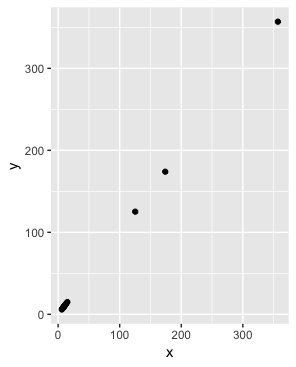

- [ ] B.

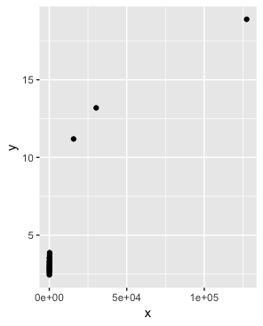

- [ ] C.

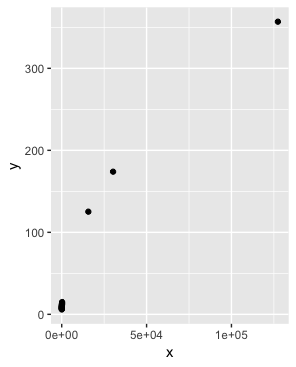

- [ ] D.

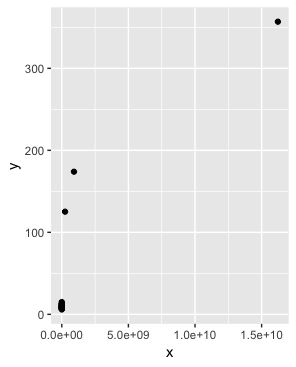

6. So from the above we know that the sum of squares of the columns of $Y$ (the total sum of squares) adds up to the sum of ```s$d^2``` and that the transformation $YV$ gives us columns with sums of squares equal to ```s$d^2```. Now compute the percent of the total variability that is explained by just the first three columns of $YV$.

What proportion of the total variability is explained by the first three columns of $YV$?

```{r}
sum(s$d[1:3]^2) / sum(s$d^2)
```

7. Before we continue, let's show a useful computational trick to avoid creating the matrix ```diag(s$d)```. To motivate this, we note that if we write $U$ out in its columns $[U_1, U_2, \dots, U_p]$ then $UD$ is equal to

$UD = [U_1 d_{1,1}, U_2 d_{2,2}, \dots, U_p d_{p,p}]$

Use the ```sweep``` function to compute $UD$ without constructing ```diag(s$d)``` or using matrix multiplication.

Which code is correct?

- [ ] A. ```identical(t(s$u %*% diag(s$d)), sweep(s$u, 2, s$d, FUN = "*"))```
        
- [X] B. ```identical(s$u %*% diag(s$d), sweep(s$u, 2, s$d, FUN = "*"))```
        
- [ ] C. ```identical(s$u %*% t(diag(s$d)), sweep(s$u, 2, s$d, FUN = "*"))```
        
- [ ] D. ```identical(s$u %*% diag(s$d), sweep(s$u, 2, s, FUN = "*"))```

8. We know that $U_1 d_{1,1}$, the first column of $UD$, has the most variability of all the columns of $UD$. Earlier we looked at an image of $Y$ using ```my_image(y)```, in which we saw that the student to student variability is quite large and that students that are good in one subject tend to be good in all. This implies that the average (across all subjects) for each student should explain a lot of the variability. Compute the average score for each student, plot it against $U_1 d_{1,1}$, and describe what you find.

What do you observe?

```{r}
plot(s$u[,1]*s$d[1], rowMeans(y))
```

- [ ] A. There is no relationship between the average score for each student and $U_1 d_{1,1}$.
- [ ] B. There is an exponential relationship between the average score for each student and $U_1 d_{1,1}$.
- [X] C. There is a linear relationship between the average score for each student and $U_1 d_{1,1}$.

9. We note that the signs in SVD are arbitrary because:

$U D V^{\top} = (-U) D (-V)^{\top}$

With this in mind we see that the first column of $UD$ is almost identical to the average score for each student except for the sign.

This implies that multiplying  𝑌  by the first column of  𝑉  must be performing a similar operation to taking the average. Make an image plot of  𝑉  and describe the first column relative to others and how this relates to taking an average.

How does the first column relate to the others, and how does this relate to taking an average?

```{r}
my_image(s$v)
```

- [ ] A. The first column is very variable, which implies that the first column of YV is the sum of the rows of Y multiplied by some non-constant function, and is thus not proportional to an average.
- [ ] B. The first column is very variable, which implies that the first column of YV is the sum of the rows of Y multiplied by some non-constant function, and is thus proportional to an average.
- [X] C. The first column is very close to being a constant, which implies that the first column of YV is the sum of the rows of Y multiplied by some constant, and is thus proportional to an average.
- [ ] D. The first three columns are all very close to being a constant, which implies that these columns are the sum of the rows of Y multiplied by some constant, and are thus proportional to an average.

10. We already saw that we can rewrite $UD$ as

$U_1 d_{1,1} + U_2 d_{2,2} + \dots + U_p d_{p,p}$

with $U_j$ the j-th column of $U$. This implies that we can rewrite the entire SVD as:

$Y = U_1 d_{1,1} V_1 ^{\top} + U_2 d_{2,2} V_2 ^{\top} + \dots + U_p d_{p,p} V_p ^{\top}$

with $V_j$ the jth column of $V$. Plot $U_1$, then plot $V_1^{\top}$ using the same range for the y-axis limits, then make an image of $U_1 d_{1,1} V_1 ^{\top}$ and compare it to the image of $Y$. Hint: use the ```my_image()``` function defined above. Use the ```drop=FALSE``` argument to assure the subsets of matrices are matrices.

```{r}
plot(s$u[,1], ylim = c(-0.25, 0.25))
plot(s$v[,1], ylim = c(-0.25, 0.25))
with(s, my_image((u[, 1, drop=FALSE]*d[1]) %*% t(v[, 1, drop=FALSE])))
my_image(y)
```

11. We see that with just a vector of length 100, a scalar, and a vector of length 24, we can actually come close to reconstructing the a $100 \times 24$ matrix. This is our first matrix factorization:

$Y \approx d_{1,1} U_1 V_1^{\top}$

In the exercise in Q6, we saw how to calculate the percent of total variability explained. However, our approximation only explains the observation that good students tend to be good in all subjects. Another aspect of the original data that our approximation does not explain was the higher similarity we observed within subjects. We can see this by computing the difference between our approximation and original data and then computing the correlations. You can see this by running this code:

```{r}
resid <- y - with(s,(u[, 1, drop=FALSE]*d[1]) %*% t(v[, 1, drop=FALSE]))
my_image(cor(resid), zlim = c(-1,1))
axis(side = 2, 1:ncol(y), rev(colnames(y)), las = 2)
```

Now that we have removed the overall student effect, the correlation plot reveals that we have not yet explained the within subject correlation nor the fact that math and science are closer to each other than to the arts. So let's explore the second column of the SVD.

Repeat the previous exercise (Q10) but for the second column: Plot $U_2$, then plot $V_2^{\top}$ using the same range for the y-axis limits, then make an image of $U_2 d_{2,2} V_2 ^{\top}$ and compare it to the image of ```resid```.

```{r}
plot(s$u[,2], ylim = c(-0.5, 0.5))
plot(s$v[,2], ylim = c(-0.5, 0.5))
with(s, my_image((u[, 2, drop=FALSE]*d[2]) %*% t(v[, 2, drop=FALSE])))
my_image(resid)
```

12. The second column clearly relates to a student's difference in ability in math/science versus the arts. We can see this most clearly from the plot of ```s$v[,2]```. Adding the matrix we obtain with these two columns will help with our approximation:

$Y \approx d_{1,1} U_1 V_1^{\top} + d_{2,2} U_2 V_2^{\top}$

We know it will explain ```sum(s$d[1:2]^2)/sum(s$d^2) * 100``` percent of the total variability. We can compute new residuals like this:

```{r}    
resid <- y - with(s,sweep(u[, 1:2], 2, d[1:2], FUN="*") %*% t(v[, 1:2]))
my_image(cor(resid), zlim = c(-1,1))
axis(side = 2, 1:ncol(y), rev(colnames(y)), las = 2)
```
  
and see that the structure that is left is driven by the differences between math and science. Confirm this by first plotting $U_3$, then plotting $V_3^{\top}$ using the same range for the y-axis limits, then making an image of $U_3 d_{3,3} V_3 ^{\top}$ and comparing it to the image of ```resid```.

```{r}
plot(s$u[,3], ylim = c(-0.5, 0.5))
plot(s$v[,3], ylim = c(-0.5, 0.5))
with(s, my_image((u[, 3, drop=FALSE]*d[3]) %*% t(v[, 3, drop=FALSE])))
my_image(resid)
```

13. The third column clearly relates to a student's difference in ability in math and science. We can see this most clearly from the plot of ```s$v[,3]```. Adding the matrix we obtain with these two columns will help with our approximation:

$Y \approx d_{1,1} U_1 V_1^{\top} + d_{2,2} U_2 V_2^{\top} + d_{3,3} U_3 V_3^{\top}$

We know it will explain: ```sum(s$d[1:3]^2)/sum(s$d^2) * 100``` percent of the total variability. We can compute new residuals like this:

```{r}
resid <- y - with(s,sweep(u[, 1:3], 2, d[1:3], FUN="*") %*% t(v[, 1:3]))
my_image(cor(resid), zlim = c(-1,1))
axis(side = 2, 1:ncol(y), rev(colnames(y)), las = 2)
```

We no longer see structure in the residuals: they seem to be independent of each other. This implies that we can describe the data with the following model:

$Y =  d_{1,1} U_1 V_1^{\top} + d_{2,2} U_2 V_2^{\top} + d_{3,3} U_3 V_3^{\top} + \varepsilon$

with $\varepsilon$ a matrix of independent identically distributed errors. This model is useful because we summarize of $100 \times 24$ observations with $3 \times (100+24+1) = 375$ numbers.

Furthermore, the three components of the model have useful interpretations:

1 - the overall ability of a student

2 - the difference in ability between the math/sciences and arts

3 - the remaining differences between the three subjects.

The sizes $d_{1,1}, d_{2,2}$ and $d_{3,3}$ tell us the variability explained by each component. Finally, note that the components $d_{j,j} U_j V_j^{\top}$ are equivalent to the jth principal component.

Finish the exercise by plotting an image of $Y$, an image of $d_{1,1} U_1 V_1^{\top} + d_{2,2} U_2 V_2^{\top} + d_{3,3} U_3 V_3^{\top}$ and an image of the residuals, all with the same ```zlim```.

```{r}
y_hat <- with(s,sweep(u[, 1:3], 2, d[1:3], FUN="*") %*% t(v[, 1:3]))
my_image(y, zlim = range(y))
my_image(y_hat, zlim = range(y))
my_image(y - y_hat, zlim = range(y))
```

## Comprehension Check - Dimension Reduction

1. We want to explore the ```tissue_gene_expression``` predictors by plotting them.

```{r}     
data("tissue_gene_expression")
dim(tissue_gene_expression$x)
```

We want to get an idea of which observations are close to each other, but, as you can see from the dimensions, the predictors are 500-dimensional, making plotting difficult. Plot the first two principal components with color representing tissue type.

Which tissue is in a cluster by itself?

```{r}
pc <- prcomp(tissue_gene_expression$x)
data.frame(pc_1 = pc$x[,1], pc_2 = pc$x[,2], 
			tissue = tissue_gene_expression$y) %>%
	ggplot(aes(pc_1, pc_2, color = tissue)) +
	geom_point()
```

- [ ] A. cerebellum
- [ ] B. colon
- [ ] C. endometrium
- [ ] D. hippocampus
- [ ] E. kidney
- [X] F. liver
- [ ] G. placenta

2. The predictors for each observation are measured using the same device and experimental procedure. This introduces biases that can affect all the predictors from one observation. For each observation, compute the average across all predictors, and then plot this against the first PC with color representing tissue. Report the correlation.

What is the correlation?

```{r}
avgs <- rowMeans(tissue_gene_expression$x)
data.frame(pc_1 = pc$x[,1], avg = avgs, 
			tissue = tissue_gene_expression$y) %>%
ggplot(aes(avgs, pc_1, color = tissue)) +
	geom_point()
cor(avgs, pc$x[,1])
```

3. We see an association with the first PC and the observation averages. Redo the PCA but only after removing the center. Part of the code is provided for you.

```{r, include=TRUE, eval=FALSE}    
#BLANK
pc <- prcomp(x)
data.frame(pc_1 = pc$x[,1], pc_2 = pc$x[,2], 
	   tissue = tissue_gene_expression$y) %>%
	   ggplot(aes(pc_1, pc_2, color = tissue)) +
	   geom_point()
```

Which line of code should be used to replace #BLANK in the code block above?

```{r}    
x <- with(tissue_gene_expression, sweep(x, 1, rowMeans(x)))
pc <- prcomp(x)
data.frame(pc_1 = pc$x[,1], pc_2 = pc$x[,2], 
	   tissue = tissue_gene_expression$y) %>%
	   ggplot(aes(pc_1, pc_2, color = tissue)) +
	   geom_point()
```

- [ ] A. ```x <- with(tissue_gene_expression, sweep(x, 1, mean(x)))```
        
- [ ] B. ```x <- sweep(x, 1, rowMeans(tissue_gene_expression$x))```
        
- [ ] C. ```x <- tissue_gene_expression$x - mean(tissue_gene_expression$x)```
        
- [X] D. ```x <- with(tissue_gene_expression, sweep(x, 1, rowMeans(x)))```

4. For the first 10 PCs, make a boxplot showing the values for each tissue.

For the 7th PC, which two tissues have the greatest median difference?

```{r}
for(i in 1:10){
	boxplot(pc$x[,i] ~ tissue_gene_expression$y, main = paste("PC", i))
}
```

Select the TWO tissues that have the greatest difference between their medians.

- [ ] A. cerebellum
- [X] B. colon
- [ ] C. endometrium
- [ ] D. hippocampus
- [ ] E. kidney
- [ ] F. liver
- [X] G. placenta

5. Plot the percent variance explained by PC number. Hint: use the ```summary``` function.

How many PCs are required to reach a cumulative percent variance explained greater than 50%? ```3```

```{r}
plot(summary(pc)$importance[3,])
```

## Comprehension Check - Clustering

These exercises will work with the ```tissue_gene_expression``` dataset, which is part of the **dslabs** package.

1. Load the ```tissue_gene_expression``` dataset. Remove the row means and compute the distance between each observation. Store the result in ```d```.

Which of the following lines of code correctly does this computation?

```{r}
d <- dist(tissue_gene_expression$x - rowMeans(tissue_gene_expression$x))
```

- [ ] A. ```d <- dist(tissue_gene_expression$x)```
        
- [ ] B. ```d <- dist(rowMeans(tissue_gene_expression$x))```
 
- [ ] C. ```d <- dist(rowMeans(tissue_gene_expression$y))```

- [X] D. ```d <- dist(tissue_gene_expression$x - rowMeans(tissue_gene_expression$x))```

2. Make a hierarchical clustering plot and add the tissue types as labels.

You will observe multiple branches.

Which tissue type is in the branch farthest to the left?

```{r}
h <- hclust(d)
plot(h)
```

- [ ] A. cerebellum
- [ ] B. colon
- [ ] C. endometrium
- [ ] D. hippocampus
- [ ] E. kidney
- [X] F. liver
- [ ] G. placenta

3. Select the 50 most variable genes. Make sure the observations show up in the columns, that the predictor are centered, and add a color bar to show the different tissue types. Hint: use the ```ColSideColors``` argument to assign colors. Also, use ```col = RColorBrewer::brewer.pal(11, "RdBu")``` for a better use of colors.

Part of the code is provided for you here:

```{r, include=TRUE, eval=FALSE}
library(RColorBrewer)
sds <- matrixStats::colSds(tissue_gene_expression$x)
ind <- order(sds, decreasing = TRUE)[1:50]
colors <- brewer.pal(7, "Dark2")[as.numeric(tissue_gene_expression$y)]
#BLANK
```

Which line of code should replace #BLANK in the code above?

```{r}
if(!require(RColorBrewer)) install.packages("RColorBrewer")

library(RColorBrewer)
sds <- matrixStats::colSds(tissue_gene_expression$x)
ind <- order(sds, decreasing = TRUE)[1:50]
colors <- brewer.pal(7, "Dark2")[as.numeric(tissue_gene_expression$y)]
heatmap(t(tissue_gene_expression$x[,ind]), col = brewer.pal(11, "RdBu"), scale = "row", ColSideColors = colors)
```

- [X] A. ```heatmap(t(tissue_gene_expression$x[,ind]), col = brewer.pal(11, "RdBu"), scale = "row", ColSideColors = colors)```
        
- [ ] B. ```heatmap(t(tissue_gene_expression$x[,ind]), col = brewer.pal(11, "RdBu"), scale = "row", ColSideColors = rev(colors))```
        
- [ ] C. ```heatmap(t(tissue_gene_expression$x[,ind]), col = brewer.pal(11, "RdBu"), scale = "row", ColSideColors = sample(colors))```
        
- [ ] D. ```heatmap(t(tissue_gene_expression$x[,ind]), col = brewer.pal(11, "RdBu"), scale = "row", ColSideColors = sample(colors))```

# Section 7 - Final Assessment

## Breast Cancer Project - Part 1

The ```brca``` dataset from the **dslabs** package contains information about breast cancer diagnosis biopsy samples for tumors that were determined to be either benign (not cancer) and malignant (cancer). The brca object is a list consisting of:

* ```brca$y```: a vector of sample classifications ("B" = benign or "M" = malignant)
* ```brca$x```: a matrix of numeric features describing properties of the shape and size of cell nuclei extracted from biopsy microscope images

For these exercises, load the data by setting your options and loading the libraries and data as shown in the code here:

```{r}
options(digits = 3)
data(brca)
```

The exercises in this assessment are available to Verified Learners only and are split into four parts, all of which use the data described here.

1. Dimensions and properties

How many samples are in the dataset?

How many predictors are in the matrix?

What proportion of the samples are malignant?

Which column number has the highest mean?

Which column number has the lowest standard deviation?
  
```{r}
dim(brca$x)[1]
dim(brca$x)[2]
mean(brca$y == "M")
which.max(colMeans(brca$x))
which.min(colSds(brca$x))
```

2. Scaling the matrix

Use ```sweep()``` two times to scale each column: subtract the column means of ```brca$x```, then divide by the column standard deviations of ```brca$x```.

After scaling, what is the standard deviation of the first column?

```{r}
x_centered <- sweep(brca$x, 2, colMeans(brca$x))
x_scaled <- sweep(x_centered, 2, colSds(brca$x), FUN = "/")

sd(x_scaled[,1])
```

After scaling, what is the median value of the first column?

```{r}
median(x_scaled[,1])
```

3. Distance

Calculate the distance between all samples using the scaled matrix.

What is the average distance between the first sample, which is benign, and other benign samples?

```{r}
d_samples <- dist(x_scaled)
dist_BtoB <- as.matrix(d_samples)[1, brca$y == "B"]
mean(dist_BtoB[2:length(dist_BtoB)])
```

What is the average distance between the first sample and malignant samples?

```{r}
dist_BtoM <- as.matrix(d_samples)[1, brca$y == "M"]
mean(dist_BtoM)
```

4. Heatmap of features

Make a heatmap of the relationship between features using the scaled matrix.

Which of these heatmaps is correct?
To remove column and row labels like the images below, use ```labRow = NA``` and ```labCol = NA```.

```{r}
d_features <- dist(t(x_scaled))
heatmap(as.matrix(d_features), labRow = NA, labCol = NA)
```

- [X] A.

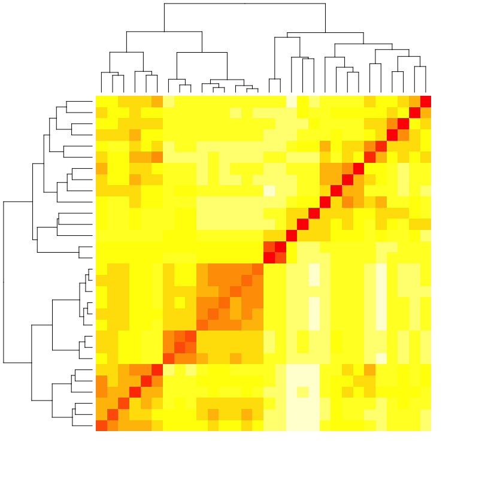

- [ ] B.

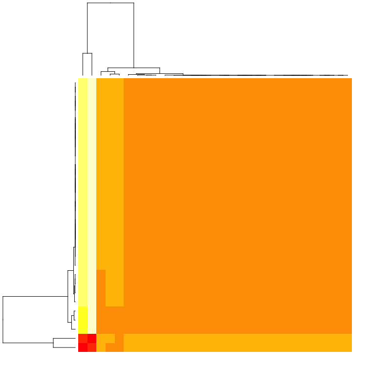

- [ ] C.

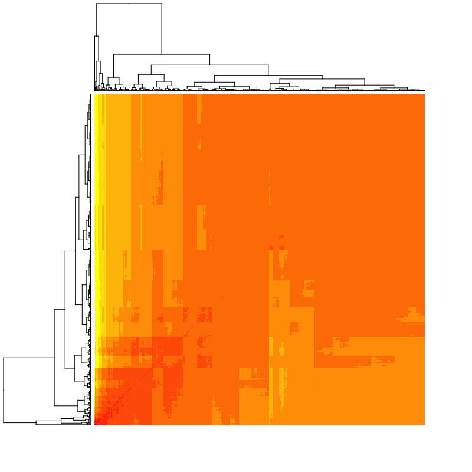

- [ ] D.

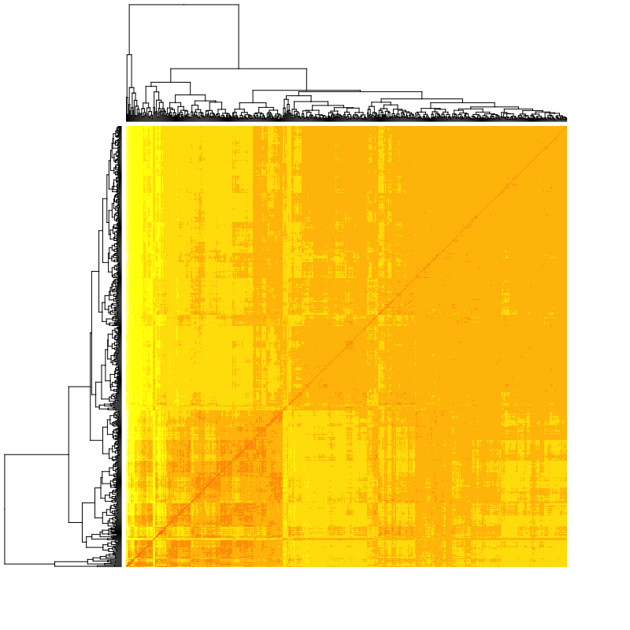

- [ ] E.

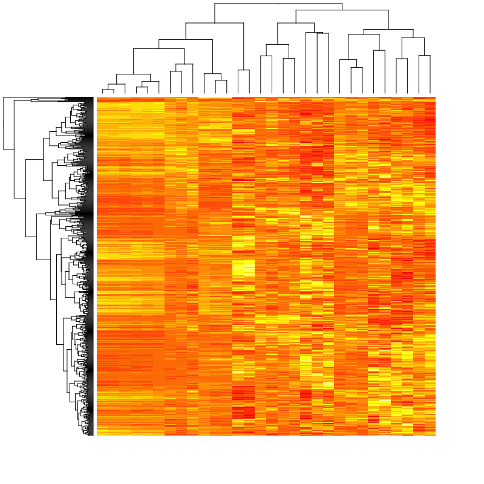

5. Hierarchical clustering

Perform hierarchical clustering on the 30 features. Cut the tree into 5 groups.

All but one of the answer options are in the same group.

Which is in a different group?

```{r}
h <- hclust(d_features)
groups <- cutree(h, k = 5)
split(names(groups), groups)
```

- [ ] A. smoothness_mean
- [ ] B. smoothness_worst
- [ ] C. compactness_mean
- [ ] D. compactness_worst
- [X] E. concavity_mean
- [ ] F. concavity_worst

## Breast Cancer Project - Part 2

6. PCA: proportion of variance

Perform a principal component analysis of the scaled matrix.

What proportion of variance is explained by the first principal component?

How many principal components are required to explain at least 90% of the variance?

```{r}
pca <- prcomp(x_scaled)
summary(pca)
```

7. PCA: plotting PCs

Plot the first two principal components with color representing tumor type (benign/malignant).

```{r}
data.frame(pca$x[,1:2], type = brca$y) %>%
  ggplot(aes(PC1, PC2, color = type)) +
  geom_point()
```

Which of the following is true?

- [ ] A. Malignant tumors tend to have smaller values of PC1 than benign tumors.
- [X] B. Malignant tumors tend to have larger values of PC1 than benign tumors.
- [ ] C. Malignant tumors tend to have smaller values of PC2 than benign tumors.
- [ ] D. Malignant tumors tend to have larger values of PC2 than benign tumors.
- [ ] E. There is no relationship between the first two principal components and tumor type.

8. PCA: PC boxplot

Make a boxplot of the first 10 PCs grouped by tumor type.

```{r}
data.frame(type = brca$y, pca$x[,1:10]) %>%
    gather(key = "PC", value = "value", -type) %>%
    ggplot(aes(PC, value, fill = type)) +
    geom_boxplot()
```

Which PCs are significantly different enough by tumor type that there is no overlap in the interquartile ranges (IQRs) for benign and malignant samples?

Select ALL that apply.

- [X] A. PC1
- [ ] B. PC2
- [ ] C. PC3
- [ ] D. PC4
- [ ] E. PC5
- [ ] F. PC6
- [ ] G. PC7
- [ ] H. PC8
- [ ] I. PC9
- [ ] J. PC10

## Breast Cancer Project - Part 3

Set the seed to 1, then create a data partition splitting ```brca$y``` and the *scaled* version of the ```brca$x``` matrix into a 20% test set and 80% train using the following code:

```{r}
# set.seed(1) if using R 3.5 or earlier
set.seed(1, sample.kind = "Rounding")    # if using R 3.6 or later
test_index <- createDataPartition(brca$y, times = 1, p = 0.2, list = FALSE)
test_x <- x_scaled[test_index,]
test_y <- brca$y[test_index]
train_x <- x_scaled[-test_index,]
train_y <- brca$y[-test_index]
```

You will be using these training and test sets throughout the exercises in Parts 3 and 4. Save your models as you go, because at the end, you'll be asked to make an ensemble prediction and to compare the accuracy of the various models!

9. Training and test sets

Check that the training and test sets have similar proportions of benign and malignant tumors.

What proportion of the training set is benign?

```{r}
mean(train_y == "B")
```       
        
What proportion of the test set is benign?

```{r}
mean(test_y == "B")
```

10a. K-means Clustering

The ```predict_kmeans()``` function defined here takes two arguments - a matrix of observations ```x``` and a k-means object ```k``` - and assigns each row of ```x``` to a cluster from ```k```.

```{r}
predict_kmeans <- function(x, k) {
    centers <- k$centers    # extract cluster centers
    # calculate distance to cluster centers
    distances <- sapply(1:nrow(x), function(i){
                        apply(centers, 1, function(y) dist(rbind(x[i,], y)))
                 })
  max.col(-t(distances))  # select cluster with min distance to center
}
```
    
Set the seed to 3. Perform k-means clustering on the training set with 2 centers and assign the output to ```k```. Then use the ```predict_kmeans()``` function to make predictions on the test set.

What is the overall accuracy?

```{r}
# set.seed(3) if using R 3.5 or earlier
set.seed(3, sample.kind = "Rounding")    # if using R 3.6 or later
k <- kmeans(train_x, centers = 2)
kmeans_preds <- ifelse(predict_kmeans(test_x, k) == 1, "B", "M")
mean(kmeans_preds == test_y)
```

10b. K-means Clustering

What proportion of benign tumors are correctly identified?

```{r}
sensitivity(factor(kmeans_preds), test_y, positive = "B")
```

What proportion of malignant tumors are correctly identified?

```{r}
sensitivity(factor(kmeans_preds), test_y, positive = "M")
```

11. Logistic regression model

Fit a logistic regression model on the training set with ```caret::train()``` using all predictors. Ignore warnings about the algorithm not converging. Make predictions on the test set.

What is the accuracy of the logistic regression model on the test set?

```{r}
train_glm <- train(train_x, train_y, method = "glm")
glm_preds <- predict(train_glm, test_x)
mean(glm_preds == test_y)
```

12. LDA and QDA models

Train an LDA model and a QDA model on the training set. Make predictions on the test set using each model.

What is the accuracy of the LDA model on the test set?

```{r}
train_lda <- train(train_x, train_y, method = "lda")
lda_preds <- predict(train_lda, test_x)
mean(lda_preds == test_y)
```

What is the accuracy of the QDA model on the test set?

```{r}
train_qda <- train(train_x, train_y, method = "qda")
qda_preds <- predict(train_qda, test_x)
mean(qda_preds == test_y)
```

13. Loess model

Set the seed to 5, then fit a loess model on the training set with the **caret** package. You will need to install the **gam** package if you have not yet done so. Use the default tuning grid. This may take several minutes; ignore warnings. Generate predictions on the test set.

What is the accuracy of the loess model on the test set?

```{r}
# set.seed(5)
set.seed(5, sample.kind = "Rounding") # simulate R 3.5
train_loess <- train(train_x, train_y, method = "gamLoess")
loess_preds <- predict(train_loess, test_x)
mean(loess_preds == test_y)
```

## Breast Cancer Project - Part 4

14. K-nearest neighbors model

Set the seed to 7, then train a k-nearest neighbors model on the training set using the **caret** package. Try odd values of $k$ from 3 to 21. Use the final model to generate predictions on the test set.

What is the final value of $k$ used in the model?

```{r}
# set.seed(7)
set.seed(7, sample.kind = "Rounding") # simulate R 3.5
tuning <- data.frame(k = seq(3, 21, 2))
train_knn <- train(train_x, train_y,
      method = "knn", 
      tuneGrid = tuning)
train_knn$bestTune
```

What is the accuracy of the kNN model on the test set?

```{r}
knn_preds <- predict(train_knn, test_x)
mean(knn_preds == test_y)
```

15a. Random forest model

Set the seed to 9, then train a random forest model on the training set using the **caret** package. Test ```mtry``` values of ```c(3, 5, 7, 9)```. Use the argument ```importance = TRUE``` so that feature importance can be extracted. Generate predictions on the test set.

Note: please use ```c(3, 5, 7, 9)``` instead of ```seq(3, 9, 2)``` in tuneGrid.

What value of mtry gives the highest accuracy?

```{r}
# set.seed(9)
set.seed(9, sample.kind = "Rounding") # simulate R 3.5
tuning <- data.frame(mtry = c(3, 5, 7, 9))
train_rf <- train(train_x, train_y,
                  method = "rf",
                  tuneGrid = tuning,
                  importance = TRUE)
train_rf$bestTune
```
What is the accuracy of the random forest model on the test set?

```{r}
rf_preds <- predict(train_rf, test_x)
mean(rf_preds == test_y)
```

What is the most important variable in the random forest model?
Be sure to enter the variable name exactly as it appears in the dataset.

```{r}
varImp(train_rf)
```

15b. Random forest model

Consider the top 10 most important variables in the random forest model.

Which set of features is most important for determining tumor type?

- [ ] A. mean values
- [ ] B. standard errors
- [X] C. worst values

16a. Creating an ensemble

Create an ensemble using the predictions from the 7 models created in the previous exercises: k-means, logistic regression, LDA, QDA, loess, k-nearest neighbors, and random forest. Use the ensemble to generate a majority prediction of the tumor type (if most models suggest the tumor is malignant, predict malignant).

What is the accuracy of the ensemble prediction?

```{r}
ensemble <- cbind(glm = glm_preds == "B", lda = lda_preds == "B", qda = qda_preds == "B", loess = loess_preds == "B", rf = rf_preds == "B", knn = knn_preds == "B", kmeans = kmeans_preds == "B")

ensemble_preds <- ifelse(rowMeans(ensemble) > 0.5, "B", "M")
mean(ensemble_preds == test_y)
```

16b. Creating an ensemble

Make a table of the accuracies of the 7 models and the accuracy of the ensemble model.

Which of these models has the highest accuracy?

```{r}
models <- c("K means", "Logistic regression", "LDA", "QDA", "Loess", "K nearest neighbors", "Random forest", "Ensemble")
accuracy <- c(mean(kmeans_preds == test_y),
              mean(glm_preds == test_y),
              mean(lda_preds == test_y),
              mean(qda_preds == test_y),
              mean(loess_preds == test_y),
              mean(knn_preds == test_y),
              mean(rf_preds == test_y),
              mean(ensemble_preds == test_y))
data.frame(Model = models, Accuracy = accuracy)
```

- [ ] A. Logistic regression
- [X] B. LDA
- [ ] C. Loess
- [ ] D. Random forest
- [ ] E. Ensemble
